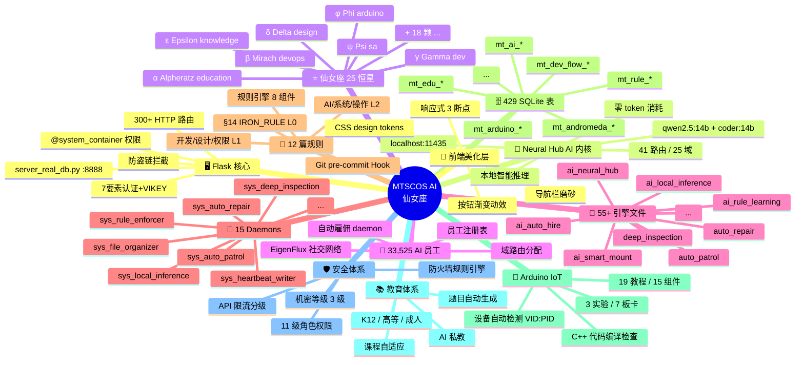

<div align="center">

# 🌟 MTSCOS AI — 仙女座智能体宇宙

**一个自我进化的 AI 智能体操作系统 · AI Agents Operating System**

[](https://www.python.org/)
[](https://flask.palletsprojects.com/)
[](https://www.sqlite.org/)
[](https://ollama.com/)
[](LICENSE)
[](VERSION)
[](docs/FEATURES.md#-仙女座-25-域-33525-ai-员工)
[](.trae/rules/00-%E8%A7%84%E5%88%99%E6%80%BB%E7%B4%A2%E5%BC%95.md)
[](.trae/rules/%C2%A714%E5%BC%BA%E5%88%B6%E5%BC%80%E5%8F%9112%E6%AD%A5%E9%AA%A4%E7%8B%AC%E7%AB%8B%E7%BA%A6%E6%9D%9F%E8%A7%84%E5%88%99.md)
[](docs/SYSTEM.md#-三重保活架构)

*An Andromeda Galaxy of 25 AI domains, 33K agents, and 12 iron rules that self-learn, self-heal, and self-evolve — running entirely on your Mac with zero API costs.*

[中文](#中文) · [English](#english)

---

</div>

## 📚 目录导航

| 文档 | 说明 |
|------|------|
| [**系统说明书**](docs/SYSTEM.md) | 完整架构、数据库、引擎、规则体系（推荐先读） |
| [**功能详细介绍**](docs/FEATURES.md) | 25 域分述 + HTTP API 手册 |
| [**版本变更日志**](docs/CHANGELOG.md) | 版本历史与里程碑 |
| [**架构导览图**](#-系统导览图) | 内嵌 Mermaid 架构图 |
| [**系统思维导图**](#-系统思维导图) | 内嵌 Mermaid mindmap |
| [**规则总索引**](.trae/rules/00-%E8%A7%84%E5%88%99%E6%80%BB%E7%B4%A2%E5%BC%95.md) | 12 篇规则 · L0 IRON_RULE → L1/L2 层级 |
| [**仙女座恒星命名表**](flask-app/static/andromeda_stars_catalog.md) | 25 颗恒星 · 域→星映射 |

---

## 🚀 快速开始

```bash
# 1. 克隆
git clone <your-repo-url> mtscos-ai
cd mtscos-ai/flask-app

# 2. 创建虚拟环境 + 安装依赖
python3 -m venv venv
source venv/bin/activate  # Windows: venv\Scripts\activate
pip install -r ../_config/requirements.txt

# 3. 启动 Ollama（本地 LLM, 零 token 成本）
ollama pull qwen2.5:14b
ollama pull qwen2.5-coder:14b
ollama serve   # 默认 :11435

# 4. 启动 MTSCOS AI
python server_real_db.py

# 5. 打开浏览器
open http://127.0.0.1:8888
```

> **零 API 成本** — 所有 AI 推理走本地 Ollama，不消耗任何云端 token。

---

## 🗺️ 系统导览图

```mermaid
graph TB
    subgraph 🌐 外部世界
        XHS[📕 小红书]
        DY[🎵 抖音]
        KS[🎬 快手]
        BILI[📺 B站 yt-dlp]
        GZH[📰 公众号]
    end

    subgraph 🖥️ Flask server_real_db.py :8888
        direction TB
        FE[🎨 前端 Jinja2 + Vue.js]
        ROUTES[300+ HTTP 路由]
        PERM[🔐 @system_container 权限装饰器]
        AUTH[7 要素认证 + VIKEY 加密狗]
        IRON[§14 IRON_RULE 12 步骤拦截]
    end

    subgraph 🧠 Neural Hub — AI 母体内核
        direction LR
        ROUTER[41 路由 · 25 域]
        OLLAMA[localhost:11435<br>qwen2.5:14b + coder:14b]
        EMP[33,525 AI 员工]
    end

    subgraph ⭐ 仙女座星系 — 25 颗恒星
        direction LR
        S1[α Alpheratz<br>education]
        S2[β Mirach<br>devops]
        S3[γ Gamma<br>dev]
        S4[δ Delta<br>design]
        S5[ε Epsilon<br>knowledge]
        S21[φ Phi<br>arduino]
        S23[ψ Psi<br>sa]
    end

    subgraph 🔧 15 Daemons — smart_mount_engine 管理
        direction TB
        D1[sys_heartbeat_writer · 30s]
        D2[sys_auto_patrol · 300s]
        D3[sys_rule_enforcer · 300s]
        D4[sys_auto_repair · 120s]
        D5[sys_local_inference · 120s]
        D6[sys_deep_inspection · 600s]
        D7[sys_file_organizer · 600s]
    end

    subgraph 🗄️ SQLite — 429 张表
        direction TB
        T1[mt_andromeda_employee_registry]
        T2[mt_andromeda_rule_knowledge · 490 chunks]
        T3[mt_ai_neural_routes]
        T4[mt_iron_rule_violations]
        T5[mt_dev_flow_session]
        T6[mt_andromeda_stars · 25]
    end

    subgraph 📜 规则体系
        R1[§14 IRON_RULE<br>L0 · 不可绕开]
        R2[开发/设计/权限<br>L1 · 核心规范]
        R3[AI/系统/操作<br>L2 · 操作规范]
    end

    FE --> ROUTES
    ROUTES --> PERM --> AUTH --> IRON
    ROUTES -->|AI 推理| ROUTER
    ROUTER --> OLLAMA
    ROUTER --> EMP
    ROUTER --> S1 & S2 & S3 & S4 & S5 & S21 & S23

    XHS & DY & KS & BILI & GZH -.->|yt-dlp / knowledge_ingest| ROUTER
    ROUTER -->|brain_feed| T2
    ROUTES --> T1 & T3 & T4 & T5 & T6
    D1 & D2 & D3 & D4 & D5 & D6 & D7 -.-> ROUTES

    R1 -.->|强制| D1 & D2 & D3 & D4
    R2 -.->|约束| ROUTES
    R3 -.->|操作| EMP

    style 外部世界 fill:#fff0f0,stroke:#FF6B9D,color:#333
    style Flask fill:#f0f4ff,stroke:#409EFF,color:#333
    style Neural fill:#f0fff0,stroke:#67C23A,color:#333
    style 仙女座 fill:#fff8e1,stroke:#F39C12,color:#333
    style Daemons fill:#fff0ff,stroke:#9B59B6,color:#333
    style SQLite fill:#f5f5f5,stroke:#909399,color:#333
    style 规则 fill:#ffebee,stroke:#E74C3C,color:#333
```

---

## 🧠 系统思维导图



---

## 💡 核心理念

| 原则 | 说明 |
|------|------|
| **本地优先** | 所有 AI 推理走本地 Ollama，零 token 消耗 |
| **规则强制** | §14 IRON_RULE 不可绕开，3 层拦截 + 9 条铁律 |
| **自我进化** | AI 自动巡逻/修复/升级/雇佣 |
| **三重保活** | Engine 内置 + LaunchD + Crontab |
| **数据真源** | 429 张 SQLite 表，零假数据 |
| **仙女座星系** | 25 颗恒星 = 25 功能域，33K AI 员工 |

---

## 🏗️ 技术栈

```
┌────────────────────────────────────────────────────────┐
│  前端      Jinja2 · Vue 2 · Element Plus · Tailwind     │
├────────────────────────────────────────────────────────┤
│  后端      Python 3.9+ · Flask 3.1 · SQLite 3           │
├────────────────────────────────────────────────────────┤
│  AI        Ollama 11435 (Metal iGPU · 24GB 共享)               │
│            qwen2.5:14b  (通用主力 · dev 档强制首选)          │
│            qwen2.5:7b   (通用兜底 · OOM/超时自动降级)         │
│            qwen2.5-coder:14b  (代码主力 · neural_hub 8 路由) │
│            qwen2.5-coder:7b   (代码兜底)                     │
│            nomic-embed-text   (768维向量 · 仙女座 Stage 2)    │
│            Volcengine ARK    🛡️ 云端兜底 (133 模型 · 3.6s)   │
│            · doubao-seed-2-0-lite  (默认兜底)               │
│            · deepseek-v4-pro       (数学/逻辑)              │
├────────────────────────────────────────────────────────┤
│  爬虫      yt-dlp (B站字幕提取)                          │
├────────────────────────────────────────────────────────┤
│  部署      macOS LaunchD + Crontab + Git Hook           │
├────────────────────────────────────────────────────────┤
│  硬件      VIKEY USB 加密狗 · Arduino 设备自动检测        │
└────────────────────────────────────────────────────────┘
```

---

## 📊 实时数据快照 (2026-09-17 · 仙女座自演化已跑通)

| 指标 | 数值 |
|------|------|
| 数据库表 | **241** 张 (flask-app/database/app.db · 396MB) |
| AI 员工 | **33,525** 人 |
| Neural Hub 路由 | **41** 条 · 25 域 · qwen2.5-coder:14b |
| 仙女座恒星 | **25** 颗 (M31 核心引擎) |
| 仙女座脑库 | **1,227,849** 条 (含 auto_derive AI 衍生) |
| 知识图谱 nodes/rels | 1,794 / 3,978 |
| EigenFlux 消息 | **278,920** 条 |
| 仙女座 7 阶段演化 | ✅ **已跑通** (26.9s 完整 cycle) |
| 引擎文件 | **55+** |
| Daemons | **17** (新增 autosync + auto_evolution) |
| HTTP 路由 | **300+** |
| 本地 Ollama | 11435 · Metal iGPU · 5 模型 · 25.7GB |
| 云端兜底 | ✅ Volcengine ARK 133 模型 |
| 规则文件 | **12** · L0 IRON_RULE
---

## 📂 项目目录结构

> **2026-09-10 深度清理** · 根目录 **178 → 33 项** · 释放 12.1 GB · 5 批次归档 → `_archive/`
> Flask 重启验证：`server_real_db.py` 显式设置 `template_folder=BASE_DIR/templates` → 根目录冗余副本全部安全归档

```
MTSCOS_AI_Project/  （清理后 · 33 项）
│
├── 📄 根级文件（6 个）
│   ├── README.md · LICENSE · FUNDING.yml · pyrightconfig.json
│   ├── services_config.json · knowledge_base.json
│   └── .env / .env.example  🔐 环境变量（勿提交）
│
├── 📦 _archive/  ⭐ 归档总目录（28 GB · 5 批次）
│   ├── batch1_runtime/           12.0 GB  运行时产物
│   │   ├── core/auto_scheduler.log  11 GB  超大旋转日志
│   │   ├── ai_engines/*.db 副本    1.4 GB  flask-app 内部 db 冗余副本
│   │   ├── 9 个空目录 · __pycache__ · node_modules
│   ├── batch2_root_duplicates/    13 MB  根目录 Flask 子系统副本
│   │   ├── core/ services/ ai_engines/ app/ scripts/
│   │   ├── entrypoints/ split_databases/ skills/
│   │   ├── app.py · backup_db.py · api_doc_service.py
│   ├── batch3_safe/                ~9 MB  根目录 final 副本
│   │   ├── templates/ (3.6M, 139 文件)  ← Flask 实际用 flask-app/templates/
│   │   ├── static/ app/ tests/ data/ logs/
│   ├── root_py_services/          652 KB  70 个散落 education_*_service.py
│   ├── root_db_replicas/           13 MB  19 个散落 .db 副本
│   ├── root_config_scatter/      9.6 MB  ViKey.CAB / .Dll / VERSION / cookies.txt
│   ├── root_inspect_baks/          21 个 .inspect_bak
│   └── ...（历史备份）
│
├── 🛠️ 顶层工具（4 个）
│   ├── _config/          配置模板（requirements.txt / Dockerfile / nginx.conf / ViKey 驱动）
│   ├── _entry_wrappers/  启动入口包装（mtscos.py / mtscos.sh / test_system.py）
│   ├── _runtime/         运维脚本（deploy/restore/verify）· start_*.command · sync_*.sh
│   └── _git_quarantine/  Git 隔离区（系统自动维护）
│
├── ⚙️ 隐藏配置（4 个）
│   ├── .github/          CI/CD workflows · CONTRIBUTING.md · FUNDING.yml
│   ├── .trae/            🤖 AI IDE 规则（12 篇规则文档 · mcp.json · L0 IRON_RULE）
│   ├── .vscode/          VS Code 配置
│   └── .git · .uploads · .venv · .venv-1
│
├── 🗄️  Database/          ⭐ **主数据源（431 表 · 9.1 GB）**
│   ├── app.db / app.db-wal / app.db-shm    ← 主库（Flask APP_DB）
│   │   ├── 431 SQLite 表
│   │   ├── 33,525 AI 员工 · 41 Neural Hub 路由
│   │   ├── 25 仙女座恒星 · 490 规则知识 chunks
│   │   ├── mt_dev_flow_session (§14 开发流程跟踪)
│   │   └── mt_andromeda_stars · mt_rule_* · mt_iron_rule_violations
│   ├── auth.db · exam.db · version_unified.db · intelligent_evaluation.db
│   ├── backups/          历史数据库备份
│   └── sql_*.sql         建表 SQL 脚本
│
├── 🌟 flask-app/          ⭐ **Flask 主应用（唯一启动点）**
│   │   cd flask-app && venv/bin/python3 server_real_db.py
│   ├── server_real_db.py         Flask 主入口 · 8000+ 行 · 300+ 路由
│   ├── 🧠 engines/               55+ AI 引擎（核心业务）
│   │   ├── ai_neural_hub.py          AI 母体内核（41 路由 · 25 域 · qwen2.5:14b）
│   │   ├── ai_smart_mount_engine.py  Daemon 管理器（17 个 · 含仙女座 autosync/evolution）
│   │   ├── ai_local_inference_engine 本地推理（零 token）
│   │   ├── auto_patrol_engine.py     6 人 AI 巡逻队
│   │   ├── auto_repair_engine.py     FAILED daemon 自动修复
│   ├── 🆕 andromeda_auto_evolution.py 仙女座 7 阶段自演化 (26.9s/cycle)
│   │   ├── deep_inspection_engine.py 页面/路由/代码深度巡检
│   │   ├── ai_eigenflux_network_engine 自动连线/交友/心跳
│   │   ├── ai_auto_hire_engine.py     AI 自动雇佣 + EigenFlux 邀请
│   │   ├── ai_edu_sync_engine.py      教辅教改同步
│   │   ├── ai_arduino_engine.py       Arduino 全套
│   │   ├── ai_rule_learning_engine.py 12 篇规则自动学习
│   │   └── ...（55+ 文件）
│   ├── 📜 ai_engines/            rules_engine 8 组件 + MCP Gateway
│   ├── 📦 app/                   Blueprint（32 文件 · 405 路由）
│   ├── 🎨 static/                CSS/JS/图片 · §11 仙女座前端美化层
│   ├── 📄 templates/             Jinja2 HTML 模板（Flask render_template 路径）
│   ├── 🗃️ migrations/            数据库迁移脚本
│   ├── 📊 logs/                  Flask + AI + Daemon 运行日志
│   ├── 📁 migrations/ config/ routes/ services/ core/ data/ ...  flask-app 级子系统
│   └── 🐍 venv/                  Python 虚拟环境
│
├── 🔐 安全（3 个）
│   ├── certs/  VPN 证书（cert_vpn_server.crt）
│   ├── keys/   VPN 私钥（key_vpn_server.key）
│   └── config/ 部署配置（vpn_config.json / services_config.json）
│
├── 📚 文档（2 个）
│   ├── docs/                    GitHub 标准文档集
│   │   ├── SYSTEM.md            系统说明书
│   │   ├── FEATURES.md          功能详细介绍（25 域分述 + HTTP API）
│   │   ├── CHANGELOG.md         版本变更日志
│   │   └── Proposals/           §14 开发流程提案（STEP 2-6）
│   └── README.md                ← 你在这里
│
└── 🧩 剩余（5 个）
    ├── frontend/        前端构建产物（Vite/Tailwind）· 2,375 文件
    ├── HTML/            独立静态 HTML（脱离 Flask 可直接打开）· 2 文件
    ├── settings/        全局 settings metadata
    ├── startup_modules/ 自定义启动模块
    └── .git · .uploads · .venv · .venv-1

```

### 清理关键架构洞察

```
Flask import 链验证（静态 + 运行时双重确认）:

server_real_db.py 的 sys.path[:5]:
  [项目根目录/flask-app, scripts/python, flask-app, ...]

Flask 模板/静态文件路径（源码显式设置）:
  app = Flask(__name__,
    template_folder=os.path.join(BASE_DIR, 'templates'),
    static_folder=os.path.join(BASE_DIR, 'static'))
  → BASE_DIR = flask-app/
  → Flask 只从 flask-app/templates 和 flask-app/static 加载

✅ 根目录所有副本（core/services/ai_engines/app/templates/static/tests）
   冗余且安全归档 — Flask 重启后模板正常渲染 data-count="33557"
```

### Flask 重启后健康度（归档后验证）

| 检查 | 结果 |
|------|------|
| `kill -9 旧 PID` + 全新启动 | ✅ 3s 内就绪 |
| `/api/health` | ✅ `status: ok` |
| 首页模板（渲染根目录 templates 已归档） | ✅ `data-count="33557"`（从 flask-app/templates 加载） |
| `/api/andromeda/stars` | ✅ 25 颗恒星 |
| Neural Hub 调用 | ✅ 40/41 路由启用 · 301,629 tokens 节省 |

---

## 🔗 相关文档

| 类型 | 链接 |
|------|------|
| 完整系统说明书 | [docs/SYSTEM.md](docs/SYSTEM.md) |
| 功能详细介绍 | [docs/FEATURES.md](docs/FEATURES.md) |
| 版本变更日志 | [docs/CHANGELOG.md](docs/CHANGELOG.md) |
| 规则总索引 | [.trae/rules/00-规则总索引.md](.trae/rules/00-%E8%A7%84%E5%88%99%E6%80%BB%E7%B4%A2%E5%BC%95.md) |
| 架构报告 | [docs/MT_ARCHITECTURE.md](docs/MT_ARCHITECTURE.md) |
| 部署指南 | [docs/DEPLOYMENT_GUIDE.md](docs/DEPLOYMENT_GUIDE.md) |

---

## 🤝 贡献

> ⚠️ **开发活动必须走 §14 IRON_RULE 12 步骤**（L0 不可绕开）
> 详见 [规则总索引](.trae/rules/00-%E8%A7%84%E5%88%99%E6%80%BB%E7%B4%A2%E5%BC%95.md) 和 [CONTRIBUTING.md](docs/CONTRIBUTING.md)

1. Fork 本仓库
2. 创建开发流程 flow（必须 12 步骤完成）
3. EigenFlux 5 人 A 轮 + AI 代表团 6/6 表决
4. Git pre-commit Hook 自动拦截规则违规
5. PR → CI 1000 轮测试
6. ✅ FINAL_DONE 后允许合并

---

## 📄 License

[MIT License](LICENSE)

---

<div id="english"></div>

## English

An **Andromeda Galaxy-inspired AI Agents Operating System** running entirely on your Mac with zero cloud API costs.

- 33,525 AI agents across 25 functional domains
- 41 AI routes via local Ollama (qwen2.5:14b + qwen2.5-coder:14b)
- 25 Andromeda stars mapped to 25 domains
- 429 SQLite tables with zero fake data
- 12 iron rules (L0 non-bypassable) with 9 iron laws
- 15 self-healing daemons with triple keepalive architecture
- §14 IRON_RULE 12-step development gatekeeping

### Quick Start

```bash
cd flask-app
python3 -m venv venv && source venv/bin/activate
pip install -r ../_config/requirements.txt
ollama pull qwen2.5:14b && ollama pull qwen2.5-coder:14b
ollama serve &
python server_real_db.py
# → http://127.0.0.1:8888
```

### Documentation

- [SYSTEM.md](docs/SYSTEM.md) — Architecture, database, engines, rules
- [FEATURES.md](docs/FEATURES.md) — All 25 domains + HTTP API reference

---

<div id="中文"></div>

## 中文

**仙女座智能体宇宙** — 一个自我进化、自我修复、自我学习的 AI 操作系统。

- 33,525 AI 员工分布在 25 个功能域
- 41 条 AI 路由走本地 Ollama（零 token 成本）
- 25 颗仙女座恒星 → 25 个域，每个域有独立视觉图标
- 429 张 SQLite 表（真实数据，零假数据）
- 12 篇规则（L0 IRON_RULE 不可绕开，3 层拦截 + 9 条铁律）
- 15 个自愈 Daemon（Engine + LaunchD + Crontab 三重保活）
- §14 IRON_RULE 12 步骤开发流程强制门禁

---

<p align="center">
  Made with 💜 · Andromeda Galaxy · Powered by local Ollama
</p>
