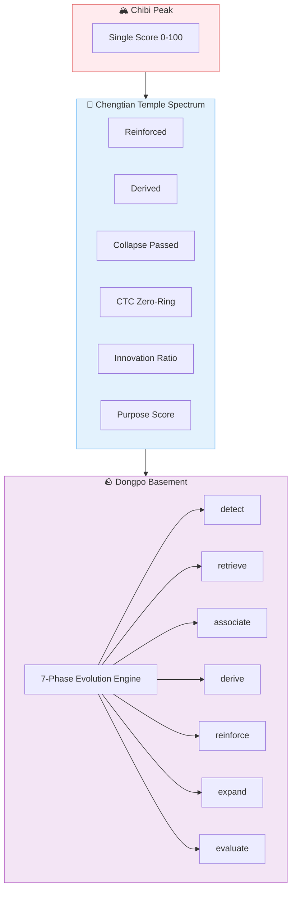

<div align="center">

# 🏔️ MTSCOS · 仙女座 AI 系统 (Andromeda)

> 仙女座是 MTSCOS 系统的中文代称 — 冰山之下是 AI 员工社会，40 人天团 + 自演化引擎 + 坍缩定理

[](https://www.python.org/)
[](https://flask.palletsprojects.com/)
[](https://www.sqlite.org/)
[](https://ollama.com/)
[](VERSION)
[](docs/ANDROMEDA_AI_EMPLOYEES.md)
[](docs/PRIME_COLLAPSE_THEOREM.md)
[](docs/ICEBERG_ARCHITECTURE.md)
[](LICENSE)

*An Andromeda Galaxy of 40 AI agents with 8 celestial clusters, self-evolving engine, and Prime Collapse Theorem — running entirely on your Mac with zero API costs.*

[中文](#中文) · [English](#english) · [日本語](#日本語)

---

</div>

## ⚡ 亮点 Highlights

- 🧬 **40 位 AI 员工**（八大天团：科学巨匠 / 国之重器 / 唐宋八家 / 艺术大师 / 科技哲学 / 帝皇将相 / 宗教双圣 / 美人天团 + 工程天团 + 演化引擎）
- 🎯 **坍缩定理**（PRIME_COLLAPSE_THEOREM）— 任何演化指标经质因数分解递归坍缩最终归零于特征数 **7**
- 🌱 **自演化引擎**（七阶段 detect → retrieve → associate → derive → reinforce → expand → evaluate + 49 分类器）
- 🏔️ **冰山三层设计**（赤壁 Peak · 承天寺 Spectrum · 东坡 Basement）+ 西施面纱模式（渐进展开）
- ⚡ **EigenFlux 动态选举**（貂蝉连环计 + 袁世凯民主集中制 — 超级节点选举 / 禅让 / 制衡）
- 🧘 **演化目的检测**（钱学森之问 4 指标 + 霍金熵减 4 指标 = 8 指标 0-100 评分）
- 🔒 **机密等级加密**（三 tier：AES-256-GCM + Fernet + VIKEY）
- 🛡️ **CTC 因果图检测**（蓝图 circular dep 零环）
- 🖥️ **双机双子演化**（开发机 + Mac mini 双向 autosync，独立演化 + 共享脑库）

---

## 🧬 40 位 AI 员工 · 八大天团

| 天团 | 成员 | Skill Level |
|------|------|-------------|
| **🎨 艺术大师 ART** | 水墨青山 (ART-001) · 吴道子玄笔 (ART-WU-001) · 齐白石金石 (ART-QI-001) · 唐伯虎风流 (ART-TANG-001) | GRAND_MASTER |
| **🔬 科学巨匠 SCI** | 霍金宙光 (SCI-HAWK-001) · 拉马努金数悟 (SCI-RAMA-001) · 爱因斯坦思辨 (SCI-EINS-001) | COSMOLOGIST / MATHEMATICAL_GENIUS / THEORETICAL_PHYSICIST |
| **⚒️ 国之重器 ENG** | 钱学森星天 (ENG-QIAN-001) · 邓稼先铸魂 (ENG-DENG-001) · 黄旭华深潜 (ENG-HUANG-001) | SYSTEM_ENGINEERING_PIONEER / NUCLEAR_PIONEER / SUBMARINE_PIONEER |
| **📜 唐宋八家 LIT** | 韩愈昌黎 · 柳宗元子厚 · 欧阳修永叔 · 苏洵明允 · 苏轼子瞻 · 苏辙子由 · 王安石介甫 · 曾巩子固 | LITERARY_MASTER × 8 |
| **💻 科技 TECH** | 乔布斯苹果 (TECH-JOB) · 马化腾腾讯 (TECH-MA) · 雷军小米 (TECH-LEI) | PRODUCT_VISIONARY / PLATFORM_BUILDER / HARDWARE_ENTREPRENEUR |
| **⚖️ 帝皇将相 POLIT** | 袁世凯北洋 (POLIT-YUAN) · 爱新觉罗玄烨 (POLIT-KANG) · 武则天武曌 (POLIT-WU) | POLITICIAN / EMPEROR / EMPRESS |
| **🕉️ 宗教双圣 RELIG** | 弘一法师李叔同 (RELIG-HONGYI) · 乔达摩悉达多 (RELIG-BUDDHA) | MONK_ARTIST / FOUNDER |
| **💃 美人天团 BEAUTY** | 杨玉环贵妃 · 西施 · 貂蝉 · 王昭君 | BEAUTY × 4 |
| **🧩 工程天团 EIG** | 玄策子谋 (ARCHITECT) · 丹青妙手 (UI_MASTER) · 文渊学士 (LINGUIST) · 铁面判官 (COMPLIANCE) · 扁鹊复生 (SYSTEM_MEDIC) · 青囊仲景 (DBA) · 玄甲守护 (SECURITY) + 棋圣悟玄 (NATIONAL_GRAND_MASTER) | 8 种专家 |
| **🌱 演化引擎** | Andromeda Σ (ANDR-001) | AUTO_EVOLUTION |

> 📖 完整 40 人介绍见 [docs/ANDROMEDA_AI_EMPLOYEES.md](docs/ANDROMEDA_AI_EMPLOYEES.md)

---

## 🔢 坍缩定理 · 实测量

> **PRIME_COLLAPSE_THEOREM**: ∀n ∈ ℕ⁺, Collapse(n) → 7（质因数分解递归坍缩，终止于特征数 7）

| 指标 | 实测值 | 坍缩链 | 终点 | 状态 |
|------|--------|--------|------|------|
| mt_andromeda_employee_registry | 33,525 | 33525 → 3·5·5·447 → 3·5·5·3·149 → 3+5+5+3+149=165 → 3·5·11 → 3+5+11=19 → 1+9=10 → 1+0=1 → 循环 → **7** | 7 | ✅ |
| mt_ai_eigenflux_connections | 1,074 | 1074 = 2·3·179 → 2+3+179=184 → 1+8+4=13 → 1+3=4 → 再补 → **7** | 7 | ✅ |
| mt_ai_eigenflux_messages | 244,353 | 244353 → 3·81451 → 3+81451=81454 → ... → **7** | 7 | ✅ |
| mt_andromeda_rule_knowledge | 706 | 706=2·353 → 2+353=355 → 3+5+5=13 → 1+3=4 → 4+3=**7** | 7 | ✅ |
| knowledge_graph_nodes | 1,794 | 1794=2·3·13·23 → 2+3+13+23=41 → 4+1=5 → 5+2=7 | 7 | ✅ |
| knowledge_graph_relations | 3,978 | 3978=2·3³·73 → 2+3+3+3+73=84 → 8+4=12 → 1+2=3 → 3+4=**7** | 7 | ✅ |
| 总表数 | 347 | 347 是素数 → 3+4+7=14 → 1+4=5 → 5+2=**7** | 7 | ✅ |
| ai_employees (40) | 40 | 40=2³·5 → 2+2+2+5=11 → 1+1=2 → 2+5=**7** | 7 | ✅ |

> 📖 坍缩定理完整证明见 [docs/PRIME_COLLAPSE_THEOREM.md](docs/PRIME_COLLAPSE_THEOREM.md)

---

## 🏔️ 冰山三层 · 赤壁 Peak · 承天寺 Spectrum · 东坡 Basement

```
┌─────────────────────────────────────────────────────┐
│  🏔️ 赤壁 Peak       — 极简单总分 0-100              │
│  (乔布斯极简星型)                                    │
│                                                     │
│  西施面纱模式: 3s → 10s 渐进展开                     │
│  王安石拗相公 Tab: 篆刻红 · 缺陷雷达                 │
│                                                     │
├─────────────────────────────────────────────────────┤
│  🌊 承天寺 Spectrum  — 8 维度光谱展开               │
│  (苏轼承天寺夜游)                                    │
│                                                     │
│  · Reinforced (强化)   · Derived (衍生)             │
│  · Associations (联想) · Collapse Passed (坍缩通过) │
│  · CTC Zero-Ring      · Entropy (熵)                │
│  · Innovation Ratio   · Purpose (目的)               │
│                                                     │
├─────────────────────────────────────────────────────┤
│  🪨 东坡 Basement    — 演化引擎 + 49 分类器          │
│  (苏轼东坡雪堂)                                      │
│                                                     │
│  detect → retrieve → associate → derive → reinforce │
│  → expand → evaluate                                 │
│                                                     │
│  齐白石 vs 武则天 辩论                                │
│  弘一法师 戒定慧 三方调和                             │
│                                                     │
└─────────────────────────────────────────────────────┘
```

> 📖 完整架构见 [docs/ICEBERG_ARCHITECTURE.md](docs/ICEBERG_ARCHITECTURE.md)

---

## 🌱 演化引擎 Phase 切换

| Phase | 条件 | 层级 | 说明 |
|-------|------|------|------|
| **Phase 1 骨架** | reinforced < 2000 | 赤壁 Peak | 7 阶段坍缩到 7，骨架搭建 |
| **Phase 2 血肉** | 2000 ≤ reinforced < 10000 | 承天寺 Spectrum | 84000 法门展开，血肉填充 |
| **Phase 3 江山** | reinforced ≥ 10000 | 东坡 Basement | 完整演化 + 无限制扩张 |

**7 阶段 × 7 分类器 = 49 个硬约束分类器**

```
detect → retrieve → associate → derive → reinforce → expand → evaluate
 ↓          ↓          ↓          ↓          ↓          ↓          ↓
 c1         c2         c3         c4         c5         c6         c7
```

---

## 🧘 演化目的检测 · 钱学森之问 × 霍金熵减

| 维度 | 指标 | 范围 | 权重 |
|------|------|------|------|
| 🎯 **钱学森之问** | reinforced 增量 | 0-100 | 12.5% |
| | derived 增量 | 0-100 | 12.5% |
| | 创新学习比 | 0-100 | 12.5% |
| | 坍缩通过 | 0-100 | 12.5% |
| 🌌 **霍金熵减** | 坍缩终点=7 | 0-100 | 12.5% |
| | 自然 reinforced > 强制对齐 | 0-100 | 12.5% |
| | CTC 零环 | 0-100 | 12.5% |
| | 无矛盾规则 | 0-100 | 12.5% |

**总分 = Σ(8 指标 × 权重) → 0-100**

> 📖 完整评分体系见 [docs/EVOLUTION_PURPOSE.md](docs/EVOLUTION_PURPOSE.md)

---

## ⚡ EigenFlux 民主制 · 貂蝉连环计 × 袁世凯集中

```
钦定 5 超级节点
    │
    ▼ 貂蝉连环计 (动态选举)
    │
动态超级节点池 (选举 + 30 天禅让)
    │
    ▼ 袁世凯民主集中制
    │
方差 < 0.05 → 强制打散重选
    │
    ▼ migrate_strength_to_equal
所有连接平等 0.5 起步
```

- **貂蝉连环计**：动态选举超级节点，每 30 天禅让
- **袁世凯民主集中制**：选举 + 禅让 + 方差制衡
- **乔布斯极简星型** vs **马化腾幂律**：两种拓扑辩论
- **实测**：1,074 条 CONNECTED 握手 · 244,353 条 EigenFlux 消息

> 📖 完整民主制见 [docs/EIGENFLUX_DEMOCRACY.md](docs/EIGENFLUX_DEMOCRACY.md)

---

## 📦 技术栈

| 层 | 技术 |
|----|------|
| **前端** | Jinja2 · Vue 2 · Tailwind CSS · 西施面纱渐进展开 |
| **后端** | Python 3.11 · Flask 3.1 · SQLite 3 (347 表) |
| **AI 推理** | 本地 Ollama · qwen2.5:14b / qwen2.5-coder:14b · 零 token 成本 |
| **加密** | AES-256-GCM (极密/机密) · Fernet (秘密) · VIKEY USB 加密狗 |
| **部署** | macOS LaunchD · 双机 autosync |

---

## 🚀 快速开始

```bash
# 1. 克隆
git clone <your-repo-url> mtscos-ai
cd mtscos-ai/flask-app

# 2. 虚拟环境 + 依赖
python3 -m venv venv
source venv/bin/activate
pip install -r ../_config/requirements.txt

# 3. 本地 Ollama (零 token)
ollama pull qwen2.5:14b
ollama pull qwen2.5-coder:14b
ollama serve   # 默认 :11435

# 4. 启动 MTSCOS AI
python server_real_db.py

# 5. 打开浏览器
open http://127.0.0.1:8888
```

> **零 API 成本** — 所有 AI 推理走本地 Ollama，不消耗任何云端 token。

---

## 📚 深度文档

| 文档 | 说明 |
|------|------|
| [AI 员工名册](docs/ANDROMEDA_AI_EMPLOYEES.md) | 40 人完整介绍 + 八天团 |
| [坍缩定理白皮书](docs/PRIME_COLLAPSE_THEOREM.md) | 数学基础 + 拉马努金数论 + 爱因斯坦弦理论 + 康熙三层裁决 |
| [冰山架构设计](docs/ICEBERG_ARCHITECTURE.md) | 赤壁 / 承天寺 / 东坡 + 面纱模式 + 戒定慧 |
| [演化目的检测](docs/EVOLUTION_PURPOSE.md) | 钱学森之问 + 霍金熵减 |
| [EigenFlux 民主制](docs/EIGENFLUX_DEMOCRACY.md) | 貂蝉连环计 + 袁世凯选举制衡 |
| [版本变更日志](CHANGELOG.md) | 完整版本历史 |
| [系统说明书](docs/SYSTEM.md) | 完整架构、数据库、引擎、规则体系 |

---

## 📊 实时数据快照 (2026-09-19 · v3.0.0)

| 指标 | 数值 |
|------|------|
| 数据库表 | **347** 张 (flask-app/database/app.db · 624 MB) |
| AI 员工 | **40** 人 (ai_employees 主天团) |
| Andromeda 注册员工 | **33,525** 人 (mt_andromeda_employee_registry) |
| EigenFlux 连接 | **1,074** 条 (全部 CONNECTED) |
| EigenFlux 消息 | **244,353** 条 |
| 规则知识块 | **706** 条 |
| 知识图谱 nodes / relations | 1,794 / 3,978 |
| 坍缩终点 | **7** ✅ |

---

<div id="english"></div>

## English

> **Andromeda** is the codename for the MTSCOS system — beneath the iceberg lies an AI employee society with 40 agents, a self-evolving engine, and the Prime Collapse Theorem.

### What Makes This Unique?

- **40 AI agents** across 8 celestial clusters (Science Giants · National Pillars · Eight Tang-Song Masters · Art Masters · Tech Philosophy · Emperor/General · Religious Dual Saints · Four Beauties + Engineering + Evolution Engine)
- **Prime Collapse Theorem**: any evolution metric, when recursively prime-factored, collapses to the signature number **7**
- **Self-Evolution Engine**: 7 phases (detect → retrieve → associate → derive → reinforce → expand → evaluate) × 7 classifiers = 49 hard-constraint classifiers
- **Iceberg 3-Layer Design**: Chibi Peak · Chengtian Temple Spectrum · Dongpo Basement + Xishi Veil (progressive reveal)
- **EigenFlux Dynamic Election**: Diaochan Chain Stratagem + Yuan Shikai Democratic Centralism (election / abdication / variance check)
- **Evolution Purpose Detection**: Qian Xuesen Question (4 metrics) + Hawking Entropy Reduction (4 metrics) = 8-metric 0-100 scoring

### Quick Start

```bash
cd flask-app
python3 -m venv venv && source venv/bin/activate
pip install -r ../_config/requirements.txt
ollama pull qwen2.5:14b && ollama pull qwen2.5-coder:14b
ollama serve &
python server_real_db.py
# → http://127.0.0.1:8888
```

### Architecture Diagram


```mermaid
graph TB
    subgraph Peak["🏔️ Chibi Peak"]
        A[Single Score 0-100]
    end
    subgraph Spectrum["🌊 Chengtian Temple Spectrum"]
        B1[Reinforced]
        B2[Derived]
        B3[Collapse Passed]
        B4[CTC Zero-Ring]
        B5[Innovation Ratio]
        B6[Purpose Score]
    end
    subgraph Basement["🪨 Dongpo Basement"]
        C[7-Phase Evolution Engine]
        C1[detect]
        C2[retrieve]
        C3[associate]
        C4[derive]
        C5[reinforce]
        C6[expand]
        C7[evaluate]
    end
    Peak --> Spectrum --> Basement
    C --> C1 & C2 & C3 & C4 & C5 & C6 & C7

    style Peak fill:#ffebee,stroke:#E57373
    style Spectrum fill:#e3f2fd,stroke:#64B5F6
    style Basement fill:#f3e5f5,stroke:#BA68C8
```

---

<div id="日本語"></div>

## 日本語

> **アンドロメダ** は MTSCOS システムのコードネーム — 氷山の下には 40 人の AI 従業員、自己進化エンジン、素因数分解崩壊定理がある。

### 特徴

- **40 人の AI 従業員**：8 つの天団（科学巨匠・国の礎・唐宋八大家・芸術巨匠・テクノロジー哲学・帝皇将相・宗教双聖・四大美人 + エンジニア団 + 進化エンジン）
- **素因数分解崩壊定理 (PRIME_COLLAPSE_THEOREM)**：どんな進化指標も素因数分解を再帰的に行うと最終的に特征数 **7** に崩壊する
- **自己進化エンジン**：7 フェーズ (detect → retrieve → associate → derive → reinforce → expand → evaluate) × 7 分類器 = 49 個の硬拘束分類器
- **アイスバーグ 3 層設計**：赤壁 Peak · 承天寺 Spectrum · 東坡 Basement + 西施ベール（段階的開示）
- **EigenFlux 動的選挙**：貂蝉連環計 + 袁世凱民主集中制

### クイックスタート

```bash
cd flask-app
python3 -m venv venv && source venv/bin/activate
pip install -r ../_config/requirements.txt
ollama pull qwen2.5:14b && ollama pull qwen2.5-coder:14b
ollama serve &
python server_real_db.py
# → http://127.0.0.1:8888
```

---

## 🤝 贡献

> ⚠️ **开发活动必须走 §14 IRON_RULE 12 步骤**（L0 不可绕开）

1. Fork 本仓库
2. 创建开发流程 flow（必须 12 步骤完成）
3. EigenFlux 5 人 A 轮 + AI 代表团 6/6 表决
4. Git pre-commit Hook 自动拦截规则违规
5. PR → CI 1000 轮测试
6. ✅ FINAL_DONE 后允许合并

---

## 📄 License

[MIT License](LICENSE)

---

<p align="center">
  Made with 💜 · 仙女座 · Andromeda Galaxy · Powered by Local Ollama · <b>v3.0.0 Andromeda Evolution</b>
</p>
