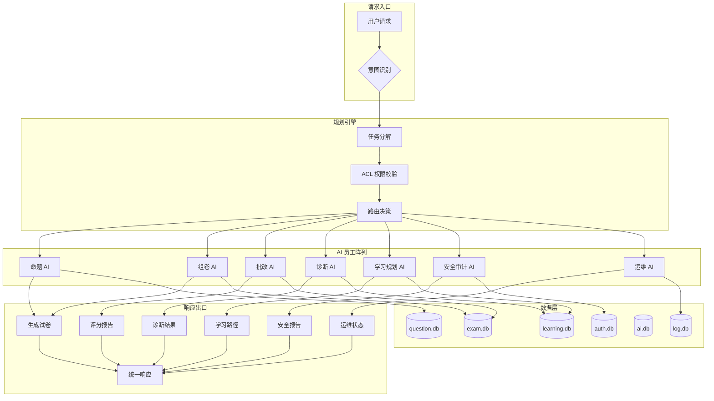
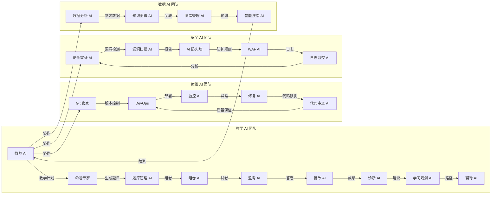

# MTSCOS AI 项目思维导图

```mindmap
## **MTSCOS AI**
### **核心愿景**
- 自治 AI 学区运营团队
- 自动化整个教育生态系统
- 人机协同，让教师专注创造性工作
### **MTS 架构 v2.0**
- 规划引擎
  - 意图识别
  - 任务分解
  - ACL 权限校验
  - 路由决策
- 执行 AI 员工阵列
  - 550+ 专业 AI 员工/引擎、47 Agent
  - 可拔插技能进化
  - 任务可委托
  - 故障可熔断恢复
- 基础设施层
  - 分片 SQLite（9+ 分片，87 张表）
  - 内存发布订阅
  - 多级缓存
  - 透明故障转移
### **AI 员工体系**
- 教学领域
  - 教师 AI
  - 学生 AI
  - 命题专家
  - 作业批改员
  - AI 辅导老师
- 运维领域
  - Git 管家
  - DevOps Agent
  - 布局修复员
  - 代码修复员
  - 日志监控员
- 安全领域
  - 安全审计员
  - 漏洞扫描员
  - AI 防火墙
- 数据领域
  - 数据分析员
  - 脑库管理员
  - 知识图谱工程师
### **核心功能矩阵**
- 题库与考试
  - 统一题库（11 学科 × 7 题型 × 3 Bloom）
  - 动态题目引擎
  - AI 智能组卷
  - 智能监考系统
- 学习与辅导
  - 自适应学习路径（IRT + RL）
  - 薄弱诊断引擎
  - 智能错题本
  - 学情分析仪表盘
- 管理门户
  - 16 角色权限管理
  - 超管 UX（硬件加固）
  - VIKEY 硬件密钥登录
- 安全与治理
  - RBAC + ABAC 双模型
  - 企业级 WAF
  - 不可变审计日志
  - CI 安全扫描矩阵
### **技术栈**
- 后端
  - Python 3.9+
  - Flask 3.x
  - SQLite 分片数据库（9+ 分片，87 张表）
  - Redis（可选）
- AI 引擎
  - GPT-4o / Claude-3.5 / Qwen2.5
  - Llama-3 / Gemini / DeepSeek
  - 火山方舟 / 通义千问
- 前端
  - HTML5 / CSS3 / JavaScript
  - Jinja2 模板引擎
  - 响应式设计
  - 移动端适配
### **安全架构**
- 认证层
  - VIKEY 硬件密钥
  - 6 位挑战码
  - Session + CSRF
- 防护层
  - SQLi / XSS / RCE 防护
  - SSRF / LFI 防护
  - 暴力破解限流
- 审计层
  - 操作日志
  - 登录日志
  - 数据变更日志
### **自维护能力**
- 8 维自动修复
  - 表结构修复
  - 配置校正
  - 缓存清理
  - 连接池重建
  - 版本回滚
  - 数据恢复
  - 索引重建
  - ACL 校准
- 预防式诊断
  - 8 维健康检查
  - 性能监控
  - 异常检测
  - 自动上报
### **版本路线图**
- v17.22.x - 超管 UX 统一版 ✅
- v17.23 - 题目扩展 v3 🚧
- v17.24 - 角色孪生 AI 学区 🚧
- v18.0 - MTS 架构 v3 🔭
### **设计哲学**
- AI 优先（AI-First）
- 模块化架构
- 分布式思维
- 自我进化
- 安全内置
```

---

## 架构流程图



---

## AI 员工协作图谱


