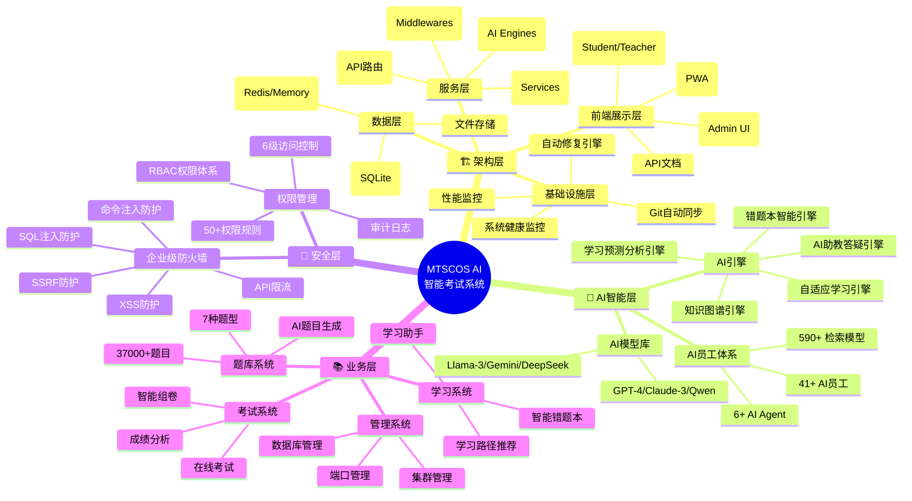
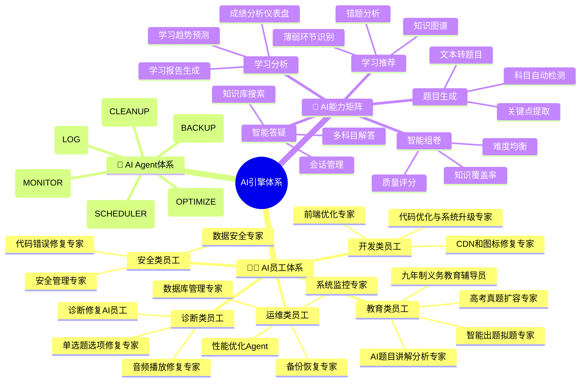
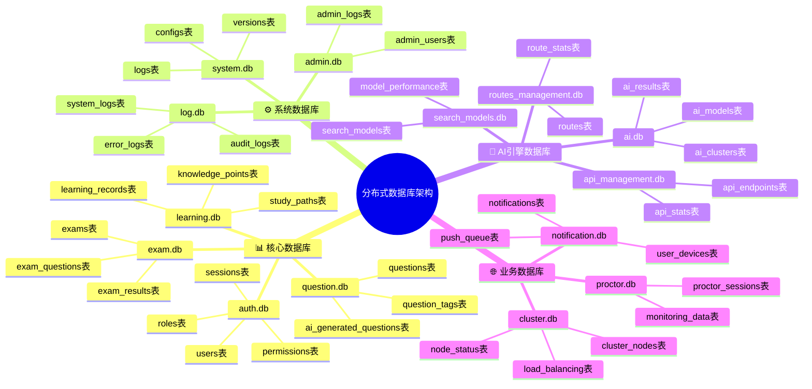
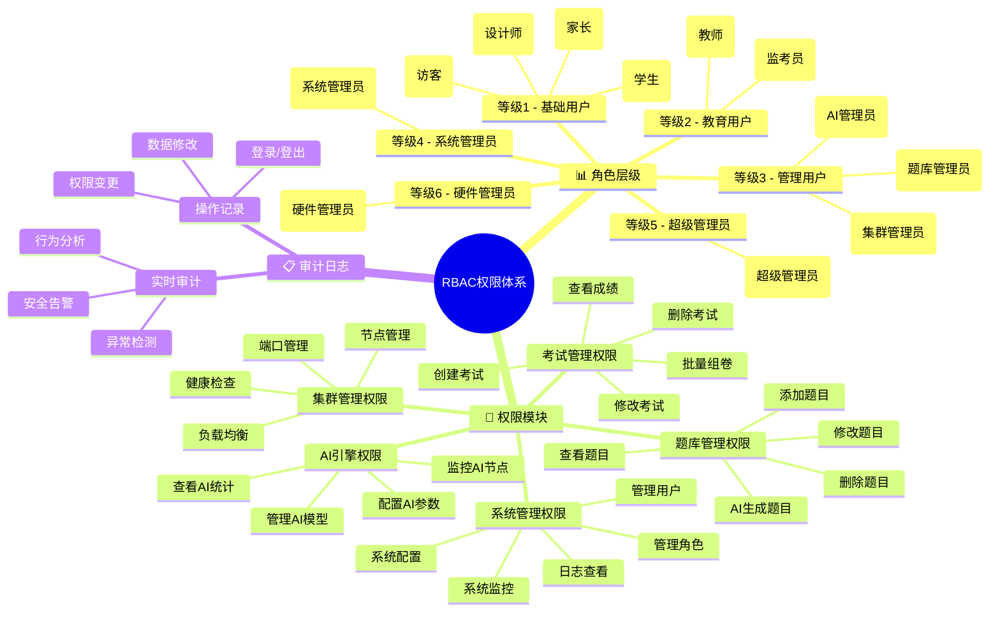
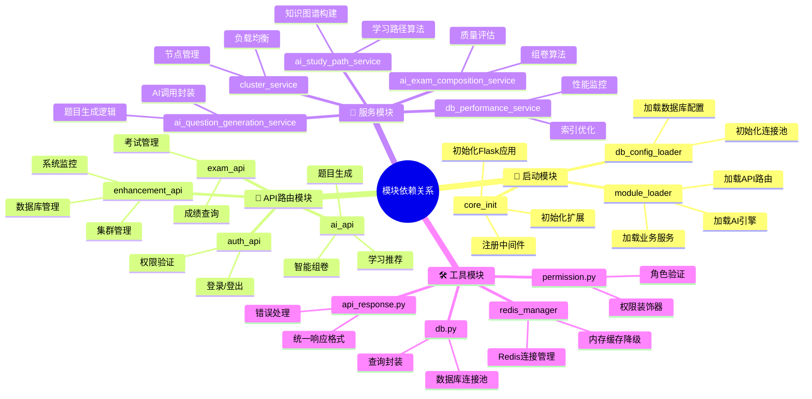
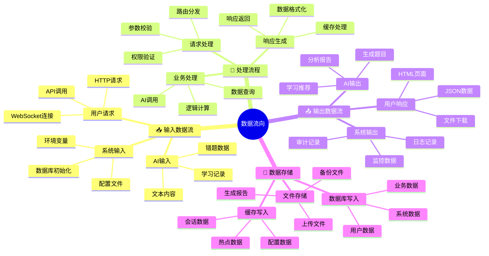
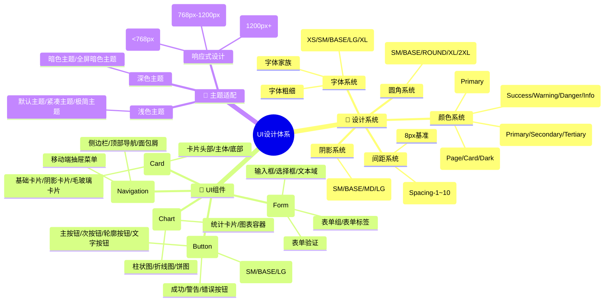
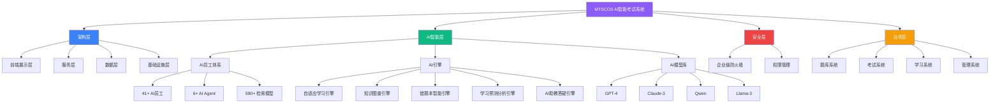

# MTSCOS AI 系统设计思维导图

> 更新日期: 2026-07-11
> 📖 **说明**: 本文件使用Mermaid mindmap语法编写，GitHub原生支持渲染。如遇渲染问题，请查看文档末尾的Flowchart版本。

---

## 🗺️ 1. 系统架构总览

---

## 🤖 2. AI引擎模块图

---

## 🗄️ 3. 数据库分布图

---

## 🔐 4. 用户角色权限图

---

## 🏗️ 5. 模块依赖关系图

---

## 📊 6. 数据流向图

---

## 🎨 7. UI设计体系图

---

## 📊 Flowchart兼容版本

---

> 📖 **提示**: 在GitHub上查看此文档时，Mermaid思维导图会自动渲染为交互式图形。
> 🎨 设计遵循项目《设计规范》中的颜色变量和主题风格。
> ⚠️ **兼容性**: 如果mindmap无法正常渲染，Flowchart版本提供了同等信息的可视化展示。