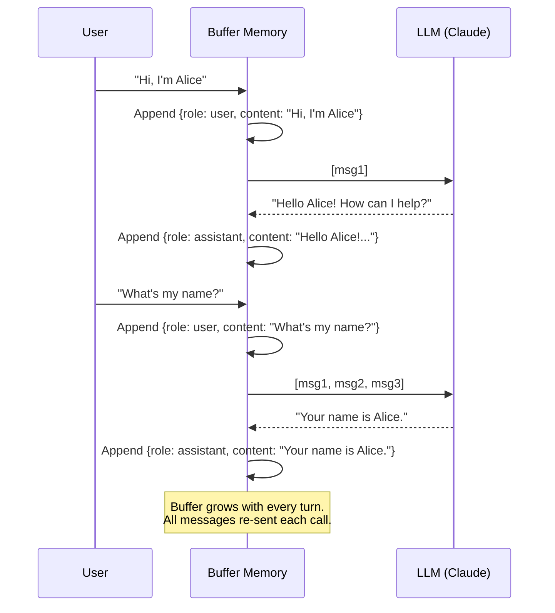

# Conversation Buffer Memory

  

## 📖 At a Glance

| Difficulty | Time | Prerequisites |
|------------|------|---------------|
| Beginner | ~15 min | Python 3.8+, `ANTHROPIC_API_KEY`, basic understanding of LLMs and chat APIs |

This technique is for developers building their first LLM chatbot who want to understand the foundation that all other memory patterns build on.

## TL;DR

- **What it is:** **Conversation Buffer Memory** stores the entire chat history verbatim and re-sends it to the LLM on every call.
- **When you need it:** Your conversation is short enough to fit inside the model's context window with room to spare.
- **The trade-off:** Token cost grows linearly with conversation length and eventually overflows the context window.
- **Closest alternative in this repo:** 02 Sliding Window Memory keeps only the last K messages instead of all of them.

## Description

Think of a tape recorder that never pauses. It captures every word of your conversation with an AI agent. When the agent needs to reply, it replays the entire tape from the start. This gives the agent perfect memory. The catch? Tapes have a limited length, and this one can't be compressed.

Conversation Buffer Memory is the most straightforward agent memory technique for LLM-based chat applications. It stores the complete conversation history (every user message and assistant response) word-for-word inside the context window. Each time the model responds, it reads the full message list as input. This makes it a natural fit for short-lived chatbots, prototyping, and any scenario where perfect recall of every turn matters. The tradeoff is cost: because the token budget (the amount of text a model can process at once) is finite, an unbounded buffer will eventually overflow it.

**Keywords:** agent memory, conversation buffer memory, LLM agent, context window, conversation history, chat memory, token budget, message list, short-term memory, chatbot memory

Each time the agent responds, it receives the entire message list as context. "Context" here means the text the model reads before producing an answer. This approach is quick to build and easy to reason about. However, it has one critical limit: the context window (the maximum text a model can process at once) is finite. An unbounded history will eventually exceed it.

Understanding this technique matters because nearly every other memory pattern builds on it or improves it.

## Key Concepts

- **Message list:** The core data structure. It's an ordered list of messages, each with a role (system, user, or assistant) and a content string.
- **Role tracking:** Keeping the correct alternation of roles so the LLM knows who said what throughout the conversation.
- **Context injection:** Inserting the stored message history into each new LLM prompt. This is how the agent maintains continuity across turns.
- **Token counting:** Monitoring how many tokens (the word-pieces a model uses internally) the history consumes relative to the model's context window limit.
- **Conversation persistence:** Saving the message list to durable storage (files, databases) so conversations survive across sessions. Serializing means converting the list into a storable format like JSON.

## Architecture

  

Mermaid source

---

## How It Works

1. You send a message.
2. The system appends it to a list with the role `user`.
3. The entire list goes to the LLM as the prompt.
4. The LLM response gets appended with the role `assistant`.
5. Steps 1-4 repeat until the conversation ends or the context window fills up.

## When to Use

- Short conversations where the total token count stays well within the model's context window.
- Prototyping and development, where simplicity matters more than efficiency.
- Scenarios that require perfect recall of every detail in the conversation.

## Limitations

- No mechanism to handle conversations that exceed the context window.
- Cost scales linearly with conversation length. Every token is re-sent on each call.
- Not suitable for long-running agent interactions without additional techniques.

## Notebook

**[conversation_buffer_memory.ipynb](conversation_buffer_memory.ipynb)**: A complete, runnable notebook covering:

- Building a `ConversationBufferMemory` class from scratch using the **Anthropic SDK** (Anthropic's Python library for calling Claude).
- Multi-turn conversation demo showing perfect recall across turns.
- **Token-growth visualization** with matplotlib. It proves linear per-turn and quadratic cumulative cost.
- JSON-based persistence (save/load conversations).
- Side-by-side comparison with **LangChain's `ConversationBufferMemory`**.

## FAQ

### Q: What is Conversation Buffer Memory in agent memory?

**A:** Conversation Buffer Memory stores every message in a chat session and sends the full history to the LLM on each call. This gives the model perfect recall of everything said so far. The trade-off is linear token growth: a 100-turn conversation at roughly 50 tokens per turn consumes about 5,000 context tokens. LangChain implements this as `ConversationBufferMemory`. It works best for short conversations (under 20 turns) where full fidelity matters more than cost.

### Q: When should I use Conversation Buffer Memory instead of Sliding Window Memory?

**A:** Use Conversation Buffer Memory when your conversations are short (under 20 turns) and every detail matters. Sliding Window Memory (technique 02) drops older messages after K turns, which saves tokens but loses early context. If your agent needs to reference the first message in turn 15, the buffer approach is safer. Once conversations grow beyond 30-50 turns, switch to a window or summary approach to control costs.

### Q: What are the limits or failure modes of Conversation Buffer Memory?

**A:** The primary failure mode is context window overflow. As conversations grow, token usage increases linearly until it exceeds the model's limit (4k-200k tokens depending on the model). At that point, the call either fails or silently truncates. Long conversations also increase latency and cost per call. There is no graceful degradation: you get full recall until you hit the wall, then nothing.

### Q: Can I combine Conversation Buffer Memory with another memory technique?

**A:** Yes. A common pattern pairs it with technique 06 (Vector Store Memory). Keep the buffer for the current session's full history and write completed sessions to a vector store. On each turn, retrieve the top 3-5 relevant past exchanges from the vector store and prepend them to the buffer. This gives you perfect short-term recall and approximate long-term recall without unbounded token growth.

### Q: What library or framework can I use to skip the implementation work?

**A:** LangChain provides `ConversationBufferMemory` as a ready-made class that plugs into any chain or agent. LlamaIndex offers `ChatMemoryBuffer` for equivalent functionality. Mem0 (technique 25) can also handle buffer-style storage with automatic persistence. For a managed solution, Zep (technique 27) stores full conversation history server-side and handles retrieval for you. All four options support Python and require minimal setup code.

## References

- [LangChain ConversationBufferMemory](https://python.langchain.com/docs/modules/memory/types/buffer?utm_source=nirdiamant&utm_medium=github&utm_campaign=agent_memory_techniques)
- [OpenAI Chat Completions API: Message Format](https://platform.openai.com/docs/guides/text-generation?utm_source=nirdiamant&utm_medium=github&utm_campaign=agent_memory_techniques)
- Harrison Chase, "Memory in LLM Applications," LangChain Documentation
- [LlamaIndex Chat Store Abstraction](https://docs.llamaindex.ai/en/stable/module_guides/storing/chat_stores/?utm_source=nirdiamant&utm_medium=github&utm_campaign=agent_memory_techniques)

## Related Techniques

- [**02 Sliding Window Memory**](../02_sliding_window_memory/) - Adds a size cap by keeping only the last *k* messages. A natural next step when your buffer grows too large.
- [**03 Summary Memory**](../03_summary_memory/) - Compresses the full history into a running summary instead of storing it raw. Trades exact recall for lower token cost.
- [**04 Summary Buffer Memory**](../04_summary_buffer_memory/) - Combines this technique with summary memory, keeping recent messages intact while summarizing older ones.
- [**05 Token Buffer Memory**](../05_token_buffer_memory/) - A token-aware cousin that trims by a strict token budget instead of message count.

---

