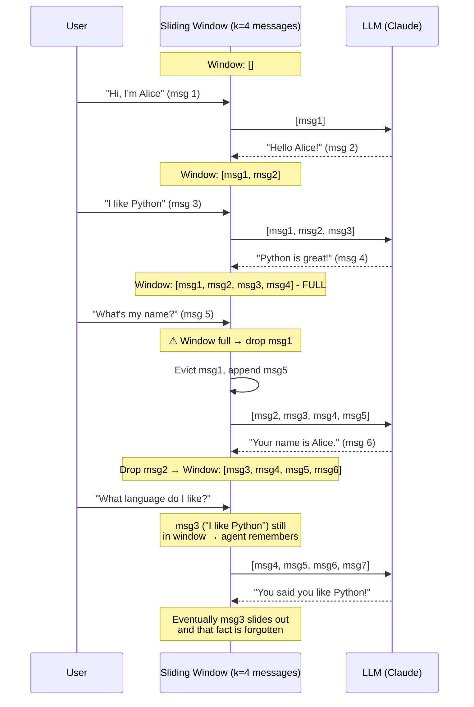

# Sliding Window Memory

  

## 📖 At a Glance

| Difficulty | Time | Prerequisites |
|------------|------|---------------|
| Beginner | ~20 min | Python 3.8+, `ANTHROPIC_API_KEY`, understanding of 01 Conversation Buffer Memory recommended |

This technique is for developers who need a fixed-size conversation history that prevents token overflow while keeping recent context intact.

## TL;DR

- **What it is:** **Sliding Window Memory** keeps only the last K messages and drops older ones using first-in-first-out eviction.
- **When you need it:** You want bounded memory cost and only care about recent conversation context.
- **The trade-off:** The agent permanently forgets everything outside the window with no graceful degradation.
- **Closest alternative in this repo:** 05 Token Buffer Memory trims by token count rather than message count for finer control.

## Description

Imagine a whiteboard that only fits five sticky notes. When you add a sixth, you peel off the oldest one and throw it away. That's sliding window memory. You always see the most recent notes, but anything older disappears for good.

Sliding Window Memory is an agent memory technique that keeps only the last *k* messages in the conversation history. It uses FIFO eviction (first-in, first-out): when a new message arrives and the buffer is full, the oldest message drops out. This bounds your context window usage to a predictable maximum, making it one of the most practical LLM agent memory strategies for chat interfaces and customer support bots. The tradeoff is a hard recency bias: the agent remembers recent turns but permanently forgets earlier conversation history.

**Keywords:** agent memory, sliding window memory, LLM agent, FIFO eviction, context window, conversation history, recency bias, chat memory, message window, short-term memory

## Key Concepts

- **Window size *k*:** The maximum number of messages retained. Choosing *k* is a tuning decision. A larger *k* preserves more history but costs more tokens.
- **FIFO eviction:** When a new message arrives and the buffer is full, the oldest message drops out. The window "slides" forward in time.
- **Recency bias:** The model can only see recent context. Information from earlier in the conversation is permanently lost unless captured elsewhere.
- **Configurable window:** You can adjust the window size dynamically based on task requirements, model context limits, or conversation complexity.
- **Message-count vs. turn-count windows:** A window of *k* messages counts each individual message. A window of *k* turns counts user-assistant pairs. Turn-count windows keep exchanges intact and avoid orphaned messages (a response without its question).

## Architecture

  

Mermaid source

---

## How It Works

1. Maintain an ordered list of messages.
2. After each new message (user or assistant), check if `len(messages) > k`.
3. If the limit is exceeded, remove the oldest message(s) from the front of the list.
4. Send only the retained messages to the LLM for the next completion.

## When to Use

- Conversations where recent context matters most and older context is expendable.
- Cost-sensitive applications where you need to cap per-request token usage.
- Chat interfaces where users are unlikely to reference much earlier parts of the conversation.

## Limitations

- Hard information cutoff: anything beyond the window is gone.
- No graceful degradation. There's no summary or trace of what was discussed before the window.
- Choosing the right *k* requires experimentation. Too small loses critical context. Too large wastes tokens.

## Notebook

**[sliding_window_memory.ipynb](sliding_window_memory.ipynb)**: A hands-on notebook that builds a `deque`-based sliding window memory from scratch using the Anthropic SDK. It includes a controlled recall evaluation across different window sizes, token-cost comparison charts, and a discussion of how to choose the right *k*.

## FAQ

### Q: What is Sliding Window Memory in agent memory?

**A:** Sliding Window Memory keeps only the last K messages in the conversation history and discards older ones using FIFO (first-in, first-out) eviction. This bounds token usage to a predictable maximum regardless of conversation length. For example, with K=10 and roughly 50 tokens per message, you always spend about 500 tokens on history. LangChain implements this as `ConversationBufferWindowMemory` with a configurable `k` parameter.

### Q: When should I use Sliding Window Memory instead of Token Buffer Memory?

**A:** Use Sliding Window Memory when you want the simplest possible bounded-memory approach and message lengths are roughly uniform. Token Buffer Memory (technique 05) trims by token count, giving finer control when messages vary in length. If some messages are 10 tokens and others are 500, a message-count window wastes budget or overflows unpredictably. For chatbots with short, consistent turns, the sliding window is easier to reason about and configure.

### Q: What are the limits or failure modes of Sliding Window Memory?

**A:** The main failure mode is context amnesia. Once a message scrolls past the window, it is gone forever. The agent cannot recall early instructions, user preferences stated in turn 1, or prior agreements. If K is too small, the agent loses critical context mid-conversation. If K is too large, you approach the same cost problems as Conversation Buffer Memory. There is no graceful degradation, only a hard cutoff at K messages.

### Q: Can I combine Sliding Window Memory with another memory technique?

**A:** Yes. Pair it with technique 03 (Summary Memory) for a lightweight hybrid. Keep the last K messages verbatim in the window, and maintain a running summary of everything that scrolled out. This is exactly what technique 04 (Summary Buffer Memory) formalizes. You can also combine it with technique 06 (Vector Store Memory) to retrieve relevant older messages on demand while keeping the window for immediate context.

### Q: What library or framework can I use to skip the implementation work?

**A:** LangChain provides `ConversationBufferWindowMemory` with a `k` parameter out of the box. LlamaIndex offers `ChatMemoryBuffer` with a `token_limit` option that provides similar bounded behavior. For managed solutions, Zep (technique 27) and Mem0 (technique 25) both support configurable retention windows. If you need finer control at the token level rather than message level, see technique 05 (Token Buffer Memory) and LangChain's `ConversationTokenBufferMemory`.

## References

- [LangChain ConversationBufferWindowMemory](https://python.langchain.com/docs/modules/memory/types/buffer_window?utm_source=nirdiamant&utm_medium=github&utm_campaign=agent_memory_techniques)
- OpenAI Best Practices: Managing Tokens
- Lilian Weng, "LLM Powered Autonomous Agents," 2023
- [LlamaIndex ChatMemoryBuffer](https://docs.llamaindex.ai/en/stable/api_reference/memory/chat_memory_buffer/?utm_source=nirdiamant&utm_medium=github&utm_campaign=agent_memory_techniques)

## Related Techniques

- [**01 Conversation Buffer Memory**](../01_conversation_buffer_memory/) - The unbounded version of this technique. Stores everything, with no eviction.
- [**04 Summary Buffer Memory**](../04_summary_buffer_memory/) - Keeps a summary of what the sliding window loses, so older context isn't completely forgotten.
- [**05 Token Buffer Memory**](../05_token_buffer_memory/) - Trims by token count instead of message count. More precise when message lengths vary widely.

---

