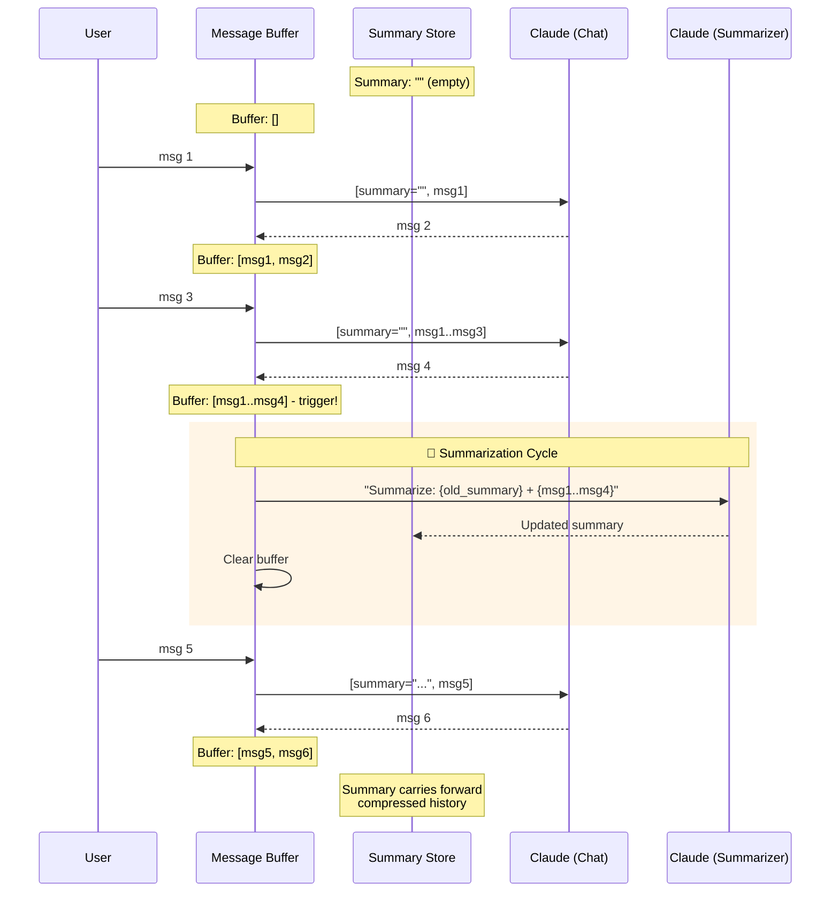

# Summary Memory

  

## 📖 At a Glance

| Difficulty | Time | Prerequisites |
|------------|------|---------------|
| Beginner | ~20 min | Python 3.8+, `ANTHROPIC_API_KEY`, understanding of 01 Conversation Buffer Memory recommended |

This technique is for developers who want to maintain long conversations without hitting token limits by compressing history into summaries.

## TL;DR

- **What it is:** **Summary Memory** replaces raw conversation history with a running LLM-generated summary that compresses all prior turns.
- **When you need it:** Your conversations regularly exceed the context window and you can tolerate lossy compression.
- **The trade-off:** Summaries lose detail, and each summarization step adds an extra LLM call with its own token cost.
- **Closest alternative in this repo:** 04 Summary Buffer Memory adds a verbatim buffer for recent messages on top of the summary.

## Description

Imagine reading a 300-page book and writing a one-page summary at the end of each chapter. You can't quote the book word-for-word anymore, but you still know what happened. That's how summary memory works. It trades exact wording for a high-level understanding that fits in a small space. The risk? Your summary might miss a detail you'll need later.

Summary Memory is an agent memory technique that replaces raw conversation history with a running LLM-generated summary. Instead of storing every message, the system periodically condenses the conversation into compact text using abstractive compression (extracting meaning and re-expressing it in fewer words). This can cut token usage dramatically, making it well suited for long-running chatbots and research assistants where the gist matters more than exact quotes. The tradeoff is information loss: the summary is a lossy representation that may omit details the model needs later.

**Keywords:** agent memory, summary memory, LLM agent, conversation summary, abstractive compression, token usage, long-term memory, progressive summarization, chat memory, information loss

## Key Concepts

- **Progressive summarization:** The system updates the summary incrementally as the conversation grows. It doesn't re-summarize everything from scratch each time.
- **Summary prompts:** Carefully written instructions tell the LLM how to produce useful summaries (for example, "preserve key decisions and open questions").
- **Information loss tradeoffs:** Every summary discards detail. The summarization prompt and strategy control what's preserved and what's lost.
- **Summary refresh triggers:** Rules that decide when to regenerate the summary. Common triggers: after every *n* messages, when a token threshold is exceeded, or on explicit request.
- **Abstractive compression:** Unlike truncation (cutting text off), summarization extracts meaning and re-expresses it concisely. This allows much higher compression ratios.

## Architecture

  

Mermaid source

---

## How It Works

1. The conversation begins with an empty summary.
2. Messages accumulate in a temporary buffer.
3. When a refresh trigger fires (for example, the buffer reaches *n* messages), the system sends the current summary and new messages to the LLM with a summarization prompt.
4. The LLM returns an updated summary, which replaces the old one.
5. The buffer clears, and the updated summary gets injected into future prompts as context.

## When to Use

- Long-running conversations where full history would exceed context limits.
- Applications where the gist matters more than exact wording.
- Scenarios where token cost is a primary concern and you can tolerate some information loss.

## Limitations

- Summarization itself costs tokens. Each summary refresh is an additional LLM call.
- Important details can be lost if the summarization prompt isn't well-tuned.
- No ability to retrieve exact quotes from earlier in the conversation.
- Summary quality depends on the summarization model's capability.

## Notebook

[**summary_memory.ipynb**](summary_memory.ipynb): Full implementation of rolling-summary memory with the Anthropic SDK. Includes a controlled experiment showing summary drift over long conversations, fact-retention heatmaps, token-cost comparisons across strategies, and practical mitigations for information loss.

## FAQ

### Q: What is Summary Memory in agent memory?

**A:** Summary Memory replaces the raw conversation history with a running LLM-generated summary. After each turn, the model compresses all prior context into a short paragraph. This keeps token usage roughly constant (typically 200-500 tokens for the summary) regardless of conversation length. LangChain implements this as `ConversationSummaryMemory`. The cost is an extra LLM call per turn to update the summary, plus loss of verbatim detail from earlier messages.

### Q: When should I use Summary Memory instead of Summary Buffer Memory?

**A:** Use pure Summary Memory when token budget is extremely tight and you do not need exact quotes from recent messages. Summary Buffer Memory (technique 04) keeps the last K messages verbatim alongside the summary, which doubles the memory overhead. If your model has a small context window (4k-8k tokens) and conversations run long (50+ turns), pure summarization gives you the most compression. Choose the buffer variant when recent-turn fidelity matters.

### Q: What are the limits or failure modes of Summary Memory?

**A:** Summaries lose detail with every compression step. Specific numbers, names, and exact phrasing often get dropped or distorted. The quality depends on the summarization model: a weak model produces lossy or hallucinated summaries. Each turn requires an extra LLM call, adding latency (200-500ms) and cost. Over very long conversations, the summary can drift, emphasizing recent topics and forgetting earlier ones. There is no way to recover lost details once compressed.

### Q: Can I combine Summary Memory with another memory technique?

**A:** Yes. Combine it with technique 06 (Vector Store Memory) for the best of both worlds. Write each message to a vector store before summarizing, so the summary handles general context and the vector store provides exact retrieval when needed. You can also layer it with technique 07 (Entity Memory): the summary tracks conversation flow while entity memory preserves structured facts about people, places, and things mentioned.

### Q: What library or framework can I use to skip the implementation work?

**A:** LangChain provides `ConversationSummaryMemory` with configurable LLM backends and prompt templates. LlamaIndex supports summary-based chat memory through its `ChatSummaryMemoryBuffer`. Mem0 (technique 25) handles summarization automatically in its managed pipeline. Letta/MemGPT (technique 26) uses a similar approach in its core memory tier, compressing older context into archival storage. For a fully managed option, Zep (technique 27) runs asynchronous summarization server-side.

## References

- [LangChain ConversationSummaryMemory](https://python.langchain.com/docs/modules/memory/types/summary?utm_source=nirdiamant&utm_medium=github&utm_campaign=agent_memory_techniques)
- Anthropic, "Long Context Window Strategies," Claude Documentation
- [Recursive Summarization with LLMs: Best Practices](https://arxiv.org/abs/2301.13848)
- LlamaIndex Summary Index

## Related Techniques

- [**04 Summary Buffer Memory**](../04_summary_buffer_memory/) - A hybrid that keeps recent messages word-for-word while summarizing older ones. Fixes this technique's weakness of losing recent detail.
- [**14 Memory Consolidation**](../14_memory_consolidation/) - A broader approach to compressing and reorganizing memories over time, inspired by how human brains consolidate during sleep.
- [**15 Memory Compaction**](../15_memory_compaction/) - Closely related compression strategy that merges and deduplicates stored memories to save space.

---

