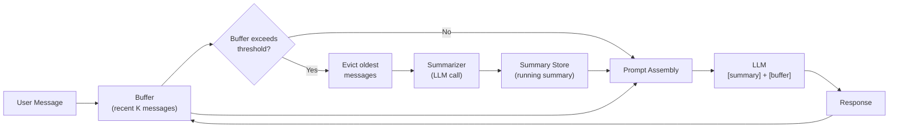

# Summary Buffer Memory

  

## 📖 At a Glance

| Difficulty | Time | Prerequisites |
|------------|------|---------------|
| Beginner | ~25 min | Python 3.8+, `OPENAI_API_KEY`, understanding of 01 Conversation Buffer Memory and 03 Summary Memory recommended |

This technique is for developers who want the best of both worlds: exact recall of recent messages combined with compressed older context.

## TL;DR

- **What it is:** **Summary Buffer Memory** keeps recent messages verbatim in a buffer while compressing older history into a running summary.
- **When you need it:** You need exact recall of the last few turns and approximate recall of earlier conversation.
- **The trade-off:** More complex to tune because you must balance buffer size, summary refresh rate, and token budget.
- **Closest alternative in this repo:** 03 Summary Memory uses pure summarization without a verbatim buffer for recent turns.

## Description

Think of how you remember a long phone call with a friend. You recall the last few sentences almost word-for-word. That's your short-term memory. The earlier parts? You remember the gist, not the exact words. That's your long-term memory. Summary Buffer Memory works the same way: it keeps recent messages intact and compresses older ones into a summary.

Summary Buffer Memory is a hybrid agent memory technique that combines conversation buffer and summary memory into one system. It keeps recent messages word-for-word while compressing older conversation history into a running LLM-generated summary. This dual-region design fits naturally into customer support agents, long-running chatbots, and any application that needs both precise recent context and historical awareness. The engineering challenge is tuning the transition threshold (the point where messages move from the buffer into the summary) and the token budget split between the two regions.

**Keywords:** agent memory, summary buffer memory, LLM agent, hybrid memory, conversation history, token budget, incremental summarization, context window, chat memory, dual-region memory

## Key Concepts

- **Buffer zone:** The most recent *k* messages stored word-for-word. These preserve exact wording, nuance, and details for immediate reasoning.
- **Running summary:** A short paragraph that captures key facts and themes from all messages that have aged out of the buffer.
- **Incremental summarization:** Instead of re-summarizing the full history each time, we fold newly evicted messages into the existing summary in a single LLM call.
- **Transition threshold:** The point at which messages age out of the buffer and get folded into the summary. You can trigger it by message count or token count.
- **Token budget allocation:** Deciding how many tokens to give to the summary versus the buffer. A typical split reserves 20-30% for the summary and 70-80% for recent messages.

## Architecture

  

Mermaid source

---

## How It Works

1. New messages are appended to the buffer.
2. When the buffer exceeds its configured threshold (for example, *t* tokens), the oldest buffer messages are removed.
3. Those removed messages get incorporated into the running summary via an LLM summarization call.
4. The next LLM prompt is assembled as: `[system] + [summary of older history] + [recent buffer messages]`.
5. This cycle continues. The summary grows and compresses while the buffer always reflects the latest exchanges.

## When to Use

- Medium to long conversations where you need both historical awareness and precise recent context.
- Customer support bots that must reference the full issue history while responding accurately to the latest message.
- Situations where pure summarization loses too much recent detail, but full buffer memory is too expensive.

## Limitations

- More complex to build than either pure buffer or pure summary memory.
- Requires tuning of buffer size, summary refresh frequency, and token budget split.
- The summary can lose important detail after many rounds of incremental summarization.
- Each eviction triggers an extra LLM call, which adds cost and latency.

## Notebook

See the [implemented notebook](./summary_buffer_memory.ipynb) for a complete, runnable implementation using the OpenAI SDK and tiktoken.

**What the notebook covers:**
- Building `SummaryBufferMemory` from scratch with token-based eviction.
- Incremental summarization with a dedicated summarizer prompt.
- A 9-turn example conversation showing eviction and summary evolution.
- Side-by-side token comparison with plain buffer memory.

## FAQ

### Q: What is Summary Buffer Memory in agent memory?

**A:** Summary Buffer Memory is a hybrid approach that keeps recent messages verbatim in a buffer while compressing older history into a running LLM-generated summary. This gives exact recall of the last K turns and approximate recall of everything before that. LangChain implements it as `ConversationSummaryBufferMemory` with a configurable `max_token_limit`. It balances the fidelity of buffer memory with the compression of summary memory.

### Q: When should I use Summary Buffer Memory instead of Summary Memory?

**A:** Use Summary Buffer Memory when you need exact quotes or details from the last few turns but also want long-conversation support. Pure Summary Memory (technique 03) compresses everything, including recent messages, losing verbatim detail. The buffer variant keeps the last 5-10 messages intact so the model can reference exact wording, code snippets, or numbers. Choose pure summary only when your token budget cannot afford any verbatim buffer.

### Q: What are the limits or failure modes of Summary Buffer Memory?

**A:** The older-than-buffer portion still suffers from summary drift and detail loss. Each eviction from the buffer triggers an LLM summarization call, adding latency (200-500ms) and cost. If the token limit is set too high, the buffer rarely triggers summarization and you get the same cost growth as Conversation Buffer Memory. If set too low, important recent messages get summarized too aggressively. Tuning the `max_token_limit` parameter requires experimentation for each use case.

### Q: Can I combine Summary Buffer Memory with another memory technique?

**A:** Yes. Pair it with technique 06 (Vector Store Memory) to recover details lost during summarization. Write every message to a vector store before it enters the buffer. When the agent needs a specific fact from the summarized portion, retrieve it from the vector store by semantic search. This gives you three tiers: verbatim buffer for recent context, summary for general flow, and vector search for on-demand detail recovery.

### Q: What library or framework can I use to skip the implementation work?

**A:** LangChain offers `ConversationSummaryBufferMemory` as a drop-in class with `max_token_limit` configuration. This is the most direct implementation. Letta/MemGPT (technique 26) uses a conceptually similar approach with its core memory (buffer) and archival memory (compressed storage). Zep (technique 27) provides managed summarization with automatic buffering. For custom implementations, the pattern requires roughly 50 lines of Python wrapping any LLM client.

## References

- [LangChain ConversationSummaryBufferMemory](https://python.langchain.com/docs/modules/memory/types/summary_buffer?utm_source=nirdiamant&utm_medium=github&utm_campaign=agent_memory_techniques)
- [MemGPT / Letta: Tiered Memory Management](https://arxiv.org/abs/2310.08560)
- Packer et al., "MemGPT: Towards LLMs as Operating Systems," 2023
- [LlamaIndex ChatSummaryMemoryBuffer](https://docs.llamaindex.ai/en/stable/api_reference/memory/?utm_source=nirdiamant&utm_medium=github&utm_campaign=agent_memory_techniques)

## Related Techniques

- [**01 Conversation Buffer Memory**](../01_conversation_buffer_memory/) - The full-buffer side of this hybrid. Useful when conversations are short enough that you don't need summarization.
- [**03 Summary Memory**](../03_summary_memory/) - The summary side of this hybrid. Good for understanding pure summarization before adding a buffer region.
- [**05 Token Buffer Memory**](../05_token_buffer_memory/) - A token-aware alternative that trims by token count. Combine its precision with this technique's summarization for even tighter control.
- [**26 Letta/MemGPT Patterns**](../26_letta_memgpt_patterns/) - Implements tiered memory ideas similar to this technique at a larger architectural scale.

---

