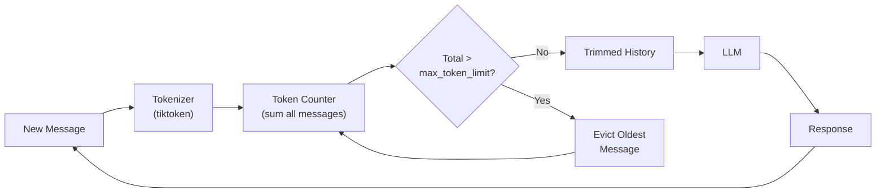

# Token Buffer Memory

  

## 📖 At a Glance

| Difficulty | Time | Prerequisites |
|------------|------|---------------|
| Beginner | ~20 min | Python 3.8+, `OPENAI_API_KEY`, understanding of 01 Conversation Buffer Memory recommended |

This technique is for developers who need precise control over memory cost by setting a strict token budget for conversation history.

## TL;DR

- **What it is:** **Token Buffer Memory** trims conversation history to fit a strict token budget by counting tokens and evicting oldest messages.
- **When you need it:** You want precise cost control and your model's tokenizer is available for accurate counting.
- **The trade-off:** Requires a matching tokenizer, and evicts whole messages, which can drop large important turns early.
- **Closest alternative in this repo:** 02 Sliding Window Memory trims by message count instead of tokens, which is simpler but less precise.

## Description

Imagine packing a suitcase with a strict weight limit. You don't count the number of items. You weigh each item and remove the oldest ones until everything fits. Token Buffer Memory works the same way: it measures conversation history by tokens (not by message count) and removes the oldest messages until the total fits under a budget.

Token Buffer Memory is an agent memory technique that trims conversation history to fit within a strict token budget. A token is the smallest piece of text a model processes (roughly a word or part of a word). Unlike sliding window memory, which drops messages by count, this technique uses a tokenizer (a tool that splits text into tokens) to measure each message precisely. This makes it the most model-aware short-term memory strategy, well suited for production chat systems, multi-model applications, and any LLM agent where context window overflow would cause hard failures.

**Keywords:** agent memory, token buffer memory, LLM agent, token budget, tokenizer, context window, conversation history, tiktoken, chat memory, prompt truncation

## Key Concepts

- **Tokenizer integration (tiktoken):** Uses a tokenizer library (such as OpenAI's `tiktoken`) to count the exact tokens each message will consume for a specific model.
- **max_token_limit:** A hard ceiling on total tokens for conversation history. The system evicts messages from the oldest end until the total is at or below this limit.
- **Message-level trimming:** Entire messages are removed rather than partially cutting message content. This preserves message coherence but means usage may land slightly under the limit.
- **Token counting accuracy:** Accurate counting must include message formatting overhead (role tokens, special tokens, message separators). These vary by model and API.
- **Model-specific token budgets:** Models have different context windows (4K, 8K, 32K, 128K, 200K tokens). Set your budget relative to the target model. Leave room for the system prompt and the model's response.

## Architecture

  

Mermaid source

---

## How It Works

1. Set a `max_token_limit` appropriate for the target model (for example, 3,000 tokens out of a 4,096-token window).
2. After each new message, tokenize all messages and compute the total token count.
3. While the total exceeds `max_token_limit`, remove the oldest message from the history.
4. Send the trimmed history to the LLM.
5. Append the LLM response and repeat.

## When to Use

- When you need precise control over context window usage.
- Multi-model applications where different models have different context limits.
- Production systems where exceeding the context window causes hard failures.
- Scenarios where message lengths vary significantly (for example, some messages contain code blocks or long documents).

## Limitations

- Requires a tokenizer that matches the target model. Using the wrong tokenizer gives inaccurate counts.
- Message-level eviction can remove large important messages prematurely if they happen to be old.
- Does not preserve any information from evicted messages (no summarization fallback).
- Token counting adds minor computational overhead on each turn.

## Notebook

See the [full notebook](./token_buffer_memory.ipynb) for a step-by-step implementation with `tiktoken` and the OpenAI SDK.

## FAQ

### Q: What is Token Buffer Memory in agent memory?

**A:** Token Buffer Memory trims conversation history to fit a strict token budget by counting actual tokens and evicting the oldest messages when the limit is exceeded. Unlike message-count windows, it accounts for varying message lengths. LangChain implements this as `ConversationTokenBufferMemory` with a `max_token_limit` parameter. A typical configuration sets the limit to 1,000-4,000 tokens, leaving room for the system prompt and model response.

### Q: When should I use Token Buffer Memory instead of Sliding Window Memory?

**A:** Use Token Buffer Memory when message lengths vary significantly. Sliding Window Memory (technique 02) keeps a fixed number of messages, so one long message (500 tokens) and one short message (10 tokens) count the same. Token-based trimming gives you precise control over context usage. This matters when you have a tight token budget or when your application mixes short chat turns with long code blocks or documents pasted inline.

### Q: What are the limits or failure modes of Token Buffer Memory?

**A:** Like Sliding Window Memory, evicted messages are permanently lost. The agent cannot recall anything trimmed from the buffer. Token counting adds minor overhead per turn (typically under 1ms using tiktoken). If the token limit is set below the length of a single message, the buffer can empty completely, leaving the agent with no history. The approach also requires a tokenizer matched to the target model for accurate counting.

### Q: Can I combine Token Buffer Memory with another memory technique?

**A:** Yes. Combine it with technique 03 (Summary Memory) to summarize evicted messages instead of discarding them. This is essentially what technique 04 (Summary Buffer Memory) does, but with token-based eviction instead of message-count eviction. You can also pair it with technique 06 (Vector Store Memory): write messages to the vector store before eviction, then retrieve relevant ones on demand to supplement the buffer.

### Q: What library or framework can I use to skip the implementation work?

**A:** LangChain provides `ConversationTokenBufferMemory` with built-in tiktoken integration for accurate token counting. LlamaIndex's `ChatMemoryBuffer` accepts a `token_limit` parameter that provides equivalent behavior. For custom implementations, the tiktoken library (OpenAI models) or the transformers tokenizer (open-source models) handles the counting. Mem0 and Zep handle token management internally as part of their managed memory services.

## References

- [LangChain ConversationTokenBufferMemory](https://python.langchain.com/docs/modules/memory/types/token_buffer?utm_source=nirdiamant&utm_medium=github&utm_campaign=agent_memory_techniques)
- [tiktoken: OpenAI's Fast BPE Tokenizer](https://github.com/openai/tiktoken)
- [OpenAI Cookbook: How to Count Tokens](https://cookbook.openai.com/examples/how_to_count_tokens_with_tiktoken?utm_source=nirdiamant&utm_medium=github&utm_campaign=agent_memory_techniques)
- [Anthropic Token Counting API](https://docs.anthropic.com/en/docs/build-with-claude/token-counting?utm_source=nirdiamant&utm_medium=github&utm_campaign=agent_memory_techniques)

## Related Techniques

- [**02 Sliding Window Memory**](../02_sliding_window_memory/) - The count-based cousin. Trims by message count instead of tokens. Simpler but less precise.
- [**04 Summary Buffer Memory**](../04_summary_buffer_memory/) - Adds a summarization fallback so evicted messages aren't completely lost.
- [**12 Working Memory / Context Window Management**](../12_working_memory_context_window/) - A broader approach to managing what goes into the context window, beyond conversation history alone.

---

