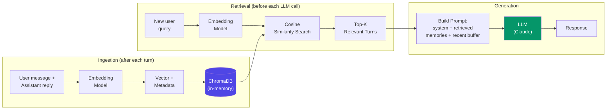

# Vector Store Memory

  

## 📖 At a Glance

| Difficulty | Time | Prerequisites |
|------------|------|---------------|
| Beginner | ~25 min | Python 3.8+, `ANTHROPIC_API_KEY`, `OPENAI_API_KEY` (for embeddings), basic understanding of vector embeddings |

This technique is for developers ready to move beyond sequential chat history and retrieve relevant memories by meaning rather than position.

## TL;DR

- **What it is:** **Vector Store Memory** embeds conversation turns into vectors and retrieves the most relevant past exchanges via similarity search.
- **When you need it:** Your agent must recall information from long or multi-topic conversations where recency alone is not enough.
- **The trade-off:** Requires an embedding model plus a vector database, and semantic similarity does not always equal task relevance.
- **Closest alternative in this repo:** 20 Memory Retrieval Patterns extends vector search with BM25 fusion, re-ranking, and diversity filtering.

## Description

Think of a library with thousands of books but no catalog: you'd walk shelf by shelf to find anything. Now imagine a librarian who instantly pulls the most relevant books for any question you ask. Vector Store Memory gives your LLM agent that librarian. This agent memory technique stores conversation turns as embeddings (numerical fingerprints of meaning) in a vector database like ChromaDB or FAISS. When the agent needs context, it runs a semantic search to retrieve the most relevant past exchanges. This makes it a great fit for long-running chatbots and multi-session assistants whose conversation history exceeds the context window.

This technique converts every conversation turn into a numerical fingerprint (called an embedding). It stores these fingerprints in a specialized database. When the agent needs context, it compares the current question against all stored fingerprints and pulls back the most relevant past exchanges. The key insight: retrieval happens by *meaning*, not by *time*.

An embedding is a list of numbers (a vector) that captures what a piece of text means. Two sentences with similar meaning produce similar vectors. A vector database (like ChromaDB or FAISS) is a storage system built to find the closest vectors quickly, even among millions.

This decouples memory from the context window (the limited text an LLM can read at once). Your agent can "remember" thousands of past interactions. It surfaces only the most relevant ones each turn.

**Keywords:** agent memory, LLM agent, vector store memory, embeddings, vector database, semantic search, ChromaDB, FAISS, conversation history, context window

## Key Concepts

- **Embedding models:** Models like OpenAI's `text-embedding-3-small` or Sentence Transformers that convert text into fixed-length vectors. These vectors capture meaning, so similar text produces nearby vectors.
- **Vector databases (ChromaDB, FAISS, Pinecone):** Storage systems optimized for approximate nearest-neighbor (ANN) search. ANN means "find the closest matches quickly, even if not perfectly exact."
- **Similarity search:** Finding stored vectors closest to the query vector. Common metrics include cosine similarity (angle between vectors), dot product, or Euclidean distance.
- **Top-k retrieval:** Returning the *k* most similar results. A small *k* saves tokens but might miss context. A large *k* catches more but costs more.
- **Chunk strategies:** How you split conversations before embedding. Options include individual messages, user-assistant pairs, sliding windows, or topic-based chunks.
- **Metadata filtering:** Attaching extra info (timestamps, user IDs, topics) to each vector. You can then filter results by these attributes for more targeted retrieval.

## Architecture

  

Mermaid source

---

## How It Works

1. After each exchange, the agent embeds the message (or message pair) using an embedding model.
2. It stores the embedding vector in a vector database alongside the original text and metadata.
3. When building the prompt for the next LLM call, the agent embeds the new user message.
4. A similarity search retrieves the top-*k* most relevant past fragments.
5. These fragments are injected into the prompt alongside the recent conversation.
6. The LLM generates a response informed by both recent context and semantically relevant history.

## When to Use

- Long-running agents where the full history far exceeds the context window.
- Applications where users revisit earlier topics and the agent needs to recall them.
- Multi-session agents that must recall information from previous conversations.
- RAG-style architectures (Retrieval-Augmented Generation, where you fetch relevant text before generating) applied to conversation memory.

## Limitations

- Embedding quality directly impacts retrieval quality. Poor embeddings lead to irrelevant retrievals.
- You need extra infrastructure: an embedding model and a vector database.
- Retrieval adds latency to every turn (typically 10-100ms, but can be more at scale).
- Semantic similarity is not the same as relevance. Retrieved fragments may be topically similar but not actually useful.

## Notebook

[**vector_store_memory.ipynb**](vector_store_memory.ipynb): Full implementation using OpenAI `text-embedding-3-small` embeddings and ChromaDB (in-memory). Includes a `VectorStoreMemory` class built from scratch, a 50-turn synthetic conversation experiment comparing semantic recall against sliding window memory, retrieval quality analysis, top-K tuning charts, and token cost comparisons.

## FAQ

### Q: What is Vector Store Memory in agent memory?

**A:** Vector Store Memory embeds conversation turns or facts into high-dimensional vectors and stores them in a vector database (such as FAISS, Chroma, Pinecone, or Weaviate). On each turn, the system retrieves the top-K most semantically similar past entries rather than relying on recency. This enables relevance-based recall across thousands of stored memories. LangChain implements this as `VectorStoreRetrieverMemory`. Typical K values range from 3 to 10 entries per query.

### Q: When should I use Vector Store Memory instead of Memory Retrieval Patterns?

**A:** Use basic Vector Store Memory when a single-stage semantic search meets your accuracy needs. Memory Retrieval Patterns (technique 20) adds BM25 keyword fusion, cross-encoder re-ranking, and MMR diversity filtering on top of vector search. Start with the simpler approach: embed and retrieve with cosine similarity. If you notice missed results due to keyword mismatches or redundant retrievals, upgrade to the multi-stage pipeline described in technique 20.

### Q: What are the limits or failure modes of Vector Store Memory?

**A:** Embedding quality determines retrieval quality. If the embedding model misses domain-specific terms, relevant memories will not surface. Semantic search can return plausible but wrong matches (high similarity, low relevance). Write latency increases as the store grows, though query time remains sublinear with approximate nearest neighbor (ANN) indexes. There is also a cold-start problem: the system has nothing to retrieve until enough memories are stored.

### Q: Can I combine Vector Store Memory with another memory technique?

**A:** Yes. A strong pattern pairs it with technique 02 (Sliding Window Memory) or technique 04 (Summary Buffer Memory). Keep the window or buffer for recent context, and query the vector store for relevant older memories. This gives you recency from the buffer and relevance from the vector store. You can also layer technique 18 (Temporal Memory) on top to add time-decay weighting to your similarity scores.

### Q: What library or framework can I use to skip the implementation work?

**A:** LangChain provides `VectorStoreRetrieverMemory` with adapters for FAISS, Chroma, Pinecone, and Weaviate. LlamaIndex has native vector memory integration through its retriever modules. Mem0 (technique 25) uses vector storage under the hood with automatic embedding. Zep (technique 27) combines vector search with its knowledge graph for hybrid retrieval. For standalone vector stores, Chroma and FAISS are the most common open-source choices for prototyping.

## References

- [LangChain VectorStoreRetrieverMemory](https://python.langchain.com/docs/modules/memory/types/vectorstore_retriever_memory?utm_source=nirdiamant&utm_medium=github&utm_campaign=agent_memory_techniques)
- [ChromaDB Documentation](https://docs.trychroma.com/?utm_source=nirdiamant&utm_medium=github&utm_campaign=agent_memory_techniques)
- [FAISS: Facebook AI Similarity Search](https://github.com/facebookresearch/faiss)
- [Pinecone Vector Database](https://www.pinecone.io/?utm_source=nirdiamant&utm_medium=github&utm_campaign=agent_memory_techniques)
- Johnson, Douze, Jegou, "Billion-scale similarity search with GPUs," IEEE Transactions on Big Data, 2019

## Related Techniques

- [**07 Entity Memory**](../07_entity_memory/) - Structures knowledge around named entities (people, places, projects) rather than raw conversation fragments.
- [**08 Knowledge Graph Memory**](../08_knowledge_graph_memory/) - Captures relationships between entities as a graph, enabling multi-hop reasoning.
- [**20 Memory Retrieval Patterns**](../20_memory_retrieval_patterns/) - Advanced retrieval strategies (hybrid search, re-ranking) that build on vector search.
- [**21 Cross-Session Memory**](../21_cross_session_memory/) - Patterns for persisting any memory type across sessions, often backed by a vector store.

---

