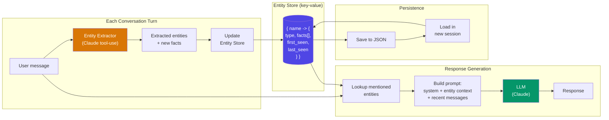

# Entity Memory

  

## 📖 At a Glance

| Difficulty | Time | Prerequisites |
|------------|------|---------------|
| Intermediate | ~30 min | Python 3.8+, `ANTHROPIC_API_KEY`, understanding of 01 Conversation Buffer Memory recommended |

This technique is for developers building agents that need to track and update information about specific people, organizations, or concepts across conversations.

## TL;DR

- **What it is:** **Entity Memory** extracts named entities from conversation and maintains a living knowledge base of facts about each one.
- **When you need it:** Your agent must track and update structured information about specific people, orgs, or projects over time.
- **The trade-off:** Entity extraction is imperfect, and merging or disambiguating entities with similar names is a hard problem.
- **Closest alternative in this repo:** 08 Knowledge Graph Memory adds relationships between entities using subject-predicate-object triples.

## Description

Imagine a personal assistant who keeps a contact card for every person, place, and project you mention. Each time you share new info ("Sarah got promoted"), they update the right card. Entity Memory gives your LLM agent that same ability. This agent memory technique uses entity extraction (spotting names of people, places, and things in text) to build a structured knowledge base. The agent creates or updates records as new facts appear, so it never asks the same question twice. It's especially useful for personal assistant chatbots and customer support agents that track user details across sessions.

Entity Memory works the same way. Instead of storing raw message history, it extracts structured information about named things (people, organizations, projects, preferences) and maintains a living knowledge base. When the user mentions "my manager Sarah" or "the Q3 budget project," the system creates or updates a record with the relevant details.

On later turns, the agent retrieves entity records and injects them into the prompt. This gives the agent persistent, structured knowledge about the people and things the user cares about. It's especially useful for personal assistant and CRM-style agents.

**Keywords:** agent memory, LLM agent, entity memory, entity extraction, named entity recognition, structured knowledge base, personal assistant, customer support, cross-session memory

## Key Concepts

- **Entity extraction (NER):** Using named entity recognition (through LLM prompts or NER models) to identify entities in each message: people, places, organizations, dates, concepts. NER stands for Named Entity Recognition, the task of spotting proper nouns and classifying them.
- **Entity schemas:** Defining what attributes to track per entity type. A person entity might have fields like name, role, relationship, and last-mentioned date. A project entity might have status, deadline, and stakeholders.
- **Entity updates and merging:** When new information about an existing entity appears, the system updates the record. Merging logic handles conflicts (e.g., a corrected phone number) and disambiguation (e.g., two people named "Alex").
- **Entity-context injection:** Before each LLM call, the system retrieves records for entities mentioned in the current message. It injects them into the prompt as structured context.
- **Structured vs. unstructured entity stores:** You can store entity information as structured records (JSON, database rows) or as free-text descriptions. Structured stores enable precise queries. Unstructured stores are more flexible.

## Architecture

  

Mermaid source

---

## How It Works

1. The user sends a message.
2. The system extracts entities from the message (via LLM or NER model).
3. For each extracted entity, it retrieves or creates an entity record.
4. New information about the entity merges into the existing record.
5. When constructing the next prompt, the system includes relevant entity records as context.
6. The LLM generates a response informed by both the conversation and entity knowledge.

## When to Use

- Personal assistant agents that need to remember user preferences, contacts, and projects across sessions.
- Customer support systems that track customer details, past issues, and account information.
- Any application where the agent must maintain a structured understanding of the "world" discussed in conversations.

## Limitations

- Entity extraction is imperfect. The system may miss entities or extract spurious ones.
- Merging and disambiguation are hard problems, especially with common names or ambiguous references.
- Maintaining entity schemas requires upfront design and ongoing maintenance.
- Entity stores can become stale if update triggers are not well-configured.

## Notebook

[entity_memory.ipynb](entity_memory.ipynb) - Builds an entity extractor with Claude tool-use (function calling), a key-value entity store that accumulates structured facts per entity, and demonstrates cross-conversation persistence. Includes a controlled 30-turn experiment comparing entity memory recall against a sliding window baseline.

## FAQ

### Q: What is Entity Memory in agent memory?

**A:** Entity Memory extracts named entities (people, organizations, products, places) from each conversation turn and maintains a structured knowledge base of facts about each entity. The system updates entity descriptions as new information appears, building a living profile per entity. LangChain implements this as `ConversationEntityMemory` using an LLM to extract and update entity summaries. It lets the agent recall "Alice is a software engineer who prefers Python" across turns.

### Q: When should I use Entity Memory instead of Knowledge Graph Memory?

**A:** Use Entity Memory when you care about facts per entity but not relationships between entities. Knowledge Graph Memory (technique 08) stores subject-predicate-object triples, enabling multi-hop queries like "Who works at the same company as Alice?" Entity Memory stores flat descriptions per entity, which is simpler to implement and cheaper to run. If your use case is a personal assistant tracking user preferences, entity memory is enough. If you need relationship reasoning, upgrade to a graph.

### Q: What are the limits or failure modes of Entity Memory?

**A:** Entity extraction depends on LLM quality. The model may miss entities, merge distinct entities with similar names, or split one entity into duplicates. Entity descriptions can grow unbounded if not pruned. The LLM call for extraction adds latency (200-500ms per turn). Contradictory facts (user says "I live in NYC" then "I moved to LA") may not overwrite cleanly unless the prompt explicitly handles updates. Disambiguation of common names is a persistent challenge.

### Q: Can I combine Entity Memory with another memory technique?

**A:** Yes. A strong combination pairs it with technique 03 (Summary Memory). The summary tracks conversation flow and topic progression, while entity memory preserves structured facts about key entities. When the agent generates a response, it gets both the narrative context and the specific entity details. You can also combine it with technique 06 (Vector Store Memory) to enable semantic search over entity descriptions for large entity sets.

### Q: What library or framework can I use to skip the implementation work?

**A:** LangChain offers `ConversationEntityMemory` with built-in LLM-based extraction and an in-memory or Redis-backed entity store. Mem0 (technique 25) performs automatic entity extraction as part of its memory pipeline. Zep (technique 27) extracts entities and relationships automatically, giving you entity memory plus graph edges. For custom solutions, spaCy NER provides fast entity extraction, and you can store results in any key-value database.

## References

- [LangChain ConversationEntityMemory](https://python.langchain.com/docs/modules/memory/types/entity_summary_memory?utm_source=nirdiamant&utm_medium=github&utm_campaign=agent_memory_techniques)
- [spaCy Named Entity Recognition](https://spacy.io/usage/linguistic-features?utm_source=nirdiamant&utm_medium=github&utm_campaign=agent_memory_techniques#named-entities)
- [Mem0 - Self-Improving Memory Layer](https://github.com/mem0ai/mem0)
- Park et al., "Generative Agents: Interactive Simulacra of Human Behavior," 2023

## Related Techniques

- [**08 Knowledge Graph Memory**](../08_knowledge_graph_memory/) - Captures relationships between entities, not only facts about them.
- [**06 Vector Store Memory**](../06_vector_store_memory/) - Retrieves relevant conversation history by meaning rather than by entity name.
- [**10 Semantic Memory**](../10_semantic_memory/) - Stores generalized facts distilled from conversation, a close cousin of entity memory.
- [**25 Mem0 Patterns**](../25_mem0_patterns/) - Mem0 includes built-in entity extraction and memory management.

---

