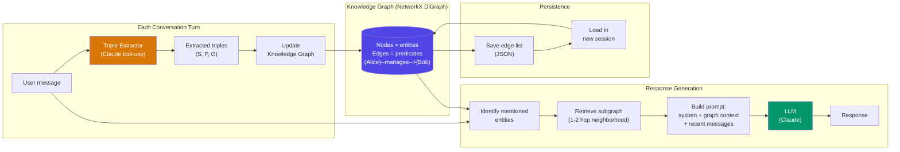

# Knowledge Graph Memory

  

## 📖 At a Glance

| Difficulty | Time | Prerequisites |
|------------|------|---------------|
| Intermediate | ~35 min | Python 3.8+, `ANTHROPIC_API_KEY`, understanding of 07 Entity Memory recommended |

This technique is for developers who need their agent to understand relationships between entities, not standalone facts.

## TL;DR

- **What it is:** **Knowledge Graph Memory** builds a directed graph of entities and relationships from subject-predicate-object triples extracted from conversation.
- **When you need it:** Your agent needs multi-hop reasoning across connected facts, like "Who manages Alice's team lead?"
- **The trade-off:** Triple extraction is noisy, graph maintenance requires deduplication and pruning, and serializing graphs is token-heavy.
- **Closest alternative in this repo:** 07 Entity Memory stores facts about entities without modeling the relationships between them.

## Description

Think of a family tree: it doesn't store facts in isolation, it shows how people connect. Knowledge Graph Memory brings this structure to LLM agent memory. It uses triple extraction (pulling subject-predicate-object relationships from text) to build a knowledge graph of entities and their connections. The agent traverses this graph for multi-hop reasoning, answering questions that span several relationships. This makes it a natural fit for project management tools, organizational assistants, and customer support agents dealing with complex relationship webs.

Knowledge Graph Memory brings this idea to AI agents. It builds a graph of relationships between entities extracted from conversations. While Entity Memory stores facts *about* individual things, Knowledge Graph Memory captures the relationships *between* them.

A knowledge graph is a directed graph. Nodes represent entities (people, projects, places). Edges represent typed relationships (manages, depends_on, located_in). Each relationship is stored as a triple: (subject, predicate, object). For example: (Alice, manages, Bob).

This graph structure supports traversal-based reasoning. The agent can follow chains of relationships to answer multi-hop questions. For example: "Who are all the people working on projects that Alice manages?"

**Keywords:** agent memory, LLM agent, knowledge graph memory, triple extraction, graph traversal, multi-hop reasoning, knowledge graph, Neo4j, NetworkX, relationship extraction

## Key Concepts

- **Triple extraction (subject-predicate-object):** The fundamental unit of a knowledge graph. Each relationship becomes a directed edge: (Alice, manages, Bob) or (Project Alpha, uses, Python).
- **Graph databases (NetworkX, Neo4j):** Storage backends for the knowledge graph. NetworkX is lightweight and in-memory. Neo4j is a production-grade graph database with its own query language (Cypher).
- **Graph traversal:** Navigating the graph by following edges from node to node. This enables multi-hop reasoning like "find all projects managed by people in the engineering department."
- **Relationship types:** Categorizing edges with semantic labels (manages, depends_on, prefers, located_in). These labels support typed queries and reasoning.
- **Subgraph retrieval:** Extracting only the relevant portion of the graph for a given query. Rather than injecting the entire graph into the prompt, you retrieve only the neighborhood of mentioned entities.

## Architecture

  

Mermaid source

---

## How It Works

1. The user sends a message.
2. The system extracts triples using an LLM prompt (e.g., "Extract all relationships as subject-predicate-object triples").
3. Triples are added to the knowledge graph. Existing edges get updated and new nodes get created.
4. When the user asks a question, the system identifies relevant entities and retrieves their neighborhood in the graph.
5. The subgraph is serialized (as text or structured data) and injected into the prompt.
6. The LLM uses the graph context to generate a relationship-aware response.

## When to Use

- Applications involving complex webs of relationships (organizational hierarchies, project dependencies, social networks).
- Agents that need to answer multi-hop reasoning questions connecting different entities.
- Scenarios where understanding *how* things relate is as important as knowing facts about individual entities.

## Limitations

- Triple extraction is noisy. LLMs may produce inconsistent or incorrect triples.
- Graph maintenance (deduplication, conflict resolution, pruning) requires ongoing effort.
- Serializing graph structures into text for LLM consumption takes careful design and can be token-expensive.
- Scaling to very large graphs requires a dedicated graph database and careful query optimization.

## Notebook

[**knowledge_graph_memory.ipynb**](knowledge_graph_memory.ipynb) - Full implementation using NetworkX as an in-memory graph backend and Claude's tool-use API for triple extraction. Includes a `TripleStore` (directed graph of entities and predicates), a `TripleExtractor` (LLM-based relationship parser), and a `KnowledgeGraphMemory` orchestrator that builds the graph incrementally, retrieves relevant subgraphs, and injects relationship context into prompts. Features multi-hop reasoning demos, graph visualization, cross-session persistence, and a controlled experiment comparing knowledge graph memory vs. sliding window on relationship-heavy recall tasks.

## FAQ

### Q: What is Knowledge Graph Memory in agent memory?

**A:** Knowledge Graph Memory builds a directed graph of entities and their relationships from conversation data. Each fact is stored as a subject-predicate-object triple (for example, "Alice-works_at-Acme Corp"). The agent can traverse these edges to answer multi-hop questions that span several relationships. LangChain implements this as `ConversationKGMemory` using an LLM to extract triples. Neo4j and NetworkX are common backends for graph storage and traversal.

### Q: When should I use Knowledge Graph Memory instead of Entity Memory?

**A:** Use Knowledge Graph Memory when your application needs relationship reasoning or multi-hop queries. Entity Memory (technique 07) stores facts about individual entities but cannot answer "Who else works at Alice's company?" because it lacks edges between entities. If your use case involves organizational hierarchies, social networks, dependency chains, or any domain where connections between concepts matter, the graph representation is worth the extra complexity.

### Q: What are the limits or failure modes of Knowledge Graph Memory?

**A:** Triple extraction is error-prone. The LLM may produce inconsistent predicate names ("works_at" vs. "employed_by"), creating duplicate edges. Graph traversal queries require careful prompt engineering or Cypher/SPARQL skills. The graph can grow large without pruning, slowing queries. Contradictory triples ("Alice works_at Acme" followed by "Alice left Acme") need explicit conflict resolution. Setup overhead is higher than flat memory, often requiring Neo4j or a similar graph database for production use.

### Q: Can I combine Knowledge Graph Memory with another memory technique?

**A:** Yes. Combine it with technique 06 (Vector Store Memory) for hybrid retrieval. Use vector search for fuzzy, broad queries and graph traversal for precise, structured queries. This is the pattern that Graphiti (technique 24) and Zep (technique 27) implement natively. You can also pair knowledge graph memory with technique 09 (Episodic Memory): the graph stores distilled facts while episodes preserve the full context of when and how facts were learned.

### Q: What library or framework can I use to skip the implementation work?

**A:** LangChain provides `ConversationKGMemory` for basic triple extraction and NetworkX-based storage. For production graph memory, Graphiti (technique 24) builds temporal knowledge graphs on Neo4j with automatic entity resolution. Zep (technique 27) offers managed graph memory with async extraction. Cognee provides knowledge graph construction from documents. For self-hosted setups, Neo4j with LangChain's graph integrations is the most common stack.

## References

- [LangChain ConversationKGMemory](https://python.langchain.com/docs/modules/memory/types/kg?utm_source=nirdiamant&utm_medium=github&utm_campaign=agent_memory_techniques)
- [Neo4j Graph Database](https://neo4j.com/?utm_source=nirdiamant&utm_medium=github&utm_campaign=agent_memory_techniques)
- [NetworkX - Python Graph Library](https://networkx.org/?utm_source=nirdiamant&utm_medium=github&utm_campaign=agent_memory_techniques)
- [Microsoft GraphRAG](https://github.com/microsoft/graphrag)
- Ji et al., "A Survey on Knowledge Graphs: Representation, Acquisition, and Applications," IEEE TNNLS, 2022

## Related Techniques

- [**07 Entity Memory**](../07_entity_memory/) - Stores facts about individual entities without relationship structure.
- [**24 Graph Memory (Graphiti)**](../24_graph_memory_graphiti/) - A production framework that builds temporal knowledge graphs from conversations.
- [**06 Vector Store Memory**](../06_vector_store_memory/) - Retrieves past exchanges by semantic similarity rather than graph traversal.
- [**20 Memory Retrieval Patterns**](../20_memory_retrieval_patterns/) - Covers hybrid retrieval strategies that can combine graph and vector search.

---

