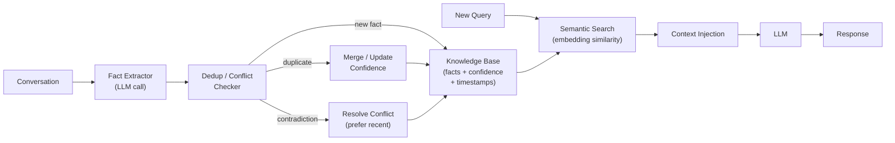

# Semantic Memory

  

## 📖 At a Glance

| Difficulty | Time | Prerequisites |
|------------|------|---------------|
| Intermediate | ~30 min | Python 3.8+, `OPENAI_API_KEY`, understanding of 06 Vector Store Memory recommended |

This technique is for developers who want their agent to organize and retrieve factual knowledge by category and meaning, independent of when it was learned.

## TL;DR

- **What it is:** **Semantic Memory** extracts generalized, timeless facts from conversations and stores them with deduplication and contradiction detection.
- **When you need it:** Your agent needs to recall what it knows about a topic regardless of when or where it learned it.
- **The trade-off:** Fact extraction can confuse opinions with facts, and the knowledge base accumulates stale entries without decay.
- **Closest alternative in this repo:** 09 Episodic Memory captures specific experiences with temporal context rather than context-free facts.

## Description

You know that Paris is the capital of France, but you probably can't recall when you learned it. That's semantic memory: knowledge distilled from experience into stable, context-free facts. Semantic Memory for LLM agents works the same way. This agent memory technique extracts generalized facts from conversations and stores them in a persistent knowledge base. It handles deduplication (spotting repeated facts) and contradiction detection (resolving conflicts between old and new info). This makes it ideal for personal assistant chatbots, customer support agents, and any long-lived agent that builds user preferences across sessions.

Semantic Memory for AI agents works the same way. It extracts generalized facts from conversations and stores them in a persistent knowledge base. Unlike episodic memory (which remembers "the user told me their birthday on Tuesday"), semantic memory stores the distilled fact itself ("the user's birthday is March 15th"). The *when* and *how* don't matter. The fact does.

Think of it like building a profile page. Every conversation adds a few more lines to the profile: preferences, tools, habits, facts about the user's world. Over many sessions, this profile grows into a rich, personalized knowledge base. The agent stops asking the same questions twice. It anticipates needs based on what it already knows.

**Keywords:** agent memory, LLM agent, semantic memory, fact extraction, knowledge base, deduplication, contradiction detection, user preferences, long-term memory, persistent knowledge

## Key Concepts

- **Fact extraction:** Identifying declarative facts from conversation text. An LLM prompt scans messages for statements that express persistent truths or preferences. "Oh yeah, I switched to a Mac last month" becomes "User uses macOS."
- **Embedding and cosine similarity:** Embeddings are vectors (lists of numbers) that capture meaning. Cosine similarity measures how close two vectors are. We use these to compare facts by meaning, not by exact wording.
- **Deduplication:** Detecting when a new fact means the same thing as one already stored. "I use a Mac" and "my laptop runs macOS" are the same fact.
- **Contradiction detection:** Identifying when a new fact conflicts with an existing one. "I use Windows" contradicts a stored "User uses macOS." The system resolves this by keeping the newer statement.
- **Confidence scoring:** Assigning confidence levels to facts. Repeated mentions boost confidence. Inferred facts get lower confidence.

## Architecture

  

Mermaid source

---

## How It Works

1. After each conversation, the agent sends the messages to an LLM that extracts declarative facts (e.g., "User prefers dark mode").
2. Each fact is converted into an embedding (a vector of numbers that captures its meaning).
3. The agent compares the new fact's embedding against all stored facts. If similarity is very high (above 0.85), it's a duplicate. If moderate (above 0.50), the agent calls the LLM to check for contradictions.
4. Duplicates boost the existing fact's confidence score. Contradictions archive the old fact and store the newer one. Genuinely new facts are added to the knowledge base.
5. When the user asks a question, the agent embeds the query and retrieves the most relevant facts by cosine similarity.
6. Those facts are formatted into the system prompt so the LLM can use them when generating its response.

## What the Notebook Covers

1. **Fact data structure** with confidence scores, timestamps, and embeddings.
2. **LLM-based fact extraction** from conversation messages.
3. **Deduplication** using cosine similarity on embeddings.
4. **Contradiction detection** using an LLM call.
5. **Semantic retrieval** of relevant facts for new queries.
6. **Chat with injected knowledge** from the fact store.
7. **Multi-session example** showing fact accumulation, dedup, and contradiction resolution.
8. **Persistence** via JSON serialization.

## When to Use

- Personal assistant agents that accumulate user preferences over many sessions.
- Knowledge management systems where agents build domain expertise from interactions.
- Any long-lived agent where facts from one conversation should be available in all future ones.
- Complementary to episodic memory. Use both for complete memory coverage.

## Limitations

- Fact extraction is imprecise. The LLM may extract opinions as facts or miss implicit knowledge.
- Contradiction detection is a hard NLP problem. Subtle contradictions may go unnoticed.
- The knowledge base can accumulate outdated facts if there is no mechanism for temporal decay.
- Scaling requires approximate nearest neighbor search. Brute-force comparison is O(n) per fact.

## Notebook

See the [implemented notebook](./semantic_memory.ipynb) for a complete walkthrough with code.

## FAQ

### Q: What is Semantic Memory in agent memory?

**A:** Semantic Memory extracts generalized, timeless facts from conversations and stores them independently of when or how they were learned. Facts like "user prefers Python over JavaScript" or "the API rate limit is 100 requests per minute" are stored with deduplication and contradiction detection. This mirrors how humans store general knowledge separately from specific experiences. It enables the agent to recall facts without needing to replay entire past conversations.

### Q: When should I use Semantic Memory instead of Episodic Memory?

**A:** Use Semantic Memory when you need to recall reusable facts without the surrounding context. Episodic Memory (technique 09) preserves full interaction records, which is useful for "what happened last time" questions. Semantic memory is better for "what do I know about the user" questions. If your agent is a personal assistant that accumulates user preferences across weeks of interaction, semantic memory keeps facts compact. Episodic memory is better for debugging or auditing past interactions.

### Q: What are the limits or failure modes of Semantic Memory?

**A:** Fact extraction quality depends on the LLM. The model may extract incorrect facts, miss implicit information, or fail to detect contradictions between old and new facts. Deduplication is imperfect: "user likes Python" and "user prefers Python" may be stored as separate facts. Over time, the fact store can accumulate stale information if there is no decay or update mechanism. The extraction step adds latency (200-500ms) and cost per turn.

### Q: Can I combine Semantic Memory with another memory technique?

**A:** Yes. The strongest pairing is with technique 09 (Episodic Memory) to create a dual-memory system. Episodes capture the full experience; semantic memory distills the reusable facts. Add technique 14 (Memory Consolidation) to periodically merge duplicate facts, resolve contradictions, and prune stale entries. This three-layer stack (episodic capture, semantic extraction, periodic consolidation) is the foundation of most production memory systems.

### Q: What library or framework can I use to skip the implementation work?

**A:** Mem0 (technique 25) is built around semantic memory: it automatically extracts and deduplicates facts from conversations. Zep (technique 27) provides managed fact extraction with contradiction detection. Letta/MemGPT (technique 26) stores semantic facts in its core memory block. LangChain does not have a dedicated semantic memory class, but you can build one by combining an LLM extraction chain with a vector store and deduplication logic. Cognee also supports fact extraction pipelines.

## References

- Tulving, Endel, "Episodic and Semantic Memory," Organization of Memory, 1972
- Park et al., "Generative Agents: Interactive Simulacra of Human Behavior," UIST 2023 (arXiv:2304.03442)
- [OpenAI Embeddings Guide](https://platform.openai.com/docs/guides/embeddings)
- [Mem0: Long-Term Memory for AI Agents](https://github.com/mem0ai/mem0?utm_source=nirdiamant&utm_medium=github&utm_campaign=agent_memory_techniques)
- [Zep: Long-Term Memory for AI Assistants](https://github.com/getzep/zep?utm_source=nirdiamant&utm_medium=github&utm_campaign=agent_memory_techniques)

## Related Techniques

- [**09 Episodic Memory**](../09_episodic_memory/) - Stores complete experiences with temporal context, while semantic memory stores distilled facts.
- [**07 Entity Memory**](../07_entity_memory/) - Organizes facts around named entities rather than freestanding knowledge.
- [**14 Memory Consolidation**](../14_memory_consolidation/) - The process of converting raw memories into stable, generalized knowledge.
- [**25 Mem0 Patterns**](../25_mem0_patterns/) - Mem0 implements semantic memory with built-in deduplication and contradiction handling.

---

