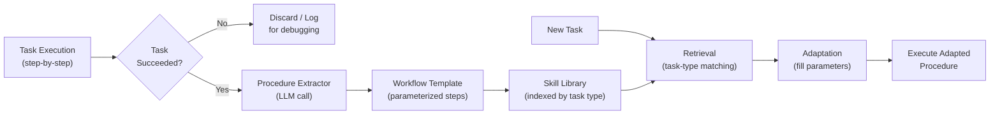

# Procedural Memory

  

## 📖 At a Glance

| Difficulty | Time | Prerequisites |
|------------|------|---------------|
| Intermediate | ~35 min | Python 3.8+, `OPENAI_API_KEY`, understanding of 09 Episodic Memory and 10 Semantic Memory recommended |

This technique is for developers building agents that learn and improve their own workflows, storing reusable procedures and skills.

## TL;DR

- **What it is:** **Procedural Memory** stores reusable step-by-step workflows in a skill library so agents can retrieve proven procedures instead of reasoning from scratch.
- **When you need it:** Your agent repeats similar multi-step tasks and you want it to learn and reuse successful workflows.
- **The trade-off:** Procedures extracted from one context may not generalize well, and the skill library needs curation as it grows.
- **Closest alternative in this repo:** 09 Episodic Memory records what happened, while Procedural Memory records how to do it.

## Overview

Think about cooking a new recipe. You check every step the first time, but by the tenth attempt your hands move on autopilot. Procedural Memory is the agent memory technique that gives an LLM agent this same learn-by-doing ability. It captures reusable workflows (step-by-step action sequences) and stores them in a skill library. When a similar task appears, the agent retrieves the proven procedure instead of reasoning from scratch. This makes it especially useful for agents that run repetitive multi-step tasks like data pipelines, API integrations, or code deployments.

Procedural memory gives an AI agent that same ability. It captures step-by-step strategies and workflows (sequences of actions that accomplish a goal) that the agent discovers through experience. Most memory techniques store *what happened* or *what is true*. Procedural memory stores *how to do things*.

Here's the problem it solves. Without procedural memory, an agent must re-derive solutions from scratch every time it faces a similar task. With procedural memory, it retrieves the learned procedure and adapts it. Systems like Voyager (Wang et al., 2023) show this in action. That Minecraft agent writes reusable code-based skills and stores them in a skill library (an organized collection of procedures). It retrieves those skills for future tasks.

The engineering challenges are threefold. First, **procedure extraction**: isolating the reusable action sequence from the noise of one specific run. Second, **generalization**: making the procedure flexible enough to work in new situations. Third, **retrieval**: matching new tasks to the right procedure in the library.

**Keywords:** agent memory, LLM agent, procedural memory, skill library, workflow templates, tool-use patterns, reusable procedures, task automation, multi-step agents

## Key Concepts

- **Procedure extraction**: Identifying and isolating reusable step sequences from successful task completions.
- **Step sequences**: Ordered lists of actions that together accomplish a goal. You store these as executable templates (reusable blueprints with placeholder values).
- **Workflow templates**: Parameterized procedures. Specific values like file names or API endpoints become placeholders. This makes the workflow apply to new inputs while keeping the overall strategy intact.
- **Tool-use patterns**: Learned sequences of tool calls, including how to build arguments and parse outputs.
- **Skill libraries**: Organized collections of procedures indexed by task type, domain, or capability.
- **Procedure generalization**: Abstracting a specific procedure into a broader form. For example, "Deploy app X to server Y" becomes "Deploy {app} to {server}."

## Architecture

  

Mermaid source

---

## How It Works

1. The agent completes a task using step-by-step reasoning or tool calls.
2. A procedure extractor identifies the successful action sequence and turns it into a template.
3. The template goes into a skill library, indexed by task type and relevant metadata (descriptive tags that help with later retrieval).
4. On future tasks, the agent retrieves matching procedures and adapts them to the current context.
5. Procedures are refined over time based on success or failure feedback.

## When to Use

- Agents that repeatedly perform similar multi-step tasks (e.g., data pipelines, API integrations).
- Scenarios where tool-use sequences are complex and benefit from being learned once, then reused.
- Systems that need to transfer learned skills across sessions or between agents.

## Limitations

- Procedures extracted from one successful run may not generalize well. A different OS or API version can cause stored steps to fail silently.
- LLM-based retrieval can match the wrong procedure, especially as the library grows. You need confidence thresholds and a fallback to solve from scratch.
- Stored procedures go stale as tools and APIs change. Without an invalidation or update mechanism, the library accumulates unreliable knowledge.
- If every task is unique, the skill library never gets reused. Extraction cost adds overhead with no payoff.

## Notebook

The [procedural memory notebook](./procedural_memory.ipynb) walks you through building a full procedural memory system from scratch using the OpenAI SDK. You'll implement:

1. A `Procedure` dataclass that captures parameterized workflows.
2. LLM-powered extraction that distills execution traces into reusable templates.
3. A skill library with LLM-based retrieval and adaptation.
4. Three end-to-end scenarios: learning a deployment procedure, retrieving and adapting it for a new task, and growing the library with a data pipeline procedure.

## FAQ

### Q: What is Procedural Memory in agent memory?

**A:** Procedural Memory stores reusable step-by-step workflows (called "skills" or "procedures") in a skill library. Instead of reasoning from scratch each time, the agent retrieves a proven procedure for the task at hand. Each procedure includes steps, preconditions, and expected outcomes. This mirrors how humans remember "how to ride a bike" separately from "the time I fell off my bike." It reduces repeated reasoning and improves consistency across similar tasks.

### Q: When should I use Procedural Memory instead of Episodic Memory?

**A:** Use Procedural Memory when your agent performs repeatable tasks that follow a known pattern, such as deploying code, filing reports, or processing orders. Episodic Memory (technique 09) records what happened during a specific interaction but does not generalize it into a reusable workflow. Procedural memory answers "how do I do X?" while episodic memory answers "what happened last time I did X?" Use both together for the strongest coverage.

### Q: What are the limits or failure modes of Procedural Memory?

**A:** Procedures go stale when the underlying system changes. A deployment procedure written for v1 may break on v2. The agent may retrieve a procedure that partially matches but is wrong for the current context. Procedure extraction requires careful prompt engineering or human curation. Over time, the skill library can accumulate conflicting or redundant procedures if there is no versioning or consolidation mechanism.

### Q: Can I combine Procedural Memory with another memory technique?

**A:** Yes. Combine it with technique 16 (Self-Reflection Memory) so the agent updates procedures based on what worked and what failed. After executing a procedure, the agent reflects on the outcome and revises the steps. You can also pair it with technique 17 (Memory Routing) to automatically select the right procedure based on task classification. This creates an adaptive skill library that improves with each execution.

### Q: What library or framework can I use to skip the implementation work?

**A:** No major framework offers a dedicated procedural memory class as of late 2025. Letta/MemGPT (technique 26) can store procedures in its archival memory tier. LangChain's tool and agent abstractions can serve as a foundation: define each procedure as a tool or chain and let the agent select it. Voyager (for Minecraft agents) pioneered the skill-library pattern. For production use, you typically build a custom retrieval layer over a vector store of procedure documents.

## References

- Sumers, T. R., et al. (2023). "Cognitive Architectures for Language Agents." arXiv:2309.02427.
- Wang, G., et al. (2023). "Voyager: An Open-Ended Embodied Agent with Large Language Models." arXiv:2305.16291.
- Anderson, J. R. (1982). "Acquisition of Cognitive Skill." *Psychological Review*, 89(4), 369-406.
- Park, J. S., et al. (2023). "Generative Agents: Interactive Simulacra of Human Behavior." arXiv:2304.03442.

## Related Techniques

- [**09 Episodic Memory**](../09_episodic_memory/) - Stores what happened, while procedural memory stores how to do things. Use both for a complete picture of an agent's experience.
- [**10 Semantic Memory**](../10_semantic_memory/) - Stores factual knowledge ("what is true"). Pair it with procedural memory so your agent knows both facts and skills.
- [**12 Working Memory & Context Window Management**](../12_working_memory_context_window/) - Procedures load into the context window for execution. This technique manages what fits and what gets evicted.
- [**23 Memory with Tools**](../23_memory_with_tools/) - Procedural memory shines when agents call external tools. This technique covers tool-memory integration patterns.

---

