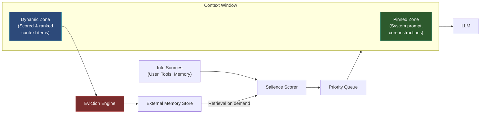

# Working Memory & Context Window Management

  

## 📖 At a Glance

| Difficulty | Time | Prerequisites |
|------------|------|---------------|
| Advanced | ~45 min | Python 3.8+, `OPENAI_API_KEY`, understanding of 02 Sliding Window Memory and 05 Token Buffer Memory recommended |

This technique is for developers building long-running agents that need to intelligently manage what stays in the context window using salience scoring and eviction policies.

## TL;DR

- **What it is:** **Working Memory** manages what stays in the context window using salience scoring and dynamic eviction policies.
- **When you need it:** You run long-running agents where naive FIFO eviction drops high-value information too early.
- **The trade-off:** Embedding-based salience scoring adds latency per turn and measures similarity, not logical importance.
- **Closest alternative in this repo:** 02 Sliding Window Memory uses naive FIFO eviction without scoring or pinning.

## Overview

Imagine you're juggling four balls. Someone tosses you a fifth, so you have to drop one. The trick is choosing which ball to drop. Working Memory & Context Window Management is the agent memory technique that solves this choice for LLM agents. It controls what stays inside the context window (the text a model can "see" at once) using salience scoring and eviction policies (rules for removing low-value items). You'll need it for long-running chatbots or research assistants that must track many facts under a tight token budget.

An LLM's context window (the text the model can "see" at once) works the same way. Whether it's 4,000 tokens or a million, there's always a limit. What lives inside that window decides how well the agent reasons. A naive approach treats the window like a queue: oldest messages fall off the end. This is a poor strategy. A critical instruction from the start of a conversation can vanish while irrelevant chatter stays.

This technique draws from cognitive psychology. Baddeley's model of human working memory describes a limited-capacity system with an attention controller. That controller decides what stays in active awareness and what fades. Agents need the same thing: a management layer that scores, ranks, pins (protects from removal), and evicts (removes) context items based on recency, relevance, and importance.

**Keywords:** agent memory, LLM agent, working memory, context window management, salience scoring, eviction policies, token budget, attention management, context prioritization

## Key Concepts

- **Context window**: The text an LLM can "see" at once, bounded by a maximum token limit.
- **Attention management**: Controlling which information occupies the context window at any moment, rather than letting it accumulate passively.
- **Context prioritization**: Ranking items by relevance, recency, and importance to decide what stays.
- **Pinned context**: Critical items (system instructions, user preferences, active goals) that stay in the window no matter what.
- **Dynamic eviction policies**: Rules for removing low-priority items when the window fills up. Common approaches include LRU (Least Recently Used) and importance-weighted eviction.
- **Salience scoring**: Assigning a numerical relevance score to each context element. "Salience" means "how much this matters right now."
- **External memory store**: A place to archive evicted items so they're retrievable later.

## Architecture

  

Mermaid source

---

## What the Notebook Covers

The [notebook](./working_memory_context_window.ipynb) builds a complete context window management system from scratch using the OpenAI SDK:

1. **`ContextItem` data model**: Wraps text with metadata (token count, salience score, timestamps, pin status).
2. **`SalienceScorer`**: Blends embedding similarity, exponential recency decay, and source importance weights.
3. **`EvictionEngine`**: Two policies (LRU and importance-weighted LRU) for removing the least valuable items.
4. **`ExternalMemoryStore`**: Archives evicted items with embeddings for later retrieval.
5. **`ContextWindowManager`**: Orchestrates scoring, insertion, eviction, retrieval, and prompt assembly.
6. **End-to-end demo**: A multi-turn travel planning conversation with a tight token budget that forces evictions and demonstrates the retrieval loop.
7. **Policy comparison**: Side-by-side results from LRU vs. importance-weighted LRU.

## How It Works

1. Each piece of context gets metadata: priority level, insertion time, last access time, and salience score.
2. As new information arrives, the manager scores it and inserts it into the dynamic zone.
3. When the context window nears capacity, eviction policies remove the lowest-scoring items.
4. Pinned items are protected from eviction. Only an explicit action can change their priority.
5. Evicted items move to the external memory store. They can be retrieved if they become relevant again.

## When to Use

- Long-running agent sessions that exceed the model's context window.
- Multi-turn conversations where early context may become irrelevant or need refreshing.
- Complex tasks where the agent tracks multiple sub-goals, documents, or data sources.
- Cost-sensitive applications where you want predictable token budgets.

## Limitations

- Scoring overhead slows things down. Every new message triggers embedding calls and re-scoring, adding latency to each turn.
- Embeddings measure semantic similarity, not logical importance. A message can be semantically distant from the current query but logically critical (e.g., "My flight leaves at 6 AM" while discussing dinner plans).
- Evicted messages create gaps in conversation history. The model may produce responses that feel disconnected because it can't see the full thread.
- This approach is more complex than a naive buffer. Scoring, eviction, archival, and retrieval add more surface area for bugs.

## FAQ

### Q: What is Working Memory in agent memory?

**A:** Working Memory manages what information stays in the LLM's context window at any given time. It uses salience scoring, dynamic eviction policies, and priority pinning to decide which memories, instructions, and retrieved context occupy the limited token budget. Unlike a naive sliding window, it evaluates each item's relevance to the current task. Think of it as an intelligent scheduler for the context window: the most important information stays, the least important gets evicted or compressed.

### Q: When should I use Working Memory instead of Sliding Window Memory?

**A:** Use Working Memory when your context window contains heterogeneous content like instructions, retrieved facts, conversation history, and tool results. Sliding Window Memory (technique 02) applies blind FIFO eviction, which may drop a critical instruction to keep a low-value chat turn. Working Memory scores each item by relevance and recency, ensuring high-value content survives. For agents that use tools, RAG, and multi-step reasoning, this intelligent prioritization significantly improves output quality.

### Q: What are the limits or failure modes of Working Memory?

**A:** Salience scoring adds computational overhead per turn. The scoring model may misjudge relevance, evicting important context or keeping irrelevant data. Pinned items (system prompts, critical instructions) reduce the budget available for dynamic content. If too many items are pinned, the working memory becomes rigid and cannot adapt. The approach also requires careful tuning of scoring weights and eviction thresholds, which vary by use case.

### Q: Can I combine Working Memory with another memory technique?

**A:** Yes. Working Memory is the natural orchestration layer for other memory types. Pair it with technique 06 (Vector Store Memory) to pull relevant long-term memories into the context window on demand. Add technique 13 (Hierarchical Memory Layers) to create a hot/warm/cold tier system where working memory is the hot tier. Use technique 17 (Memory Routing) to decide which memory store to query before populating the working memory.

### Q: What library or framework can I use to skip the implementation work?

**A:** Letta/MemGPT (technique 26) directly implements working memory management through its self-editing core memory block with a fixed token budget. LangChain does not have a dedicated working memory class, but you can approximate it with custom memory classes that score and evict items. OpenAI's Assistants API handles some context management internally. For fine-grained control, you typically build a custom layer that manages the context window contents programmatically.

## References

- Liu, N. F., et al. (2023). "Lost in the Middle: How Language Models Use Long Contexts." [arXiv:2307.03172](https://arxiv.org/abs/2307.03172).
- Baddeley, A. (2000). "The Episodic Buffer: A New Component of Working Memory?" [*Trends in Cognitive Sciences*](https://doi.org/10.1016/S1364-6613%2800%2901538-2), 4(11), 417-423.
- Mu, J., et al. (2023). "Learning to Compress Prompts with Gist Tokens." [arXiv:2304.08467](https://arxiv.org/abs/2304.08467).
- Modarressi, A., et al. (2023). "RET-LLM: Towards a General Read-Write Memory for LLMs." [arXiv:2305.14322](https://arxiv.org/abs/2305.14322).

## Related Techniques

- [**02 Sliding Window Memory**](../02_sliding_window_memory/) - A simpler windowing approach that drops the oldest turns. Good baseline before you add salience scoring.
- [**05 Token Buffer Memory**](../05_token_buffer_memory/) - Trims context by a strict token count. A lightweight alternative when you don't need per-item scoring.
- [**13 Hierarchical Memory Layers**](../13_hierarchical_memory_layers/) - The L1 hot tier is essentially working memory. This technique adds warm and cold tiers underneath.
- [**15 Memory Compaction**](../15_memory_compaction/) - Compacts memories into shorter forms so you can fit more semantic content into the same token budget.

---

