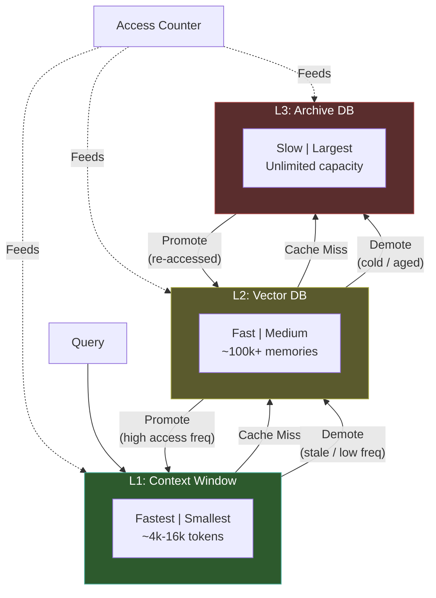

# Hierarchical Memory Layers

  

## 📖 At a Glance

| Difficulty | Time | Prerequisites |
|------------|------|---------------|
| Advanced | ~50 min | Python 3.8+, `OPENAI_API_KEY`, understanding of 06 Vector Store Memory and 12 Working Memory recommended |

This technique is for developers who need to organize agent memory across hot, warm, and cold storage tiers with automatic promotion and demotion.

## TL;DR

- **What it is:** **Hierarchical Memory Layers** organizes memories into hot, warm, and cold tiers with automatic promotion and demotion based on access patterns.
- **When you need it:** Your agent accumulates more memory than any single store can hold and you need tiered retrieval by access frequency.
- **The trade-off:** Managing three tiers with promotion and demotion logic adds significant implementation complexity.
- **Closest alternative in this repo:** 12 Working Memory manages the context window tier only, without warm or cold storage layers.

## Overview

Think of a kitchen. Everyday spices sit on the counter (fast, limited space), less common ones go in a cabinet, and rarely used items live in the pantry. Hierarchical Memory Layers applies this same tiered-storage idea to LLM agent memory. It organizes memories into hot, warm, and cold tiers. The warm tier typically uses a vector database (a database that matches items by meaning). Memories promote to faster tiers when accessed often and demote when they go stale. This agent memory technique is a natural fit for long-lived assistants or customer support agents that accumulate thousands of memories over time.

Hierarchical memory layers apply this same idea to agent memory. They organize storage into tiers (levels) with different speed, capacity, and cost. A typical setup has three layers. L1 (hot) holds the most relevant memories right inside the context window. L2 (warm) stores recently used memories in a fast vector database (a database that finds similar items by meaning). L3 (cold) keeps archived memories in cheaper, slower storage.

Memories move between tiers. When the agent accesses a memory often, it gets promoted (moved to a faster tier). When a memory goes stale, it gets demoted (moved to a slower tier). This approach lets agents handle far more total memory than flat storage. It also keeps retrieval fast for the most important information.

**Keywords:** agent memory, LLM agent, hierarchical memory, tiered storage, memory layers, vector database, promotion and demotion, cascading retrieval, long-lived agents, context window

## Notebook

The [implemented notebook](./hierarchical_memory_layers.ipynb) walks you through building a three-tier memory system from scratch using the OpenAI SDK. It covers:

1. **TieredMemory data model** with content, embeddings, tier labels, and access-tracking metadata.
2. **HierarchicalMemoryManager** with L1/L2/L3 storage, cascading retrieval, and tier movement logic.
3. **Promotion and demotion policies** that run between agent turns based on access frequency and staleness.
4. **HierarchicalMemoryAgent** that wires the memory manager into a conversational agent with automatic fact extraction.
5. **Persistence** via JSON serialization for saving and restoring the full hierarchy.

## Key Concepts

- **L1/L2/L3 memory tiers**: Hot (in-context), warm (vector store), and cold (archival database) layers. Each has a distinct speed and capacity profile.
- **Promotion policies**: Rules that move memories to faster tiers when access frequency crosses a threshold.
- **Demotion/eviction**: Pushing memories to slower tiers when they fall below activity thresholds or when faster tiers reach capacity.
- **Access frequency tracking**: Counting how often each memory is retrieved. This informs promotion and demotion decisions.
- **Cascading retrieval**: Searching L1 first, then L2 on a miss, then L3. Mirrors how CPU cache misses cascade through the hardware hierarchy.

## Architecture

  

Mermaid source

---

## How It Works

1. A new memory enters L2 (the warm tier) with an embedding and access-tracking metadata.
2. When the agent queries memory, it searches L1 first, then L2, then L3. This is called cascading retrieval.
3. Each hit increments an access counter and updates the last-accessed timestamp.
4. A maintenance cycle runs between agent turns. It promotes frequently accessed L2 memories to L1 (the hot tier).
5. Stale L1 memories (those not accessed for a set period) get demoted back to L2. Cold L2 memories sink to L3.
6. If a user re-accesses an archived L3 memory, it promotes back to L2 automatically.

## When to Use

- Production agents with large memory volumes where storing everything in a vector database is too expensive.
- Systems that need predictable low-latency retrieval for critical memories alongside deep archival search.
- Long-lived agents that accumulate memories over weeks or months.

## When to Avoid

- Short conversations (under 20 turns) where flat storage works fine.
- Prototypes where tuning promotion thresholds adds unnecessary complexity.
- Systems where all memories are equally important (no natural hot/cold distinction).

## Limitations

- Promotion thresholds, staleness windows, and L1 capacity all need calibration. Bad settings cause tier thrashing (memories bouncing between tiers) or stale data pinned in L1.
- A new agent has no access history. Everything sits in L2 until enough queries accumulate to drive promotions. This is the cold start problem.
- Every memory needs an embedding and access metadata. This adds latency and cost to every store operation.
- In-memory implementations don't scale. Production systems need real backends (e.g., Redis for L1, a vector database for L2, PostgreSQL for L3).
- The maintenance cycle can block the response path if you don't run it asynchronously.

## FAQ

### Q: What is Hierarchical Memory in agent memory?

**A:** Hierarchical Memory organizes memories into hot, warm, and cold tiers based on access patterns and importance. The hot tier (context window) holds active working data. The warm tier (fast cache like Redis) stores recently accessed items. The cold tier (vector DB or disk) archives everything else. Memories promote upward when accessed and demote downward when idle. This mirrors CPU cache hierarchies: frequently used data stays close, rarely used data lives in cheaper storage.

### Q: When should I use Hierarchical Memory instead of Working Memory?

**A:** Use Hierarchical Memory when you have more data than fits in any single tier and access patterns are uneven. Working Memory (technique 12) manages only the context window. Hierarchical Memory adds warm and cold tiers below it, creating a complete storage stack. If your agent accumulates thousands of memories across sessions but only accesses a small subset per conversation, the tiered approach avoids loading everything into expensive context while keeping popular items fast.

### Q: What are the limits or failure modes of Hierarchical Memory?

**A:** Promotion and demotion policies require tuning per use case. Incorrect thresholds cause cache thrashing (items bouncing between tiers) or stale warm caches. The system adds infrastructure complexity: you need at least two storage backends (context + persistent store, often three). Cold-tier retrieval adds latency (50-500ms depending on the backend). Monitoring which tier holds which data requires observability tooling that most lightweight memory systems lack.

### Q: Can I combine Hierarchical Memory with another memory technique?

**A:** Yes. Hierarchical Memory is a structural pattern that wraps other techniques. Use technique 06 (Vector Store Memory) as the cold tier, technique 12 (Working Memory) as the hot tier, and Redis or a fast key-value store as the warm tier. Add technique 14 (Memory Consolidation) to periodically clean and merge cold-tier contents. Technique 19 (Forgetting and Decay) can trigger demotion from warm to cold based on time-based decay scores.

### Q: What library or framework can I use to skip the implementation work?

**A:** Letta/MemGPT (technique 26) implements a three-tier hierarchy with core memory (hot), recall memory (warm), and archival memory (cold). Zep (technique 27) uses a two-tier approach with in-session memory and persistent graph storage. No other major framework provides a ready-made hierarchical memory class. For custom builds, combine Redis (warm tier) with Chroma or Pinecone (cold tier) and a LangChain memory wrapper for the hot tier.

## References

- Patterson, D. A., & Hennessy, J. L. (2017). *Computer Organization and Design*. Morgan Kaufmann.
- Packer, C., et al. (2023). "MemGPT: Towards LLMs as Operating Systems." arXiv:2310.08560.
- Zhang, Z., et al. (2024). "A Survey on the Memory Mechanism of Large Language Model Based Agents." arXiv:2404.13501.
- Nuxoll, A. M., & Laird, J. E. (2007). "Extending Cognitive Architecture with Episodic Memory." *AAAI*, 1560-1564.

## Related Techniques

- [**12 Working Memory & Context Window Management**](../12_working_memory_context_window/) - The L1 hot tier is working memory. This technique dives deeper into managing what fits in the context window.
- [**06 Vector Store Memory**](../06_vector_store_memory/) - The warm tier typically uses vector storage. Start here if you want to understand embeddings and similarity search first.
- [**14 Memory Consolidation**](../14_memory_consolidation/) - Consolidation keeps each tier clean by merging duplicates and resolving contradictions as memories accumulate.
- [**15 Memory Compaction**](../15_memory_compaction/) - Compaction shrinks memories into shorter forms so each tier holds more information in less space.

---

