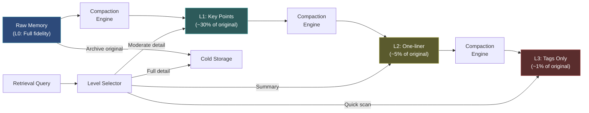

# Memory Compaction

  

## 📖 At a Glance

| Difficulty | Time | Prerequisites |
|------------|------|---------------|
| Intermediate | ~30 min | Python 3.8+, `OPENAI_API_KEY`, understanding of 03 Summary Memory recommended |

This technique is for developers who need to compress stored memories into shorter forms to fit more knowledge into a fixed token budget.

## TL;DR

- **What it is:** **Memory Compaction** compresses stored memories through progressive multi-level summarization from full text down to tags.
- **When you need it:** You need to fit more knowledge into a fixed token budget and want to choose the detail level at retrieval time.
- **The trade-off:** Each memory may need up to three LLM calls to reach the final compression level, and aggressive compression loses detail.
- **Closest alternative in this repo:** 03 Summary Memory creates a single summary, while Compaction produces multiple progressive levels for flexible retrieval.

## Overview

Imagine you record every meeting at work, word for word. After a year you have thousands of pages, but the real decisions fill maybe 10% of the text. Memory Compaction is the agent memory technique that solves this for LLM agents through progressive summarization (compressing text in stages). Raw memories get transformed into denser versions at multiple levels: full text, key points, a one-liner, and tags. The agent retrieves whichever level of detail the current task needs. This is especially valuable for token-constrained systems or long-running assistants that accumulate large volumes of conversation history.

Memory compaction does this for an agent's memory store. It reduces storage size and token cost (the expense of including text in a prompt) through progressive summarization (compressing in stages). Raw memories, like full conversation transcripts and verbose tool outputs, take up a lot of space. Compaction transforms them into denser versions that keep the essential information and discard the filler.

The key challenge is the storage-fidelity tradeoff. Aggressive compression saves tokens and money, but risks losing details that may matter later. Well-designed compaction systems use multiple compression levels. Memories get progressively shorter over time, but the original stays accessible in cold storage (cheap, slower storage) when you need it.

The practical benefit is dramatic. A compacted memory store can hold 10x to 100x more semantic content in the same storage budget. Retrieval gets faster because compressed entries are smaller and more information-dense.

**Keywords:** agent memory, LLM agent, memory compaction, progressive summarization, token budget, compression levels, storage-fidelity tradeoff, prompt compression, long-term memory

## Key Concepts

- **Progressive summarization levels**: Multi-stage compression. L0 is the raw text. L1 extracts key points. L2 distills those into one sentence. L3 reduces everything to tags only.
- **Lossy vs. lossless compression**: Lossless keeps all information (e.g., structured extraction). Lossy discards details for brevity (e.g., summarization). Compaction uses both.
- **Detail levels**: Configurable granularity for retrieval. You can request more or less compressed versions depending on the query's needs.
- **Compaction scheduling**: Rules for when memories become eligible for further compression (e.g., after N days without access, or when storage pressure rises).
- **Reversibility**: Keeping the original memory alongside compressed versions. This lets you recover full detail when needed.
- **Storage-fidelity tradeoff**: The core tension between saving resources through compression and preserving information for future use.

## Architecture

  

Mermaid source

---

## How It Works

1. New memories are stored at full fidelity (L0) along with extracted metadata (tags, entities, timestamps).
2. After a configurable aging period, or when storage pressure rises, the compaction engine selects candidate memories.
3. Each candidate is compressed to the next level using LLM-based summarization or entity extraction (pulling out structured facts like names, dates, and decisions).
4. The compressed version becomes the primary retrieval target. The original may stay in cold storage or be discarded.
5. Retrieval can specify a desired detail level. The system returns the appropriate compression level.

## When to Use

- Token-constrained systems where retrieved context must fit within tight budget limits.
- Agents with long operational lifetimes that accumulate large volumes of raw memory.
- Cost-sensitive deployments where storage and inference costs scale with memory volume.

## Limitations

- Summarization is lossy. If the agent later needs exact wording from a past turn, compressed levels won't have it. Cold storage retrieval adds latency.
- Each memory needs up to three LLM calls to reach L3. High-throughput agents (hundreds of memories per hour) may spend more on compaction than they save on storage.
- For small memory stores (under 100 entries), multi-level compaction adds overhead without meaningful benefit. A buffer or sliding window is a better fit.
- Compaction scheduling involves tradeoffs. Age-based triggers compress old memories even if they're still useful. Storage-pressure triggers delay compression but create traffic spikes.

## Notebook

The [notebook](./memory_compaction.ipynb) walks through a complete implementation:

1. **Data structures**: `CompactionLevel` enum and `CompactedMemory` dataclass that hold content at four fidelity levels (L0 raw, L1 key points, L2 one-liner, L3 tags).
2. **Compaction engine**: Uses LLM calls (OpenAI `gpt-4o-mini`) to compress from one level to the next with level-specific prompts.
3. **Memory store**: Manages active memories and cold storage. Supports level-aware retrieval so you pick the right resolution per query.
4. **Compaction scheduler**: Selects memories for compression based on age and idle-time policies.
5. **Example run**: Three realistic agent memories compacted end-to-end, with storage savings measured at each level.

## FAQ

### Q: What is Memory Compaction in agent memory?

**A:** Memory Compaction compresses stored memories through progressive multi-level summarization to fit more knowledge into a fixed token budget. Unlike single-pass summarization, compaction creates a hierarchy of summaries at different fidelity levels: a detailed version, a medium summary, and a one-line gist. The system selects the appropriate fidelity level based on available context space. This lets you pack 10x more memories into the same token budget by using shorter representations for less relevant items.

### Q: When should I use Memory Compaction instead of Summary Memory?

**A:** Use Memory Compaction when you have many memories competing for limited context space and want flexible fidelity control. Summary Memory (technique 03) produces a single summary of the conversation. Compaction produces multiple compression levels per memory, so you can include 50 one-line gists and 5 detailed memories in the same context window. Choose compaction when your agent has hundreds of stored facts and needs to present the most relevant ones at varying detail levels.

### Q: What are the limits or failure modes of Memory Compaction?

**A:** Each compression level loses information. The one-line gist of a complex memory may be misleading or incomplete. Generating multiple fidelity levels per memory multiplies LLM costs (3 calls per memory if you want 3 levels). Storage also increases since you keep multiple versions. If the selection algorithm picks the wrong fidelity level, the agent gets either too little or too much detail. Compaction works best with factual content and poorly with nuanced or conditional information.

### Q: Can I combine Memory Compaction with another memory technique?

**A:** Yes. Combine it with technique 13 (Hierarchical Memory Layers) to store different fidelity levels in different tiers: gists in the hot tier, medium summaries in the warm tier, and full memories in the cold tier. Pair it with technique 20 (Memory Retrieval Patterns) to first retrieve by relevance, then select the appropriate fidelity level based on remaining context budget. This creates a highly token-efficient retrieval pipeline.

### Q: What library or framework can I use to skip the implementation work?

**A:** No major framework provides a dedicated multi-level compaction class as of late 2025. Letta/MemGPT (technique 26) implements a form of compaction when archiving core memory to archival storage. You can build compaction on top of LangChain by creating a custom memory class that stores multiple summary versions per entry. The implementation requires roughly 100-200 lines of Python: an LLM chain for each compression level plus a selector that chooses fidelity based on available token budget.

## References

- Forte, T. (2017). "Progressive Summarization: A Practical Technique for Designing Discoverable Notes." Forte Labs.
- Xu, Z., et al. (2023). "RECOMP: Improving Retrieval-Augmented LMs with Compression and Selective Augmentation." arXiv:2310.04408.
- Chevalier, A., et al. (2023). "Adapting Language Models to Compress Contexts." arXiv:2305.14788.
- Jiang, H., et al. (2023). "LongLLMLingua: Accelerating and Enhancing LLMs in Long Context Scenarios via Prompt Compression." arXiv:2310.06839.

## Related Techniques

- [**14 Memory Consolidation**](../14_memory_consolidation/) - Consolidation merges and deduplicates memories. Compaction compresses them. Use both for a clean, space-efficient store.
- [**03 Summary Memory**](../03_summary_memory/) - Summarization is the simplest form of compaction, applied to entire conversations at once.
- [**04 Summary Buffer Memory**](../04_summary_buffer_memory/) - Combines recent-message buffering with summarization of older turns. A lightweight alternative to full multi-level compaction.
- [**13 Hierarchical Memory Layers**](../13_hierarchical_memory_layers/) - Compaction works naturally across memory tiers. Compress more aggressively as memories move to colder layers.

---

