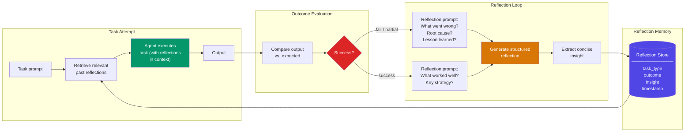

# Self-Reflection Memory

  

## 📖 At a Glance

| Difficulty | Time | Prerequisites |
|------------|------|---------------|
| Advanced | ~50 min | Python 3.8+, `ANTHROPIC_API_KEY`, understanding of 06 Vector Store Memory recommended |

This technique is for developers building agents that evaluate and learn from their own past behavior, using self-assessment to improve future responses.

## TL;DR

- **What it is:** **Self-Reflection Memory** has the agent analyze its own performance after tasks, extract lessons learned, and store them for future retrieval.
- **When you need it:** Your agent repeats similar tasks and you want it to improve by learning from past mistakes and successes.
- **The trade-off:** Reflection quality depends on model reasoning ability, and every task triggers an extra LLM call for analysis.
- **Closest alternative in this repo:** 09 Episodic Memory records what happened, while Self-Reflection Memory records what the agent learned from it.

## Overview

Think of a chess player who reviews their games after each match. They don't record moves alone. They ask: "Why did I lose that piece? What pattern did I miss?" Self-Reflection Memory is the agent memory technique that brings this same metacognition (thinking about one's own thinking) to LLM agents. After each task, the agent analyzes what went well or poorly, extracts reusable lessons, and stores them for future retrieval. It builds on the Reflexion framework's approach to verbal reinforcement learning. Code generation agents, research assistants, and other multi-step systems use it to improve over sessions with no model retraining.

Self-reflection memory works this way in practice. After each task attempt, the agent pauses and analyzes *why* things went well or poorly. It identifies recurring patterns in its decisions and extracts reusable lessons. These reflections go into a specialized memory store. Before future tasks, the agent retrieves relevant past reflections to guide its planning.

This technique draws from metacognition research in cognitive science. It also builds on the Reflexion framework (Shinn et al., 2023), where agents use verbal self-reflection to turn sparse feedback into rich learning signals. The result is an agent that learns from mistakes and reinforces successful strategies across sessions, with no model retraining required.

**Keywords:** agent memory, LLM agent, self-reflection, metacognition, Reflexion framework, verbal reinforcement learning, self-improvement, insight extraction, task failure analysis

## Key Concepts

- **Reflection prompts**: Structured questions that guide the agent to evaluate its recent actions. For example: "What went well? What could be improved? What would you do differently?"
- **Meta-cognition**: The agent's ability to reason about its own reasoning. It identifies strengths and weaknesses in its approach.
- **Outcome evaluation**: Comparing actual results against intended goals. The agent determines success, partial success, or failure.
- **Behavioral patterns**: Recurring tendencies in the agent's behavior. For example: consistently underestimating task complexity or over-relying on a specific tool.
- **Reflection-triggered learning**: Using reflection outputs to update strategies, modify prompts, or adjust memory retrieval preferences.
- **Insight extraction**: Distilling reflections into concise, reusable principles or rules-of-thumb for future decisions.
- **Reflexion framework**: The approach from Shinn et al. (2023) where agents use linguistic feedback to iteratively refine their behavior.

## Architecture

  

Mermaid source

---

## How It Works

1. After completing a task (or failing), the agent receives an outcome signal (success, failure, partial).
2. A reflection prompt asks the agent to analyze what happened, why, and what lessons to extract.
3. The agent generates a structured reflection containing observations, root causes, and actionable insights.
4. Reflections go into a dedicated memory store, indexed by task type and outcome.
5. Before future tasks, the agent retrieves relevant past reflections and injects them into the planning context.

## When to Use

- Agents performing complex tasks where failure analysis can prevent repeated mistakes.
- Systems where explicit reward signals are sparse but verbal reasoning about outcomes is possible.
- Long-running agents that should demonstrably improve their performance over time.

## Limitations

- Reflection quality depends on the model's reasoning ability. Shallow or incorrect reflections get stored and can mislead future attempts.
- There's no built-in way to detect contradictions. If two reflections give conflicting advice, both persist in the store.
- Every failure triggers an extra LLM call to generate the reflection. In high-failure-rate scenarios, this adds significant API cost.
- The technique needs clear, evaluatable success criteria. Open-ended tasks (creative writing, design decisions) can't trigger meaningful reflection.
- Keyword-based retrieval can miss relevant past reflections when the current task uses different wording. Production systems should use embedding-based search instead.

## Notebook

See [**self_reflection_memory.ipynb**](self_reflection_memory.ipynb) for a full, runnable implementation.

The notebook implements a `ReflectiveAgent` that uses Claude's tool-use API to generate structured reflections after task failures. It stores them in a `ReflectionStore` and retrieves relevant past insights before future attempts. A 6-task benchmark run across 3 iterations demonstrates measurable improvement as the agent accumulates reflections. The agent learns from mistakes without any parameter updates.

## FAQ

### Q: What is Self-Reflection Memory in agent memory?

**A:** Self-Reflection Memory has the agent analyze its own performance after completing tasks. The agent reviews what worked, what failed, and why, then stores these reflections as searchable lessons learned. On future tasks, it retrieves relevant past reflections to avoid repeating mistakes. This is inspired by the Reflexion paper (Shinn et al., 2023), where agents iteratively improve by reflecting on failures. It stores meta-knowledge: knowledge about the agent's own behavior and reasoning patterns.

### Q: When should I use Self-Reflection Memory instead of Episodic Memory?

**A:** Use Self-Reflection Memory when your agent needs to improve over time without retraining. Episodic Memory (technique 09) records what happened but does not analyze why it happened or extract lessons. Self-reflection adds an analysis layer that distills actionable insights from experiences. If your agent makes the same type of error repeatedly, self-reflection memory helps it recognize and correct the pattern. Use episodic memory when you need raw recall; use self-reflection when you need learning.

### Q: What are the limits or failure modes of Self-Reflection Memory?

**A:** Reflection quality depends on the LLM's ability to accurately diagnose its own failures. Models can produce shallow or incorrect analyses, blaming the wrong factor. Storing too many reflections without curation creates noise that drowns out useful lessons. The reflection step adds latency (300-1000ms) and cost after each task. If the agent retrieves a reflection from a different context, it may apply a lesson that does not fit the current situation, causing new errors.

### Q: Can I combine Self-Reflection Memory with another memory technique?

**A:** Yes. Combine it with technique 11 (Procedural Memory) so reflections can update stored procedures. When a reflection identifies a failed step in a procedure, the agent revises that procedure for future use. You can also pair it with technique 09 (Episodic Memory): episodes provide the raw data, and self-reflection extracts the lessons. Add technique 14 (Memory Consolidation) to periodically merge and deduplicate accumulated reflections.

### Q: What library or framework can I use to skip the implementation work?

**A:** LangGraph and LangChain support reflection patterns through custom agent loops with self-critique steps. The Reflexion pattern from the research paper can be implemented in roughly 50-100 lines on top of any LLM framework. Letta/MemGPT (technique 26) can store reflections in its core or archival memory. No major framework offers a dedicated reflection memory class. For custom builds, create a post-task reflection chain that writes structured lessons to a vector store for later retrieval.

## References

- Shinn, N., et al. (2023). "Reflexion: Language Agents with Verbal Reinforcement Learning." arXiv:2303.11366.
- Madaan, A., et al. (2023). "Self-Refine: Iterative Refinement with Self-Feedback." arXiv:2303.17651.
- Flavell, J. H. (1979). "Metacognition and Cognitive Monitoring." *American Psychologist*, 34(10), 906-911.
- Yao, S., et al. (2023). "ReAct: Synergizing Reasoning and Acting in Language Models." arXiv:2210.03629.

## Related Techniques

- [**09 Episodic Memory**](../09_episodic_memory/) - Reflections are a specialized type of episode. Episodic memory gives you the storage layer that self-reflection builds on.
- [**14 Memory Consolidation**](../14_memory_consolidation/) - Over time, reflections accumulate. Consolidation merges and deduplicates them to keep the store clean.
- [**12 Working Memory Context Window**](../12_working_memory_context_window/) - Retrieved reflections feed into the agent's working memory for planning. This technique controls what fits in that window.
- [**26 Letta/MemGPT Patterns**](../26_letta_memgpt_patterns/) - Letta implements reflection-like loops where the agent edits its own memory based on self-assessment.

---

