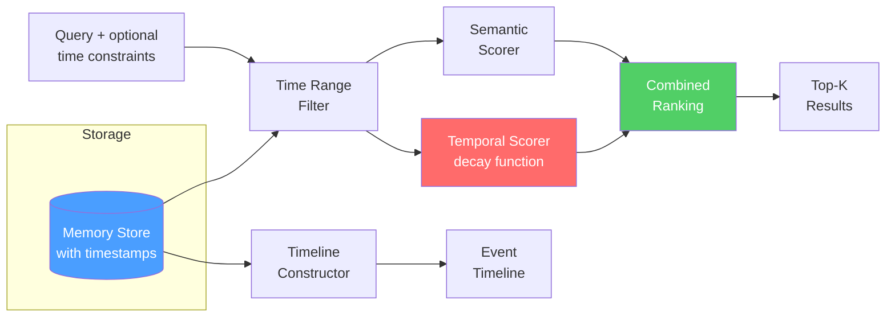

# Temporal Memory

  

## 📖 At a Glance

| Difficulty | Time | Prerequisites |
|------------|------|---------------|
| Intermediate | ~35 min | Python 3.8+, `OPENAI_API_KEY`, understanding of 06 Vector Store Memory recommended |

This technique is for developers building agents that need to track when facts were learned, detect outdated information, and reason about time.

## TL;DR

- **What it is:** **Temporal Memory** attaches timestamps to memories and uses recency-weighted retrieval with configurable decay functions.
- **When you need it:** Your agent must prefer newer facts over older ones and support time-range or "as of" queries.
- **The trade-off:** Choosing the right decay half-life requires experimentation, and scoring all candidates adds latency at 100k+ entries.
- **Closest alternative in this repo:** 19 Forgetting and Decay applies decay for lifecycle pruning, while Temporal Memory applies it during retrieval scoring.

## Overview

Think of a notebook where you write everything with a date. When someone asks "what's the project status?", you don't read the entire notebook. You flip to the most recent page. Temporal Memory is the agent memory technique that gives LLM agents this same time-awareness. It attaches timestamps to every stored memory and adds recency-weighted retrieval (scoring newer memories higher when relevance is similar). It also supports time-range queries and "as of" queries that reconstruct past knowledge states. You'll need it for project tracking agents, customer support bots, and any system where facts change over time.

Standard vector-based retrieval (searching by meaning similarity) treats all memories as equally current. This can lead to agents citing outdated information or failing to notice how situations evolved.

Temporal memory solves this. It supports time-range queries ("what happened last week?"), recency-weighted retrieval (preferring newer information when relevance scores are close), and "as of" queries (reconstructing what the agent knew at a specific past moment). These capabilities are essential for agents in dynamic environments where facts change and chronological order carries meaning.

**Keywords:** agent memory, LLM agent, temporal memory, timestamp metadata, recency-weighted retrieval, temporal decay, time-range queries, chronological memory, event timeline

## Key Concepts

- **Timestamp metadata**: Every memory carries creation time, last access time, and optionally an event time (when the described event actually occurred).
- **Temporal decay functions**: Mathematical functions (exponential, linear) that reduce a memory's retrieval score as it ages. Parameterized by a half-life (the time for the score to drop to 50%).
- **Recency scoring**: Combining semantic relevance with temporal freshness. When two memories match a query equally well, the more recent one ranks higher. The blending weight is configurable.
- **Time-range queries**: Retrieving memories that fall within a specified time window. For example: "conversations from the past 24 hours."
- **Temporal ordering**: Maintaining the chronological sequence of memories. This helps the agent understand cause-and-effect relationships.
- **"As of" retrieval**: Reconstructing what the agent knew at a specific past moment by filtering out memories created after that timestamp.
- **Event timelines**: Building ordered sequences of related events from memory, with optional LLM-powered narrative summarization.

## Architecture

  

Mermaid source

---

## How It Works

1. Every memory is stored with structured timestamp fields (`created_at`, `event_time`, `last_accessed`).
2. At query time, a temporal decay function adjusts each memory's base relevance score by its age.
3. The decay function is configurable: exponential decay for strong freshness preference, linear decay for gradual aging, or no decay for time-insensitive queries.
4. Time-range filters constrain results to specific periods before semantic search runs.
5. "As of" queries exclude memories created after the target timestamp.
6. Timeline construction aggregates related memories in chronological order for narrative-style recall.

## What You Will Build

The [notebook](./temporal_memory.ipynb) walks through a complete implementation:

- A `TemporalMemory` dataclass with structured timestamp metadata.
- A `TemporalDecay` class supporting exponential and linear decay functions.
- A `TemporalMemoryStore` with four retrieval modes: standard query, time-range, "as of", and timeline.
- An LLM-powered timeline summarizer that produces narrative summaries.
- A full example tracking a software project over 30 days, demonstrating all retrieval modes.

## When to Use

- Agents tracking evolving situations where information becomes outdated (project status, market conditions).
- Systems that need to answer "when" questions or provide chronological summaries.
- Environments where the same entity's attributes change over time and the most current state matters.

## Limitations

- Evergreen facts (math formulas, API docs, company policies) get unfairly penalized by decay. You need to exempt them from decay or set a very long half-life.
- Choosing the right half-life and recency weight requires experimentation. Too short forgets important context. Too long defeats the purpose of temporal awareness.
- Every query computes decay scores for all candidate memories. For large stores (100k+ entries), this adds latency compared to pure vector search.
- The system assumes accurate timestamps. Out-of-order arrivals or clock skew in distributed setups produce misleading recency scores.

## FAQ

### Q: What is Temporal Memory in agent memory?

**A:** Temporal Memory attaches timestamps to every stored memory and uses recency-weighted retrieval to prefer newer information over older information. A configurable decay function (exponential, linear, or step) reduces the retrieval score of older memories. For example, with a half-life of 7 days, a memory from last week scores 50% of a memory from today. This helps the agent prioritize current facts when information evolves over time, such as project status or user preferences.

### Q: When should I use Temporal Memory instead of Forgetting and Decay?

**A:** Use Temporal Memory when you want time-awareness during retrieval without permanently deleting memories. Forgetting and Decay (technique 19) permanently prunes memories that fall below an importance threshold. Temporal Memory keeps everything in storage but down-ranks older items in search results. If you might need old memories later (for auditing or reactivation), temporal scoring is safer. Use forgetting and decay when storage cost is a concern and you want to reclaim space.

### Q: What are the limits or failure modes of Temporal Memory?

**A:** Temporal weighting can bury timeless facts. If the user stated a permanent preference months ago, decay may push it below newer but less important messages. Choosing the right decay function and half-life requires experimentation. A half-life that is too short makes the agent forgetful. A half-life that is too long provides almost no temporal benefit. The approach also assumes that newer means more relevant, which is not always true for stable facts or long-term preferences.

### Q: Can I combine Temporal Memory with another memory technique?

**A:** Yes. Combine it with technique 06 (Vector Store Memory) by adding a time-decay multiplier to the similarity score during retrieval. This gives you relevance times recency ranking. Pair it with technique 10 (Semantic Memory) and tag facts with "stable" or "volatile" labels so stable facts (like a user's name) bypass decay while volatile facts (like project deadlines) decay normally. This selective decay approach prevents burying permanent information.

### Q: What library or framework can I use to skip the implementation work?

**A:** Zep (technique 27) applies temporal scoring natively in its retrieval pipeline. Graphiti (technique 24) timestamps all graph edges and supports temporal queries over its knowledge graph. LangChain does not have a built-in temporal memory class, but you can add a time-decay multiplier to any retriever by wrapping the score function. The implementation adds roughly 20-30 lines to an existing vector retrieval setup. Mem0 (technique 25) tracks fact creation and update times for temporal filtering.

## References

- Park, J. S., et al. (2023). ["Generative Agents: Interactive Simulacra of Human Behavior."](https://arxiv.org/abs/2304.03442) arXiv:2304.03442.
- Zhong, W., et al. (2024). ["MemoryBank: Enhancing Large Language Models with Long-Term Memory."](https://arxiv.org/abs/2305.10250) arXiv:2305.10250.
- Tulving, E. (2002). ["Episodic Memory: From Mind to Brain."](https://doi.org/10.1146/annurev.psych.53.100901.135114) *Annual Review of Psychology*, 53, 1-25.
- Hassabis, D., & Maguire, E. A. (2007). ["Deconstructing Episodic Memory with Construction."](https://doi.org/10.1016/j.tics.2007.05.001) *Trends in Cognitive Sciences*, 11(7), 299-306.

## Related Techniques

- [**19 Forgetting and Decay**](../19_forgetting_and_decay/) - Uses similar decay functions but focused on pruning stale memories instead of scoring them.
- [**09 Episodic Memory**](../09_episodic_memory/) - Episodes carry natural temporal ordering. Temporal memory adds the retrieval math to take advantage of it.
- [**20 Memory Retrieval Patterns**](../20_memory_retrieval_patterns/) - Temporal scoring integrates into multi-stage retrieval pipelines alongside semantic and keyword search.
- [**06 Vector Store Memory**](../06_vector_store_memory/) - The basic embedding-based retrieval that temporal memory extends with time-awareness.

---

