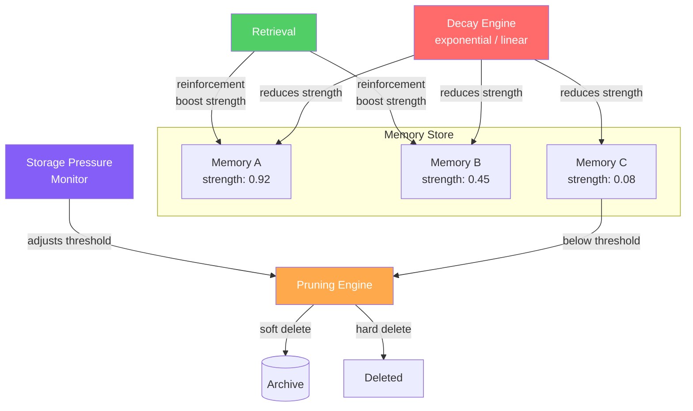

# Forgetting & Decay

  

## 📖 At a Glance

| Difficulty | Time | Prerequisites |
|------------|------|---------------|
| Intermediate | ~35 min | Python 3.8+, `OPENAI_API_KEY`, understanding of 06 Vector Store Memory recommended |

This technique is for developers who want their agent to naturally forget low-value information over time, mimicking human memory decay.

## TL;DR

- **What it is:** **Forgetting and Decay** reduces memory importance over time using exponential decay, reinforces memories on access, and prunes below a threshold.
- **When you need it:** Your memory store grows unbounded and you need automatic cleanup that keeps frequently accessed memories alive.
- **The trade-off:** All memories decay equally by age, so critical facts like allergies or legal constraints can be pruned without safeguards.
- **Closest alternative in this repo:** 18 Temporal Memory uses time-based scoring at retrieval without deleting memories from the store.

## Overview

Think about your kitchen pantry. If you never throw anything out, it fills up with expired food. Finding what you need becomes harder. Eventually, you spend more time searching than cooking. Forgetting and Decay is the agent memory technique that applies this same controlled cleanup to LLM agent memory. It uses mathematical decay functions (like the exponential forgetting curve from Ebbinghaus's 1885 research) to reduce memory importance scores over time. Memories that are accessed often get reinforced through spaced repetition (reviewing at growing intervals). Memories that fall below a threshold get pruned. This keeps retrieval quality high for long-running chatbots, customer support agents, and other cost-sensitive systems.

While it seems counterintuitive to deliberately forget, unbounded memory accumulation leads to three real problems: retrieval quality degrades, costs grow, and noise drowns out relevant information.

The goal is not to lose valuable information. The goal is to maintain a high signal-to-noise ratio in the memory store. What the agent remembers should be genuinely useful. Neuroscience now views biological forgetting as an adaptive feature of memory, not a failure. This technique brings that same principle to AI systems.

**Keywords:** agent memory, LLM agent, forgetting curve, exponential decay, spaced repetition, memory pruning, storage pressure, memory lifecycle, access-based reinforcement

## Key Concepts

- **Ebbinghaus forgetting curve**: The empirical observation that memory retention decays exponentially over time without reinforcement. It provides the mathematical basis for decay functions.
- **Exponential decay**: A decay function where memory strength decreases as `S(t) = S_0 * e^(-lambda * t)`. The decay rate lambda is configurable. A higher lambda means faster forgetting.
- **Spaced repetition**: Reinforcing memories at increasing intervals to slow their decay. Borrowed from learning science (the Leitner system, the SM-2 algorithm).
- **Access-based scoring**: Boosting a memory's retention score each time it's retrieved. This ensures frequently useful memories persist longer.
- **Pruning thresholds**: Minimum score values below which memories become candidates for deletion or archival (moving to long-term cold storage).
- **Memory lifecycle**: The full journey of a memory: creation, active use, decay, and eventual pruning or archival.
- **Storage pressure management**: Triggering more aggressive forgetting when memory stores approach capacity limits.

## Architecture

  

Mermaid source

---

## How It Works

1. Each memory gets an initial strength score based on its estimated importance.
2. A decay function continuously reduces the strength score as time passes since last access.
3. When a memory is retrieved, its strength is boosted (reinforcement). This resets or slows the decay.
4. A background process periodically identifies memories whose scores fall below the pruning threshold.
5. Below-threshold memories are either soft-deleted (moved to archival storage) or hard-deleted depending on policy.
6. Storage pressure can dynamically adjust the pruning threshold, triggering more aggressive forgetting when needed.

## When to Use

- Long-lived agents that accumulate thousands of memories and experience retrieval quality degradation.
- Cost-sensitive systems where storage and embedding costs grow with memory volume.
- Environments with high information turnover where old data frequently becomes irrelevant.

## Limitations

- Critical information (user allergies, legal requirements, safety rules) can decay and get pruned if you don't exempt it. The decay function treats all memories equally by age.
- Rarely accessed but important memories (annual compliance procedures, once-a-year events) decay long before their next use. Access frequency doesn't always reflect importance.
- The half-life, reinforcement boost, and pruning threshold interact in non-obvious ways. Expect iterative tuning for each use case.
- When information becomes stale, the old version and the new correction coexist in memory. Decay alone doesn't resolve conflicting versions. The outdated entry persists until it naturally decays away.
- Clock skew in distributed systems can cause unexpected forgetting. All decay calculations depend on the difference between "now" and "last accessed."

## Notebook

The [full notebook](./forgetting_and_decay.ipynb) walks you through a complete implementation. You'll build:

- A `DecayableMemory` data class that tracks strength, access count, and timestamps.
- A `DecayEngine` that applies exponential decay with a configurable half-life and reinforces memories on retrieval.
- A `ForgettingMemoryStore` that combines embedding-based search with strength-weighted ranking, automatic pruning, and storage pressure management.
- An end-to-end agent demo that shows how memories fade and get pruned over simulated time.

The notebook uses the OpenAI SDK for embeddings and chat completions.

## FAQ

### Q: What is Forgetting and Decay in agent memory?

**A:** Forgetting and Decay reduces memory importance scores over time using exponential decay and permanently prunes memories that fall below a threshold. Memories that are accessed or reinforced have their scores boosted, keeping useful memories alive. This mimics the Ebbinghaus forgetting curve from cognitive science. The net effect is a self-cleaning memory store where frequently used memories survive and neglected ones disappear. Typical implementations use a decay half-life of 1 to 30 days depending on the domain.

### Q: When should I use Forgetting and Decay instead of Temporal Memory?

**A:** Use Forgetting and Decay when you need to control storage size and cost by permanently removing stale memories. Temporal Memory (technique 18) keeps all memories but down-ranks old ones during retrieval. If your agent runs for months and accumulates tens of thousands of memories, decay with pruning prevents the store from growing without bound. Choose temporal memory alone when you need to keep all data for compliance or auditing but still prefer fresh results.

### Q: What are the limits or failure modes of Forgetting and Decay?

**A:** Pruned memories are gone forever unless you maintain a separate archive. Incorrect threshold or half-life settings can delete important but infrequently accessed memories. A user preference stated once and never re-accessed will decay and vanish. The decay function is domain-sensitive: a 7-day half-life works for news but not for medical history. Reinforcement on access can create feedback loops where popular memories get stronger while equally valid alternatives starve.

### Q: Can I combine Forgetting and Decay with another memory technique?

**A:** Yes. Pair it with technique 14 (Memory Consolidation) so that consolidation runs before pruning. This way, related memories merge into stronger combined entries before weak individual ones get pruned. Combine it with technique 10 (Semantic Memory) to protect certain fact categories (like user identity or compliance data) from decay using "pinned" flags. Add technique 13 (Hierarchical Memory Layers) to demote decaying memories to cold storage instead of deleting them.

### Q: What library or framework can I use to skip the implementation work?

**A:** Zep (technique 27) implements time-based decay and importance scoring in its managed memory service. Mem0 (technique 25) supports memory lifecycle management with automatic relevance scoring. No major framework provides a standalone decay-and-pruning class. For custom builds, add an `importance` field and `last_accessed` timestamp to your memory store, then run a periodic job that applies the decay formula and deletes entries below the threshold. This requires roughly 30-50 lines of Python.

## References

- Ebbinghaus, H. (1885). *Memory: A Contribution to Experimental Psychology*. (Translated by Ruger & Bussenius, 1913).
- Zhong, W., et al. (2024). "MemoryBank: Enhancing Large Language Models with Long-Term Memory." arXiv:2305.10250.
- Richards, B. A., & Frankland, P. W. (2017). "The Persistence and Transience of Memory." *Neuron*, 94(6), 1071-1084.
- Wozniak, P. A., & Gorzelanczyk, E. J. (1994). "Optimization of Repetition Spacing in the Practice of Learning." *Acta Neurobiologiae Experimentalis*, 54, 59-62.

## Related Techniques

- [**18 Temporal Memory**](../18_temporal_memory/) - The time-aware companion. Temporal memory scores by recency. Forgetting and decay prunes by age.
- [**14 Memory Consolidation**](../14_memory_consolidation/) - Another memory lifecycle technique. It merges and deduplicates instead of deleting.
- [**15 Memory Compaction**](../15_memory_compaction/) - Compresses memories to save space. A complement to pruning: shrink before you delete.
- [**30 Production Memory Patterns**](../30_production_memory_patterns/) - Decay policies are essential for production deployments. This technique shows how to operationalize them.

---

