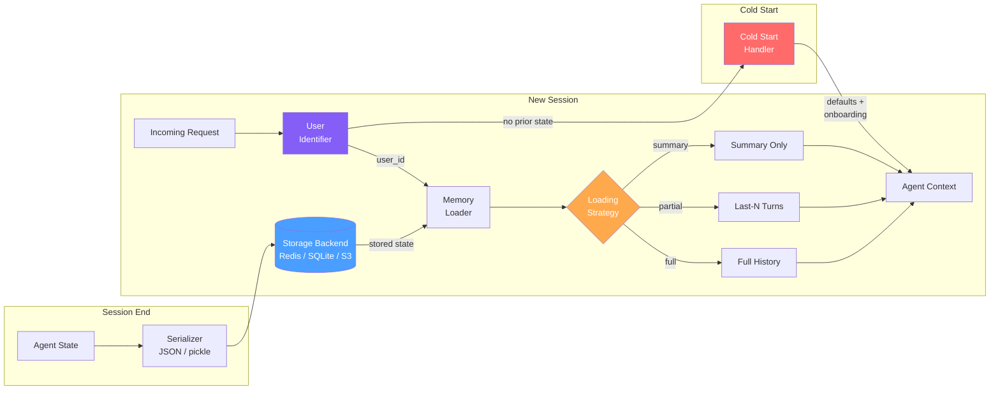

# Cross-Session Memory

  

## 📖 At a Glance

| Difficulty | Time | Prerequisites |
|------------|------|---------------|
| Intermediate | ~35 min | Python 3.8+, `OPENAI_API_KEY`, understanding of 06 Vector Store Memory recommended |

This technique is for developers building agents that remember users across separate sessions, maintaining continuity over days or weeks.

## TL;DR

- **What it is:** **Cross-Session Memory** persists agent state between independent sessions using serialization and a storage backend keyed by user ID.
- **When you need it:** Your agent must remember users across separate conversations that happen hours, days, or weeks apart.
- **The trade-off:** Adds serialization logic, storage costs, and a user-identification layer that must handle returning vs. new users.
- **Closest alternative in this repo:** 22 Multi-Agent Shared Memory also persists state, but coordinates multiple agents rather than one agent across sessions.

## Description

Think of a coworker who forgets every conversation overnight. Each morning, you'd re-explain your project, your preferences, and yesterday's decisions. That's what an LLM agent without Cross-Session Memory feels like. This agent memory technique fixes the problem by persisting state (conversation history, learned facts, preferences) between independent sessions. The agent serializes its memory to durable storage, like a database or file, then reloads the right slice when you return. You'll find this essential for long-running chatbots, personal assistants, and any agent that needs session persistence and user identification across visits.

**Keywords:** agent memory, LLM agent, cross-session memory, session persistence, state serialization, conversation history, user identification, memory loading strategies, cold start handling, personal assistants

Cross-session memory lets an AI agent keep its internal state between independent sessions. A "session" is a single conversation from start to finish. "State" includes conversation history, user preferences, learned facts, and task progress. Without this technique, every session starts from scratch.

This technique covers the full lifecycle of session state. At the end of a session, the agent serializes its state. "Serializing" means converting in-memory data into a format you can save to disk, like JSON. The serialized state goes into durable storage (files, databases, or cloud object stores). When a user returns, the system identifies them and reloads the right memory slice. It also handles cold-start scenarios, where no prior memory exists. And it covers strategies for choosing which memories to load when the stored history grows large.

## What the Notebook Covers

The [notebook](./cross_session_memory.ipynb) builds a complete cross-session memory system from scratch using the OpenAI SDK:

1. **SessionState** data class for serializable agent state (facts, summaries, messages, preferences).
2. **SQLiteBackend** for persisting state between sessions.
3. **LLM-powered extraction**: uses `gpt-4o-mini` to pull out user facts and compress conversations into summaries at session end.
4. **CrossSessionManager** for the full session lifecycle: resumption, cold starts, and three loading strategies (full, last-N, summary-only).
5. **CrossSessionAgent** that wires persisted memory into the conversation loop.
6. **Multi-session demo** showing Session 1 (cold start), Session 2 (agent remembers), and a new-user cold start.

## Key Concepts

- **Session serialization**: Converting the agent's in-memory state (messages, metadata, extracted
  facts) into a portable format you can save to disk. JSON is human-readable. Pickle handles
  complex Python objects. Protobuf (Protocol Buffers) offers compact binary encoding with support
  for schema changes over time.
- **State persistence backends**: Where you store the serialized state between sessions. Options
  include local files, relational databases (PostgreSQL, SQLite), key-value stores (Redis), or
  cloud storage (S3, GCS). Your choice depends on speed, reliability, and scale needs.
- **Session resumption**: The system detects a returning user via user ID, API key, or session
  token. It then loads the correct memory snapshot before the new session's first turn.
- **User identification**: Mapping each incoming request to a persistent user identity. This
  ensures the agent retrieves the right memory and doesn't mix up users.
- **Memory loading strategies**: Deciding how much prior state to reload. Options include full
  history, last-N turns, summary-only, or relevance-ranked retrieval (finding the memories most
  relevant to the current question). These strategies help you stay within context limits.
- **Cold start handling**: Initializing agent state when no prior session exists. This
  includes default persona settings and initial preference questions.

## Architecture

  

Mermaid source

---

## How It Works

1. At session end, the agent extracts key facts and generates a conversation summary using an LLM.
2. A `SessionState` object bundles these facts, the summary, user preferences, and recent messages.
3. A serializer converts the state to JSON and writes it to a storage backend (SQLite, Redis, or S3).
4. When the user returns, the system identifies them by user ID and loads their stored state.
5. A loading strategy (full history, last-N turns, or summary-only) trims the state to fit the context window.
6. If no prior state exists, a cold-start handler creates a default state and begins onboarding.

## When to Use

- You're building a personal assistant that users return to across days or weeks.
- Your agent manages long-running tasks (like multi-day research) that span multiple sessions.
- Users keep repeating context every time they start a new conversation.
- You need per-user personalization that accumulates over time (preferences, projects, goals).

## Limitations

- Stored facts can go stale. A user's job, city, or project may change, but old memories persist unless you add expiration logic.
- Storing personal data across sessions raises privacy concerns (GDPR, CCPA). You need clear retention and deletion policies.
- Accumulated state from many sessions can exceed the LLM's context window, even with loading strategies.
- Storage costs grow linearly with your user base. Millions of users need proper database infrastructure and backup plans.

## FAQ

### Q: What is Cross-Session Memory in agent memory?

**A:** Cross-Session Memory persists agent state between independent sessions so the agent remembers users across days, weeks, or months. It serializes conversation history, extracted facts, and user preferences to a storage backend (database, file system, or cloud service) keyed by user or session ID. When a new session starts, the agent loads the relevant state and resumes with full context. This is the foundation for any agent that maintains long-term user relationships.

### Q: When should I use Cross-Session Memory instead of Multi-Agent Shared Memory?

**A:** Use Cross-Session Memory when a single agent serves one user at a time and needs continuity across sessions. Multi-Agent Shared Memory (technique 22) coordinates multiple agents reading and writing the same memory store concurrently. If your architecture has one agent per user with no inter-agent communication, cross-session persistence is all you need. Add shared memory only when multiple agents must collaborate on a task or share facts about the same entities.

### Q: What are the limits or failure modes of Cross-Session Memory?

**A:** The memory store grows with each session unless you apply decay (technique 19) or consolidation (technique 14). Serialization format lock-in can make migrations painful. If the storage backend is slow (high-latency database), session startup takes too long. Stale data is a risk: facts stored months ago may no longer be true. You also need a reliable user ID scheme. Without proper key management, one user's memories may leak into another user's sessions.

### Q: Can I combine Cross-Session Memory with another memory technique?

**A:** Yes. Cross-session persistence is a storage layer that wraps other memory techniques. Pair it with technique 10 (Semantic Memory) to persist extracted facts across sessions. Add technique 14 (Memory Consolidation) to clean and merge facts between sessions. Use technique 19 (Forgetting and Decay) to prune stale entries on each session load. This creates a self-maintaining long-term memory system that stays fresh without unbounded growth.

### Q: What library or framework can I use to skip the implementation work?

**A:** Mem0 (technique 25) provides cross-session persistence out of the box with automatic user-scoped memory management. Zep (technique 27) persists session and fact data server-side with user isolation built in. Letta/MemGPT (technique 26) serializes its entire agent state (core, recall, and archival memory) across sessions. LangChain supports persistence through `RedisChatMessageHistory`, `PostgresChatMessageHistory`, and similar backends. All four options handle serialization and key management for you.

## References

- Packer et al. (2023). "MemGPT: Towards LLMs as Operating Systems."
  [https://arxiv.org/abs/2310.08560](https://arxiv.org/abs/2310.08560)
- LangChain Memory documentation:
  [https://python.langchain.com/docs/modules/memory/](https://python.langchain.com/docs/modules/memory/?utm_source=nirdiamant&utm_medium=github&utm_campaign=agent_memory_techniques)
- Letta (MemGPT) persistence model:
  [https://docs.letta.com](https://docs.letta.com?utm_source=nirdiamant&utm_medium=github&utm_campaign=agent_memory_techniques)
- SQLite for local agent state:
  [https://www.sqlite.org/whentouse.html](https://www.sqlite.org/whentouse.html?utm_source=nirdiamant&utm_medium=github&utm_campaign=agent_memory_techniques)
- Redis persistence documentation:
  [https://redis.io/docs/latest/operate/oss_and_stack/management/persistence/](https://redis.io/docs/latest/operate/oss_and_stack/management/persistence/)

## Related Techniques

- [**14 Memory Consolidation**](../14_memory_consolidation/) - Compresses and merges memories over time, which pairs naturally with cross-session persistence.
- [**20 Memory Retrieval Patterns**](../20_memory_retrieval_patterns/) - Covers strategies for choosing which memories to load when stored history grows large.
- [**26 Letta (MemGPT) Patterns**](../26_letta_memgpt_patterns/) - A framework that implements cross-session persistence as a core feature, with tiered memory management.
- [**01 Conversation Buffer Memory**](../01_conversation_buffer_memory/) - The simplest in-session memory. Understanding it helps you see what cross-session memory adds on top.

---

