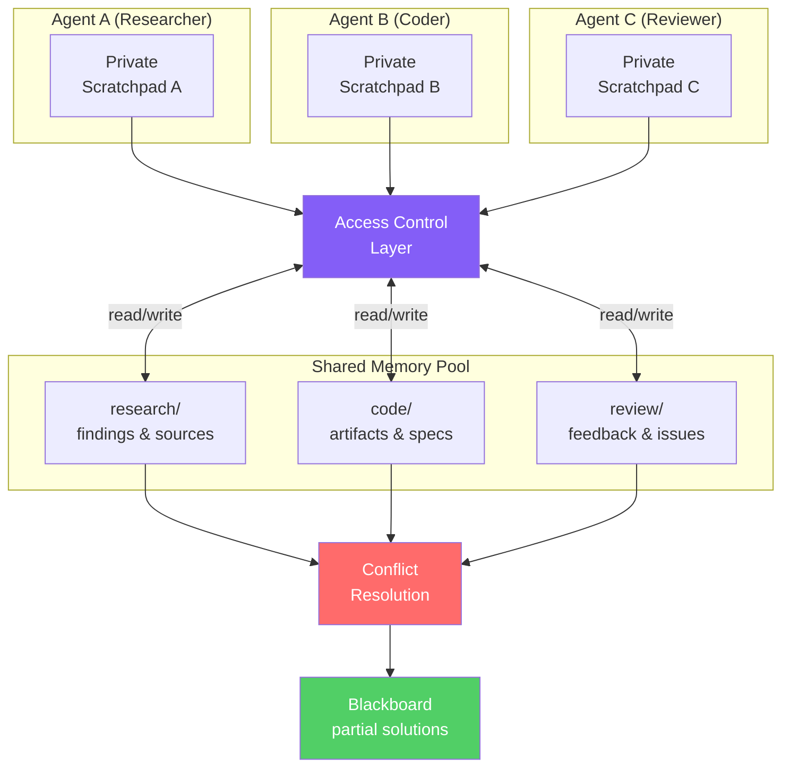

# Multi-Agent Shared Memory

  

## 📖 At a Glance

| Difficulty | Time | Prerequisites |
|------------|------|---------------|
| Intermediate | ~40 min | Python 3.8+, `OPENAI_API_KEY`, understanding of 21 Cross-Session Memory recommended |

This technique is for developers coordinating multiple agents that need to read and write a shared memory space with proper access control.

## TL;DR

- **What it is:** **Multi-Agent Shared Memory** gives multiple collaborating agents a shared memory space with namespace scoping and conflict resolution.
- **When you need it:** You run a multi-agent pipeline where agents must read each other's findings without redundant work.
- **The trade-off:** Requires access control, namespace management, and conflict resolution logic that single-agent systems never need.
- **Closest alternative in this repo:** 21 Cross-Session Memory handles persistence for a single agent, without multi-agent coordination.

## Description

Imagine a team of chefs in a kitchen. Each chef has their own cutting board (a private workspace), but they all share one recipe book on the counter. Multi-Agent Shared Memory works the same way for LLM agents. This agent memory technique gives multiple collaborating agents a shared memory store where they can read and write findings, decisions, and partial results. It uses namespace scoping (logical partitions like `research/` or `code/`) and conflict resolution rules to keep data organized. The approach builds on the classic blackboard architecture from distributed AI. You'll need this for multi-agent pipelines, collaborative coding workflows, and any system where agents must coordinate through shared state.

**Keywords:** agent memory, LLM agent, multi-agent shared memory, blackboard architecture, shared memory store, namespace scoping, conflict resolution, multi-agent collaboration, distributed AI, collaborative agents

When multiple AI agents collaborate on a task, they need a shared memory layer. Think of a researcher agent, a coder agent, and a reviewer agent working together. The researcher's findings need to reach the coder. The coder's output needs to reach the reviewer. Shared memory makes this exchange possible.

This technique covers the data structures, access patterns, and consistency rules that let agents share information. It includes shared key-value stores that all agents can read and write. It covers scoping rules that separate an agent's private memory from the collective memory. It also addresses conflict resolution: what happens when two agents try to update the same fact at the same time. The approach builds on classical blackboard architectures from distributed AI. A "blackboard" is a shared workspace where agents post partial results for others to refine.

## Key Concepts

- **Shared memory store**: A centralized data store (Redis, a database, or an in-memory dictionary) that multiple agents read from and write to during collaborative tasks.
- **Access control**: Rules that determine which agents can read or write each namespace. Prevents unauthorized changes.
- **Namespaces**: Logical partitions within shared memory (for example, `research/`, `code/`, `review/`). They organize information by domain and reduce write conflicts.
- **Private scratchpad**: An agent's internal notes, invisible to other agents. Only finished results go into shared memory.
- **Blackboard system**: A classic AI architecture where agents post partial solutions to a shared workspace. Other agents read, refine, or extend those solutions.
- **Conflict resolution**: Strategies for handling simultaneous updates. Options include last-write-wins and optimistic locking (version-checked writes that fail on conflict).

## Architecture

  

Mermaid source

---

## How It Works

1. Each agent gets a private scratchpad for internal notes that other agents can't see.
2. An access-control layer grants read or write permissions per agent per namespace (like `research/` or `code/`).
3. When an agent finishes a subtask, it writes results to the shared memory pool under its namespace.
4. Other agents read from the pool to get context for their own subtasks.
5. A conflict-resolution strategy (last-write-wins or version-check) handles simultaneous writes to the same key.
6. A blackboard view aggregates all shared entries so any agent (or a human) can see the full picture.

## When to Use

- You have a multi-agent pipeline where each agent has a distinct role (researcher, coder, reviewer).
- Agents need to pass structured results to each other without direct conversation.
- You want an audit trail showing which agent wrote what and when.
- Your workflow involves iterative refinement where one agent's output feeds another's input.

## Limitations

- Thread locks become a bottleneck when many agents write to the same keys at high frequency.
- As shared memory grows, each agent reads more context per turn, increasing token costs.
- The permission model runs in application code only. A bug could leak private scratchpad data into shared memory.
- For tightly coupled agents that need real-time back-and-forth, direct message passing is faster than shared memory.

## Notebook

The [implemented notebook](./multi_agent_shared_memory.ipynb) walks you through building a complete shared memory system from scratch using the OpenAI SDK. You'll create three agents (researcher, coder, reviewer) that collaborate on a programming task through namespace-scoped shared memory. The notebook covers:

- `Permission`, `MemoryEntry`, and `AccessControl` data types.
- A thread-safe `SharedMemoryPool` with last-write-wins and version-check conflict resolution.
- An `Agent` class with private scratchpad and shared memory access.
- A `Blackboard` class that aggregates all shared entries.
- An end-to-end example run with permission enforcement and conflict resolution demos.

## FAQ

### Q: What is Multi-Agent Shared Memory in agent memory?

**A:** Multi-Agent Shared Memory gives multiple collaborating agents a common memory space where they can read and write shared knowledge. Each agent contributes its findings and reads from the pool, enabling coordination without direct message passing. The system handles namespace scoping (so agents can have private and shared memory regions) and conflict resolution (when two agents update the same fact). This is essential for multi-agent architectures like research teams or pipeline agents.

### Q: When should I use Multi-Agent Shared Memory instead of Cross-Session Memory?

**A:** Use Multi-Agent Shared Memory when two or more agents work on the same task or share knowledge about the same domain. Cross-Session Memory (technique 21) handles one agent persisting its own state across time. Shared memory handles multiple agents coordinating in real time. If a research agent and a writing agent need to share findings, or if specialized sub-agents divide a complex task, shared memory prevents redundant work and ensures consistency.

### Q: What are the limits or failure modes of Multi-Agent Shared Memory?

**A:** Concurrent writes create race conditions. Two agents may update the same fact simultaneously, and without conflict resolution, one update overwrites the other. Namespace design requires careful planning: too many shared regions create noise; too few create silos. Read contention can add latency when many agents query the store simultaneously. The shared memory also becomes a single point of failure. If it goes down, all agents lose access to collective knowledge.

### Q: Can I combine Multi-Agent Shared Memory with another memory technique?

**A:** Yes. Pair it with technique 17 (Memory Routing) to classify and route each agent's contributions to the right shared store (facts to semantic memory, experiences to episodic memory). Add technique 14 (Memory Consolidation) to periodically clean duplicates from the shared pool. Use technique 22 with technique 07 (Entity Memory) so agents build a shared entity knowledge base where each agent contributes facts about different entities.

### Q: What library or framework can I use to skip the implementation work?

**A:** LangGraph supports multi-agent workflows with shared state objects. CrewAI provides shared memory for agent crews. AutoGen supports shared context between conversable agents. For lower-level implementations, use Redis or a shared database as the memory backend and build namespace scoping on top. Zep (technique 27) can serve as a shared memory backend for multi-agent systems. Letta/MemGPT (technique 26) supports shared archival memory between agents in the same organization.

## References

- Nii, H. P. (1986). ["Blackboard Systems."](https://doi.org/10.1609/aimag.v7i2.537) *AI Magazine*, 7(2), 38-53.
- [LangGraph Multi-Agent Patterns](https://langchain-ai.github.io/langgraph/?utm_source=nirdiamant&utm_medium=github&utm_campaign=agent_memory_techniques)
- [CrewAI Shared Memory](https://docs.crewai.com/concepts/memory?utm_source=nirdiamant&utm_medium=github&utm_campaign=agent_memory_techniques)
- [AutoGen Multi-Agent Conversations](https://microsoft.github.io/autogen/?utm_source=nirdiamant&utm_medium=github&utm_campaign=agent_memory_techniques)
- [Redis as a Shared State Backend](https://redis.io/docs/?utm_source=nirdiamant&utm_medium=github&utm_campaign=agent_memory_techniques)

## Related Techniques

- [**21 Cross-Session Memory**](../21_cross_session_memory/) - Persists a single agent's state across sessions. Shared memory extends this idea to multiple agents.
- [**12 Working Memory and Context Window**](../12_working_memory_context_window/) - Explains how each agent manages its own context window, the private counterpart to shared memory.
- [**24 Graph Memory with Graphiti**](../24_graph_memory_graphiti/) - A graph-based store that can serve as the shared backend when agents need relational reasoning.
- [**30 Production Memory Patterns**](../30_production_memory_patterns/) - Covers deployment concerns like concurrency and consistency that matter when multiple agents write to the same store.

---

