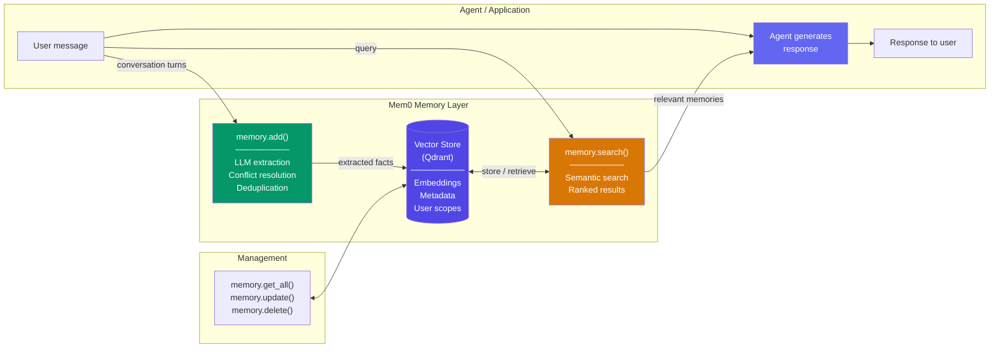

# Mem0 Integration Patterns

  

## 📖 At a Glance

| Difficulty | Time | Prerequisites |
|------------|------|---------------|
| Advanced | ~50 min | Python 3.8+, `OPENAI_API_KEY`, `mem0ai` package, understanding of 06 Vector Store Memory recommended |

This technique is for developers who want a managed memory layer using the mem0 SDK for automatic extraction, storage, and retrieval of user knowledge.

## TL;DR

- **What it is:** **Mem0 Integration Patterns** provides a managed memory layer that automatically extracts facts from conversations and retrieves them by user ID.
- **When you need it:** You want production-ready memory with minimal setup and are comfortable with a third-party dependency.
- **The trade-off:** Vendor lock-in to the Mem0 service, and you trade control over extraction logic for reduced setup effort.
- **Closest alternative in this repo:** 23 Memory with Tools gives the agent explicit CRUD control instead of automatic extraction.

## Description

Think of a personal assistant who takes notes during every meeting. After each conversation, they jot down key facts about you: your preferences, your schedule, your contacts. Before the next meeting, they review those notes so they can help you better. Mem0 Integration Patterns shows you how to use Mem0 as a managed agent memory layer for your LLM agent. Mem0 automatically extracts facts from conversations, stores them in a vector store (a database optimized for semantic search by meaning), and retrieves relevant memories scoped by user ID. This makes it a strong fit for personalized chatbots, customer support agents, and any application where each user needs their own persistent memory profile.

**Keywords:** agent memory, LLM agent, Mem0, automatic memory extraction, vector store, user-scoped memory, semantic search, memory API, personalization, self-improving memory

Mem0 provides a managed memory layer for AI agents. It automatically extracts, stores, and retrieves user-specific memories from conversations. An "extraction pipeline" is a series of steps that pull structured facts from raw text. A "vector store" is a database optimized for finding similar items by meaning, not exact keywords. Mem0 handles both of these for you.

Instead of building custom extraction pipelines and vector stores, you use Mem0's API. You call `add()` to store memories from conversation text. You call `search()` to find relevant memories by query. You call `get_all()` to retrieve a user's full memory profile. All operations are scoped by user ID, so each person gets a personalized experience.

This technique covers practical integration patterns. You'll learn to initialize the Mem0 client, add memories after each conversation turn, and search for relevant context before generating a response. It also covers categorizing memories by type (preferences, facts, instructions) and combining Mem0 with LangChain or other orchestration frameworks. Mem0's self-improving memory feature refines stored memories over time by resolving contradictions and merging related facts.

## Key Concepts

- **Mem0 API**: The REST and Python SDK (Software Development Kit) interface for adding,
  searching, retrieving, and deleting memories. Available as a managed service or self-hosted.
- **Memory add/search/get**: The three primary operations. `add()` extracts and stores memories
  from text. `search()` finds relevant memories by semantic query. `get_all()` retrieves a
  user's complete memory set.
- **User-scoped memory**: Partitioning memories by user ID so each user has an isolated memory
  store. This enables personalization without cross-contamination between users.
- **Automatic extraction**: Mem0's built-in LLM pipeline that identifies memorable facts,
  preferences, and instructions from raw conversation text. No manual annotation or custom
  extraction logic needed.
- **Memory categories**: Organizing memories by type (personal preferences, factual knowledge,
  behavioral instructions). This enables filtered retrieval and priority-based loading into the
  context window.
- **Mem0 with LangChain**: Integrating Mem0 as a memory backend within LangChain chains and
  agents. This replaces or augments LangChain's built-in memory classes for richer memory
  management.
- **Self-improving memory**: Mem0's ability to automatically update, merge, and deduplicate
  memories over time. As new information arrives or contradictions appear, the memory store
  refines itself.

## Architecture

  

Mermaid source

---

## How It Works

1. You initialize the Mem0 client with a config specifying your LLM, embedding model, and vector store (Qdrant by default).
2. After each conversation turn, you call `memory.add()` with the messages and a `user_id`.
3. Mem0's LLM pipeline extracts facts, detects contradictions with existing memories, and deduplicates before storing.
4. Before generating a response, you call `memory.search()` with the user's query to retrieve relevant memories.
5. The agent includes retrieved memories in the system prompt, then calls the LLM for a personalized response.
6. All memories are scoped by `user_id`. Each user gets an isolated memory profile with no cross-contamination.

## When to Use

- You want a working memory layer fast, without building custom extraction pipelines or managing a vector database.
- Your application serves multiple users who each need personalized, persistent memory.
- You're prototyping a chatbot and need automatic fact extraction from conversations.
- You want built-in conflict resolution (e.g., when a user's city changes, the old memory updates instead of duplicating).

## Limitations

- You have limited control over what Mem0 extracts as "memorable." Critical facts can be missed, or irrelevant details stored.
- Every `add()` call triggers an LLM call. High-throughput applications (over 1,000 messages per minute) face significant costs.
- Memories persist forever unless you delete them manually. There's no built-in TTL (time-to-live, an automatic expiration timer) or decay.
- Semantic search works well for fuzzy queries, but structured filters (like "category = dietary AND created after January") are limited.

## Notebook

See [**mem0_patterns.ipynb**](mem0_patterns.ipynb) for a full, runnable implementation.

The notebook walks through installing and configuring Mem0, adding memories from conversations, and semantic search. It covers automatic conflict resolution (for example, updating a user's city when they move). You'll also see explicit update/delete operations and a `Mem0Agent` class that retrieves relevant memories before each response and stores new facts after each turn. A multi-user isolation demo confirms that memories stay scoped by `user_id`.

## FAQ

### Q: What is Mem0 in agent memory?

**A:** Mem0 is a managed memory layer that automatically extracts facts from conversations and stores them in a user-scoped memory store. You pass conversation messages to Mem0's API, and it handles entity extraction, fact deduplication, contradiction detection, and retrieval. Memories are keyed by user ID, enabling cross-session personalization with minimal code. Mem0 offers both a cloud service and an open-source self-hosted option. It is one of the most popular memory frameworks, with a focus on simplicity and quick integration.

### Q: When should I use Mem0 instead of Memory with Tools?

**A:** Use Mem0 when you want automatic memory management with minimal setup. Memory with Tools (technique 23) requires the agent to explicitly decide what to save and search, which gives more control but needs careful prompt engineering. Mem0 handles extraction and deduplication automatically. Choose Mem0 for quick prototyping, personal assistants, and use cases where you trust the system to decide what is worth remembering. Choose the tool approach when you need explicit, auditable control.

### Q: What are the limits or failure modes of Mem0?

**A:** Mem0's automatic extraction can miss implicit facts or extract incorrect ones. You have limited control over what gets stored without custom configuration. The cloud service adds network latency (50-200ms per call). Self-hosted Mem0 requires managing dependencies (vector store, optional graph store). Deduplication may fail for paraphrased facts. The memory format is optimized for factual extraction and works less well for procedural knowledge or complex multi-step experiences.

### Q: Can I combine Mem0 with another memory technique?

**A:** Yes. Use Mem0 as the semantic memory layer (technique 10) and add technique 09 (Episodic Memory) separately for full session records. Pair Mem0 with technique 04 (Summary Buffer Memory) for the in-session context while Mem0 handles cross-session fact persistence. You can also use Mem0 alongside technique 24 (Graphiti) if you need relationship-aware graph queries that go beyond Mem0's built-in entity storage.

### Q: What library or framework can I use to skip the implementation work?

**A:** Mem0 is the framework. Install via `pip install mem0ai` for the open-source version or use the Mem0 Platform cloud API. It integrates with LangChain, LlamaIndex, and CrewAI through official adapters. For alternatives with similar automatic extraction, Zep (technique 27) offers managed memory with graph capabilities. Letta/MemGPT (technique 26) provides a more opinionated architecture with tiered memory. If Mem0's extraction does not fit your needs, technique 23 (Memory with Tools) gives you manual control.

## References

- Mem0 documentation:
  [https://docs.mem0.ai](https://docs.mem0.ai?utm_source=nirdiamant&utm_medium=github&utm_campaign=agent_memory_techniques)
- Mem0 GitHub repository:
  [https://github.com/mem0ai/mem0](https://github.com/mem0ai/mem0)
- Mem0 Python SDK:
  [https://pypi.org/project/mem0ai/](https://pypi.org/project/mem0ai/?utm_source=nirdiamant&utm_medium=github&utm_campaign=agent_memory_techniques)
- Mem0 + LangChain integration:
  [https://docs.mem0.ai/integrations/langchain](https://docs.mem0.ai/integrations/langchain?utm_source=nirdiamant&utm_medium=github&utm_campaign=agent_memory_techniques)
- Mem0 platform:
  [https://app.mem0.ai](https://app.mem0.ai?utm_source=nirdiamant&utm_medium=github&utm_campaign=agent_memory_techniques)

## Related Techniques

- [**06 Vector Store Memory**](../06_vector_store_memory/) - The underlying storage pattern that Mem0 builds on. Useful if you want to understand how semantic search works under the hood.
- [**23 Memory with Tools**](../23_memory_with_tools/) - A build-it-yourself approach to the same save/search/update/delete cycle that Mem0 automates.
- [**24 Graph Memory with Graphiti**](../24_graph_memory_graphiti/) - A graph-based alternative when you need relationship tracking between entities, not flat memory records.
- [**27 Zep Memory**](../27_zep_memory/) - Another managed memory platform. Comparing Mem0 and Zep helps you pick the right tool for your use case.

---

