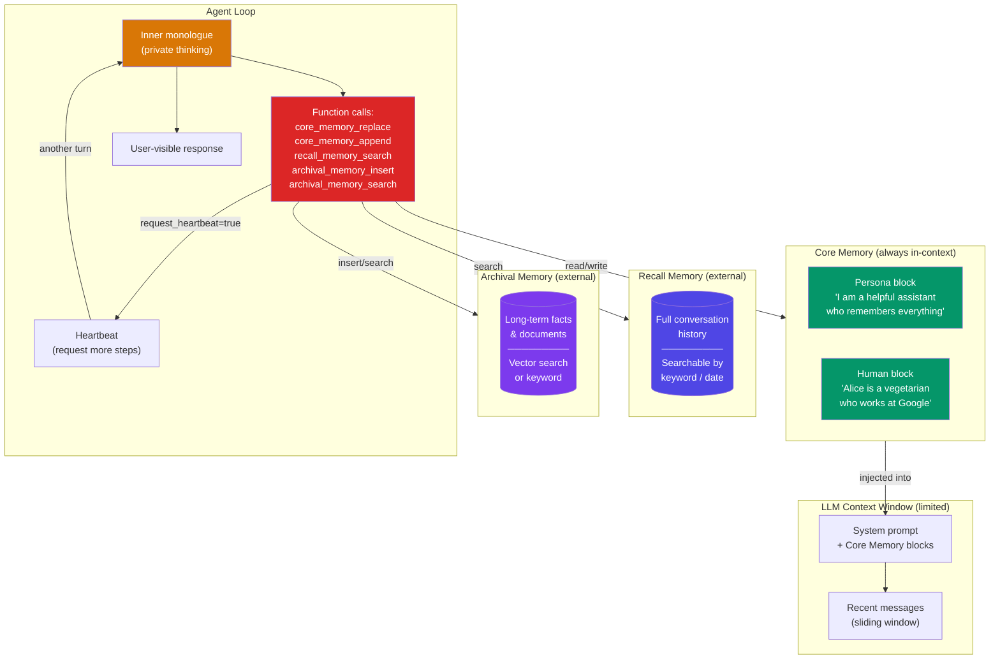

# Letta (MemGPT) Patterns

  

## 📖 At a Glance

| Difficulty | Time | Prerequisites |
|------------|------|---------------|
| Advanced | ~55 min | Python 3.8+, `OPENAI_API_KEY`, understanding of 12 Working Memory recommended |

This technique is for developers interested in MemGPT-style memory management where the agent controls its own memory reads and writes through function calls.

## TL;DR

- **What it is:** **Letta (MemGPT) Patterns** implements tiered memory (core, archival, recall) where the agent manages its own memory through function calls.
- **When you need it:** Your agent handles thousands of turns and needs OS-style virtual memory with self-managed paging.
- **The trade-off:** Requires a heartbeat mechanism and inner-monologue logic that adds coordination overhead to every turn.
- **Closest alternative in this repo:** 23 Memory with Tools offers simpler agent-driven CRUD without the tiered memory and paging model.

## Description

Think of your computer's RAM. It's small and fast, but when it fills up, the OS swaps data to the hard drive and retrieves it later. Letta (formerly MemGPT) Patterns apply this same idea to LLM agent memory and context window management. The context window (the text a model can see in one call) is the agent's "RAM." Letta gives the agent a self-editing, tiered memory system. Core memory stays in the prompt, archival memory goes to a vector database, and recall memory keeps full conversation history. This makes Letta a strong fit for personal AI assistants and long-running chatbots that remember users across thousands of turns.

Letta solves this with three memory tiers. **Core memory** stays in the context window at all times. **Archival memory** is a searchable long-term store (like a hard drive). **Recall memory** holds the full conversation history. The agent actively manages what stays in context and what gets moved to storage.

The agent uses an inner monologue (a private reasoning step, invisible to the user) to decide what to remember, forget, or look up. A heartbeat mechanism lets the agent chain multiple memory operations in one turn without waiting for user input. Memory pressure signals tell the agent when its context is getting full, prompting it to summarize or archive information.

This technique produces agents that maintain coherent, long-running relationships with users across thousands of interactions.

**Keywords:** agent memory, Letta, MemGPT, tiered memory architecture, self-editing memory, context window management, LLM agent, virtual memory, personal AI assistant, long-running chatbot

## Key Concepts

- **MemGPT architecture**: the three-tier memory system (core, archival, recall) with explicit memory management functions. The agent calls these functions to move information between tiers.
- **Core memory (persona + human blocks)**: two always-in-context memory blocks. One describes the agent's persona. The other holds key facts about the current user. The agent edits these blocks via `core_memory_replace` and `core_memory_append` function calls.
- **Archival memory**: a searchable long-term store backed by a vector database (a database that finds similar items by meaning, not exact keywords). The agent inserts and queries information that doesn't fit in the context window.
- **Recall memory**: the full conversation history stored externally. The agent can search it to retrieve earlier parts of the dialogue that have scrolled out of active context.
- **Inner monologue**: a private reasoning channel. The agent thinks about what it knows, what it needs to remember, and what memory operations to perform before responding to the user.
- **Heartbeat mechanism**: a control flow feature that lets the agent request additional processing steps. It chains multiple tool calls without waiting for user input.
- **Memory pressure**: signals indicating that the context window is approaching capacity. These prompt the agent to summarize, archive, or discard lower-priority information.
- **Self-editing memory**: the defining feature of MemGPT. The agent autonomously rewrites its own core memory blocks to keep them current, accurate, and relevant as conversations evolve.

## Architecture

  

Mermaid source

---

## How It Works

1. The system assembles a prompt with the agent's current core memory blocks and recent messages.
2. The agent produces an inner monologue (private reasoning the user never sees) to plan memory operations.
3. The agent calls memory tools: edit core memory, search recall or archival memory, or insert new archival entries.
4. If the agent sets `request_heartbeat=true`, the loop repeats from step 2 without waiting for user input.
5. When ready, the agent calls `send_message` to deliver a visible response to the user.
6. The system checks memory pressure (how full the context window is) and signals the agent to archive or summarize if needed.

## When to Use

- You're building a personal assistant that must remember user facts across hundreds or thousands of sessions.
- Your agent needs to update its own knowledge when user details change (new job, new city, new preferences).
- You want full visibility into agent reasoning for debugging, since inner monologue exposes every memory decision.
- The agent must handle conversations longer than its context window without silently losing older information.

## Limitations

- Token overhead is high. The memory tools, system prompt, and core memory blocks consume a large share of the context window before the conversation even starts.
- The agent must correctly decide when and how to use memory tools. LLMs sometimes forget to update core memory, make incorrect replacements, or over-archive unimportant details.
- Each heartbeat is an additional LLM call. Multi-step memory operations add latency and cost to every turn.
- A new agent starts with minimal core memory. It takes several turns to build up useful context (cold-start problem).
- The from-scratch implementation uses keyword search, which misses semantic matches. Production use requires vector search for reliable retrieval.

## Notebook

[**letta_memgpt_patterns.ipynb**](letta_memgpt_patterns.ipynb): Builds a minimal MemGPT-style agent loop from scratch using only the OpenAI SDK. It implements all three memory tiers (core, recall, archival), inner monologue, heartbeat chaining, and memory pressure handling. You'll see the agent self-edit its core memory as user facts change, archive detailed information for later retrieval, and manage context overflow. The notebook concludes with a reference for using the Letta SDK in production.

## FAQ

### Q: What is Letta (MemGPT) in agent memory?

**A:** Letta (formerly MemGPT) implements tiered memory where the agent manages its own memory through function calls. It defines three tiers: core memory (in-context, editable by the agent), recall memory (searchable conversation history), and archival memory (long-term vector storage). The agent reads and writes its own core memory block, deciding what facts to keep in its limited context window. This OS-inspired "virtual memory" approach lets agents handle conversations longer than any context window.

### Q: When should I use Letta instead of Memory with Tools?

**A:** Use Letta when you want a complete, opinionated memory architecture with tiered storage out of the box. Memory with Tools (technique 23) gives you a blank canvas: you define the tools and the storage. Letta provides the architecture (core/recall/archival), the paging mechanism, and the agent loop. Choose Letta for faster development when its three-tier model fits your use case. Choose the tool-based approach when you need a custom memory architecture that does not fit Letta's model.

### Q: What are the limits or failure modes of Letta?

**A:** Core memory has a fixed token budget (typically 2,000-8,000 tokens). If the agent makes poor editing decisions, it may evict important facts from core memory. The agent must learn to manage its own memory through prompting, which can be unreliable with weaker models. Archival memory retrieval adds latency. The framework has a learning curve and is more opinionated than composable libraries like LangChain. Running the Letta server adds infrastructure overhead compared to simpler in-process memory.

### Q: Can I combine Letta with another memory technique?

**A:** Yes. Letta's archival memory can use technique 06 (Vector Store Memory) or technique 24 (Graphiti) as its backend. Add technique 14 (Memory Consolidation) as a periodic process that cleans archival memory. Use technique 16 (Self-Reflection Memory) by having the agent write reflections to its core memory block. Letta's architecture is extensible: you can add custom tools that connect to any external memory system while keeping the core/recall/archival structure.

### Q: What library or framework can I use to skip the implementation work?

**A:** Letta is the framework. Install via `pip install letta` and run the Letta server. It provides a Python SDK and REST API. For alternatives, Mem0 (technique 25) offers simpler automatic memory with less architectural complexity. Zep (technique 27) provides managed memory with graph capabilities. If you want Letta's virtual memory concept without the full framework, you can implement the core memory editing pattern in roughly 100-200 lines on top of any tool-calling LLM using technique 23's approach.

## References

- Packer, C., Wooders, S., Lin, K., Fang, V., Patil, S., Stoica, I., & Gonzalez, J. (2023).
  "MemGPT: Towards LLMs as Operating Systems." arXiv:2310.08560.
- Letta documentation:
  [https://docs.letta.com](https://docs.letta.com?utm_source=nirdiamant&utm_medium=github&utm_campaign=agent_memory_techniques)
- Letta GitHub repository:
  [https://github.com/letta-ai/letta](https://github.com/letta-ai/letta)
- Letta Python SDK:
  [https://pypi.org/project/letta/](https://pypi.org/project/letta/?utm_source=nirdiamant&utm_medium=github&utm_campaign=agent_memory_techniques)
- MemGPT paper:
  [https://arxiv.org/abs/2310.08560](https://arxiv.org/abs/2310.08560)

## Related Techniques

- [**12 Working Memory & Context Window**](../12_working_memory_context_window/) - Letta's core memory blocks are a direct implementation of working memory ideas. Start here if you want the theory behind it.
- [**25 Mem0 Patterns**](../25_mem0_patterns/) - Another memory framework. Compare Mem0's automatic approach to Letta's explicit self-editing style.
- [**14 Memory Consolidation**](../14_memory_consolidation/) - Letta's flow from context to archival storage is a form of memory consolidation.
- [**24 Graph Memory (Graphiti)**](../24_graph_memory_graphiti/) - Graphiti focuses on graph-based long-term memory, while Letta uses vector-based archival storage.

---

