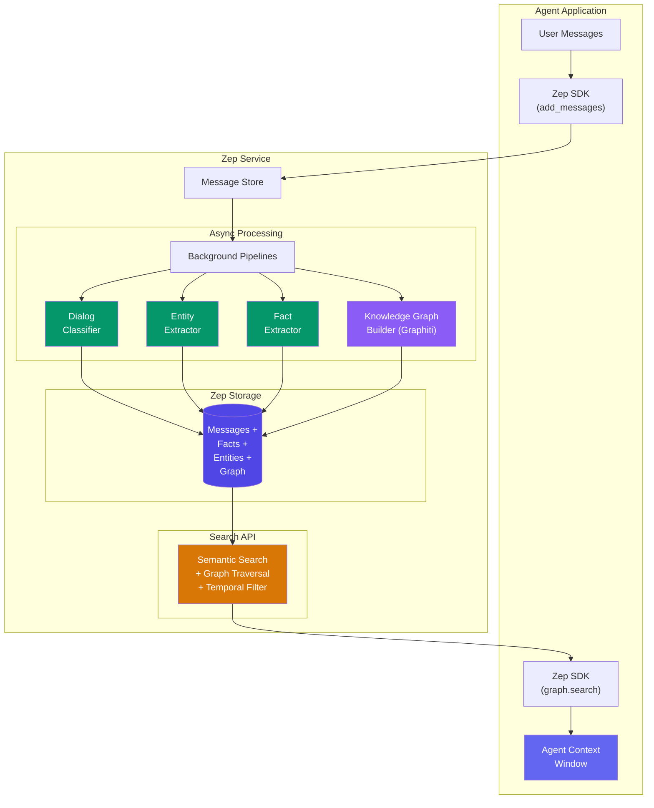

# Zep Memory

  

## 📖 At a Glance

| Difficulty | Time | Prerequisites |
|------------|------|---------------|
| Advanced | ~50 min | Python 3.8+, `ZEP_API_KEY`, `ANTHROPIC_API_KEY`, Zep Cloud account |

This technique is for developers who want a production-ready memory service with automatic fact extraction, temporal tracking, and user-scoped sessions.

## TL;DR

- **What it is:** **Zep Memory** is a managed memory service that automatically extracts entities and facts, builds temporal knowledge graphs, and retrieves asynchronously.
- **When you need it:** You want a production-grade memory backend with multi-mode retrieval and do not want to self-host infrastructure.
- **The trade-off:** Requires a Zep Cloud account, and automatic extraction may hallucinate facts that need validation.
- **Closest alternative in this repo:** 24 Graph Memory with Graphiti offers similar temporal graph capabilities but self-hosted with Neo4j.

## Description

Imagine hiring a personal assistant. They take notes, organize them by category, spot the people mentioned, extract key facts, and map how everything connects. That's what Zep Memory does for your AI agent's conversations. Zep is a production-grade agent memory service that goes well beyond storing chat history. It runs background pipelines (automated processes) to extract entities, distill structured facts, and build a temporal knowledge graph that tracks relationships over time. This makes it a strong choice for customer support agents, research assistants, or any LLM agent that needs to recall user details across sessions.

Zep is a production-grade memory service for AI assistants. It goes beyond storing conversations. When you add messages to Zep, background pipelines (automated processes that run after each message) spring into action. A dialog classifier labels the conversation's intent and topic. An entity extractor identifies people, organizations, and projects. A fact extractor distills structured statements like "User prefers Python over JavaScript." A knowledge graph builder (powered by Graphiti) captures relationships between entities with timestamps.

All of this happens asynchronously. Your agent doesn't wait for extraction to complete before responding. The result is a memory layer with three retrieval modes: semantic search over extracted facts, graph traversal over entity relationships, and raw message history with dialog classifications.

Zep is available as both a cloud-hosted service and a self-hosted open-source deployment.

**Keywords:** agent memory, Zep, temporal knowledge graph, entity extraction, fact extraction, LLM agent, Graphiti, memory service, customer support agent, session management

## Key Concepts

- **Zep Cloud/OSS**: two deployment options. The managed cloud service handles scaling and maintenance automatically. The open-source version gives you full data control on your own infrastructure.
- **Session management**: conversations in Zep are organized into sessions. Each session has an ID and is linked to a user. Sessions track message history, metadata, and all extracted knowledge.
- **Dialog classification**: Zep's automatic analysis of conversation turns. It classifies intent, topic, sentiment, and other attributes without manual labeling or custom models.
- **Entity extraction**: identifying and tracking named entities (people, places, organizations, products) across conversations. Entities are deduplicated and linked across sessions, building a persistent registry.
- **Fact extraction**: distilling structured factual statements from unstructured dialogue (e.g., "The user's budget is $50k"). These are stored as queryable, timestamped records.
- **Temporal knowledge graph**: Zep's graph layer (powered by Graphiti) captures relationships between entities with temporal metadata. "Temporal" means it tracks *when* things were true. This enables time-aware queries and change tracking.
- **Memory search**: querying Zep's memory using natural language. Results are ranked by semantic relevance (how close in meaning the query is to stored facts). You can filter by time range, entity, or session.
- **Zep SDK integration**: Python and TypeScript SDKs that plug into LangChain, LlamaIndex, or custom agent frameworks. Adding Zep memory to an existing agent typically requires fewer than 20 lines of code.

## Architecture

  

Mermaid source

---

## How It Works

1. Your agent sends user and assistant messages to Zep through the SDK's `add_messages()` method.
2. Zep stores the messages and starts background pipelines (automated processes that run without blocking your code).
3. A dialog classifier labels each turn's intent and topic. An entity extractor identifies people, organizations, and projects.
4. A fact extractor distills structured statements (like "User's budget is $200k") from unstructured text.
5. A knowledge graph builder (powered by Graphiti) maps relationships between entities with timestamps.
6. Before responding, your agent calls `graph.search()` or `get_user_context()` to retrieve ranked facts and entities for its prompt.

## When to Use

- You need cross-session memory where facts from one conversation carry into the next without custom persistence code.
- You want automatic extraction of facts, entities, and relationships from raw messages, with no custom NLP pipelines.
- Your agent must track when facts were true (temporal awareness), for example distinguishing a past job from a current one.
- You prefer a managed service that handles scaling, indexing, and model updates so your team focuses on agent logic.

## Limitations

- Background pipelines use LLMs to extract facts. They can miss nuances, hallucinate facts, or misclassify entities. You can't easily tune the extraction models.
- Extraction is asynchronous. Facts aren't searchable the instant you add messages. There's a brief delay before new knowledge appears.
- Every message triggers LLM-based extraction. At high message volumes, the per-message extraction cost adds up compared to simpler approaches like buffer or window memory.
- The cloud version requires a Zep account and API key. The open-source version needs self-hosting with specific infrastructure. Either way, you commit to Zep's data model.

## Notebook

The [notebook](./zep_memory.ipynb) walks through Zep end-to-end:

1. **Setup**: install the `zep-cloud` SDK and configure API keys.
2. **Create a user and thread**: register a user and open a conversation thread in Zep.
3. **Add messages**: send a multi-turn conversation and let background pipelines extract facts, entities, and graph relationships.
4. **Search facts**: query the knowledge graph for extracted facts using natural language.
5. **Retrieve assembled context**: get a pre-formatted context string ready for LLM prompt injection.
6. **Build an agent loop**: wire Zep into a reusable `ZepMemoryAgent` class that stores and recalls memory across sessions.
7. **Compare retrieval modes**: test edge search, node search, and auto search on the same query.

## FAQ

### Q: What is Zep Memory in agent memory?

**A:** Zep is a managed memory service for AI agents that automatically extracts entities, facts, and relationships from conversations. It builds a temporal knowledge graph, performs asynchronous summarization, and provides hybrid retrieval (vector search plus graph traversal). Zep runs as a cloud service or self-hosted server, handling the infrastructure complexity of memory management. It processes data asynchronously, so memory extraction does not block the conversation flow. Zep is built on the same technology as Graphiti (technique 24).

### Q: When should I use Zep instead of Graph Memory with Graphiti?

**A:** Use Zep when you want managed infrastructure with minimal operational burden. Graphiti (technique 24) is the open-source library that powers Zep's graph layer, but you must self-host Neo4j and manage the infrastructure. Zep handles hosting, scaling, and maintenance for you. Choose Graphiti when you need on-premises deployment, custom graph schemas, or want to avoid vendor lock-in. Choose Zep when you want to focus on building your agent, not managing memory infrastructure.

### Q: What are the limits or failure modes of Zep?

**A:** Zep's cloud service adds network latency (50-200ms per API call). Automatic extraction can miss domain-specific entities without custom configuration. The async processing model means newly extracted facts are not immediately available (typically 1-5 seconds delay). Pricing scales with usage, which can become costly at high volumes. Self-hosted Zep requires managing multiple services (API server, database, graph store). Entity resolution across different phrasings is good but not perfect.

### Q: Can I combine Zep with another memory technique?

**A:** Yes. Use Zep as the long-term memory backend and pair it with technique 04 (Summary Buffer Memory) or technique 02 (Sliding Window Memory) for in-session context management. Zep handles cross-session persistence (technique 21) and fact extraction (technique 10) natively. Layer technique 28 (Memory Evaluation) on top to measure Zep's retrieval quality against your specific use case. Zep's API is compatible with most agent frameworks as a drop-in memory backend.

### Q: What library or framework can I use to skip the implementation work?

**A:** Zep is the framework. Use it via the `zep-python` SDK or REST API. It integrates with LangChain through the `ZepMemory` and `ZepRetriever` classes. LlamaIndex also has a Zep integration. For alternatives, Mem0 (technique 25) offers simpler automatic memory without graph capabilities. Graphiti (technique 24) gives you Zep's graph technology as a self-hosted library. Letta/MemGPT (technique 26) provides a different architectural approach with self-managed tiered memory.

## References

- [Zep Documentation](https://docs.getzep.com?utm_source=nirdiamant&utm_medium=github&utm_campaign=agent_memory_techniques)
- [Zep GitHub Repository](https://github.com/getzep/zep)
- [Zep Python SDK (PyPI)](https://pypi.org/project/zep-cloud/?utm_source=nirdiamant&utm_medium=github&utm_campaign=agent_memory_techniques)
- [Graphiti: Temporal Knowledge Graphs](https://github.com/getzep/graphiti)
- [Anthropic: Building Effective Agents](https://www.anthropic.com/engineering/building-effective-agents?utm_source=nirdiamant&utm_medium=github&utm_campaign=agent_memory_techniques)

## Related Techniques

- [**24 Graph Memory (Graphiti)**](../24_graph_memory_graphiti/) - Zep uses Graphiti under the hood for its temporal knowledge graph. This technique covers Graphiti in depth.
- [**25 Mem0 Patterns**](../25_mem0_patterns/) - Another all-in-one memory framework. Compare Mem0's approach to automatic extraction with Zep's.
- [**07 Entity Memory**](../07_entity_memory/) - Zep's entity extractor builds on the ideas in this foundational technique.
- [**21 Cross-Session Memory**](../21_cross_session_memory/) - Zep tracks facts and entities across sessions automatically. This technique covers the pattern in general.

---

