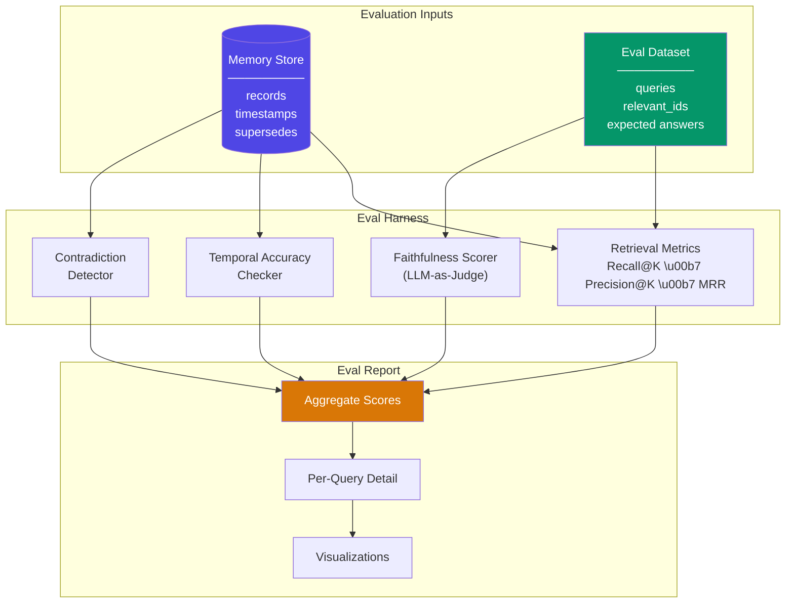

# Memory Evaluation

  

## 📖 At a Glance

| Difficulty | Time | Prerequisites |
|------------|------|---------------|
| Intermediate | ~40 min | Python 3.8+, `ANTHROPIC_API_KEY`, understanding of 06 Vector Store Memory recommended |

This technique is for developers who need to measure memory system quality with quantitative metrics like precision, recall, and answer accuracy.

## TL;DR

- **What it is:** **Memory Evaluation** is a framework for measuring memory system quality using retrieval precision, recall, staleness detection, and LLM-as-judge scoring.
- **When you need it:** You have a working memory system and need quantitative proof that it retrieves the right information accurately.
- **The trade-off:** Requires building evaluation datasets, and LLM-based scoring adds API cost on top of the system under test.
- **Closest alternative in this repo:** 29 Memory Benchmarks (LoCoMo) uses standardized public datasets instead of custom evaluation sets.

## Description

Building an agent memory system is only half the challenge. You also need to measure whether it works. Think of it like testing a student: you don't know what they learned until you quiz them and score the answers. Memory Evaluation gives you a structured way to measure LLM agent memory quality. You'll track retrieval precision (are the fetched memories relevant?) and recall (did you find all the relevant ones?). You'll also check for staleness (is the agent using outdated facts?) and contradictions. Whether you're building a chatbot or a research assistant, evaluation turns "it seems to work" into numbers you can compare and improve.

Memory evaluation assesses how well an agent's memory system stores, retrieves, and applies information. It covers quantitative metrics (numbers you can track) like retrieval precision (are the retrieved memories relevant?) and recall (are all relevant memories retrieved?). It also measures staleness detection (is the agent using outdated information when newer facts exist?) and contradiction handling (does the system detect and resolve conflicting memories?).

Beyond retrieval quality, evaluation should measure downstream impact: does better memory lead to more accurate, personalized, and coherent agent responses?

This technique describes how to build evaluation datasets from real or synthetic conversations, run automated evaluations using LLM-as-judge patterns (where a language model scores quality instead of a human), and design human evaluation protocols for subjective quality like naturalness and user satisfaction.

**Keywords:** agent memory, memory evaluation, retrieval precision, recall, LLM-as-judge, staleness detection, contradiction handling, evaluation harness, benchmark, memory quality

## Key Concepts

- **Retrieval precision/recall**: precision measures what fraction of retrieved memories are relevant. Recall measures what fraction of all relevant memories are successfully retrieved. Together they tell you if your system finds the right things without including junk.
- **Memory staleness**: detecting when the agent relies on outdated information despite newer, contradicting facts being available in the memory store.
- **Contradiction detection**: identifying cases where the memory system stores conflicting facts (e.g., "user lives in NYC" vs. "user lives in SF") and evaluating how the system resolves or flags these conflicts.
- **Memory coverage**: assessing whether the memory system captures all important information from conversations. Are critical facts lost during extraction, summarization, or storage?
- **Evaluation datasets**: curated sets of conversations paired with ground-truth memories, expected retrievals, and correct answers. You use these to benchmark memory system performance reproducibly.
- **Automated evaluation**: using LLM-as-judge patterns, embedding similarity scores, or rule-based checks to evaluate memory quality at scale. This removes the need for human annotators on every test case.
- **Human evaluation protocols**: structured procedures for human raters to assess subjective memory quality. They judge relevance, coherence, personalization accuracy, and overall user satisfaction.

## Architecture

  

Mermaid source

---

## How It Works

1. You build an evaluation dataset: queries paired with ground-truth relevant memory IDs and expected answers.
2. The harness retrieves memories for each query and computes Recall@K, Precision@K, and MRR against the ground-truth labels.
3. For each query, the harness generates a response from retrieved memories, then scores its faithfulness using an LLM-as-judge (a language model that rates accuracy).
4. A temporal accuracy checker verifies that newer facts rank above superseded (outdated) ones in retrieval results.
5. A contradiction detector scans all stored memories for conflicting statements using LLM-based comparison.
6. The harness combines all scores into an aggregate report with per-query detail and visualizations.

## When to Use

- You're comparing two or more memory architectures (vector retrieval vs. graph memory, for example) and need objective numbers.
- You want regression testing: run the benchmark after each change to confirm your memory system didn't get worse.
- You need to diagnose whether failures come from retrieval (wrong memories found), faithfulness (right memories but wrong answer), or staleness (outdated facts served).
- Your team needs a shared, reproducible way to talk about memory quality instead of relying on subjective impressions.

## Limitations

- Creating evaluation datasets with known-relevant memory IDs requires manual annotation. Synthetic datasets may not reflect real-world conversation distributions.
- The LLM judge may be lenient, inconsistent, or share blind spots with the generation model. Cross-model judging helps but doesn't eliminate this.
- Contradiction detection is noisy. The LLM may flag legitimate updates (like a job change) as contradictions, or miss subtle logical conflicts.
- This technique measures retrieval and faithfulness in isolation. It doesn't measure end-to-end task success: whether better memory actually leads to better agent outcomes.

## Notebook

[Memory Evaluation notebook](memory_evaluation.ipynb): Implements a lightweight evaluation harness (a test framework) covering retrieval metrics (Recall@K, Precision@K, MRR), faithfulness scoring via LLM-as-judge, temporal accuracy checking, and contradiction detection. Includes a synthetic eval dataset and visualization of results.

## FAQ

### Q: What is Memory Evaluation in agent memory?

**A:** Memory Evaluation is a framework for measuring how well an agent's memory system works. It tests retrieval precision (did the right memories come back?), recall (did any relevant memories get missed?), staleness detection (are outdated facts being served?), and answer quality (using LLM-as-judge scoring). You build custom evaluation datasets from your domain, run the memory system against them, and score the results. This is how you prove your memory system works before shipping to production.

### Q: When should I use Memory Evaluation instead of Memory Benchmarks (LoCoMo)?

**A:** Use custom Memory Evaluation when you need metrics specific to your domain and use case. LoCoMo and LongMemEval (technique 29) provide standardized public benchmarks for comparing systems on common ground. Your custom evaluations test what matters for your product: "Does the agent remember the user's dietary restrictions?" is more useful than a generic benchmark score. Use LoCoMo for initial system selection. Use custom evaluation for ongoing monitoring and regression testing in production.

### Q: What are the limits or failure modes of Memory Evaluation?

**A:** Building good evaluation datasets is expensive and time-consuming. You need realistic conversations with ground-truth annotations. LLM-as-judge scoring is useful but noisy: different runs can produce different scores. Evaluation metrics may not capture all quality dimensions (for example, latency or cost efficiency). Over-optimizing for one metric (like precision) can hurt another (like recall). Regular dataset updates are needed as your application evolves, or evaluations become stale.

### Q: Can I combine Memory Evaluation with another memory technique?

**A:** Yes. Memory Evaluation is a meta-technique that applies to any memory system. Use it to compare technique 06 (Vector Store Memory) against technique 20 (Memory Retrieval Patterns) and quantify the improvement from hybrid retrieval. Test technique 19 (Forgetting and Decay) to find the optimal half-life for your domain. Evaluate technique 10 (Semantic Memory) extraction accuracy. Every memory technique in this repo benefits from systematic evaluation to tune its parameters.

### Q: What library or framework can I use to skip the implementation work?

**A:** RAGAS provides retrieval evaluation metrics (precision, recall, faithfulness) that apply to memory retrieval. DeepEval offers LLM-as-judge evaluation with customizable criteria. LangSmith (from LangChain) supports tracing and evaluation of memory-augmented chains. For memory-specific benchmarks, see technique 29 (LoCoMo and LongMemEval). Custom evaluation typically requires 100-200 lines of Python to build a test harness, generate queries, and score results against ground truth.

## References

- RAGAS evaluation framework:
  [https://docs.ragas.io](https://docs.ragas.io?utm_source=nirdiamant&utm_medium=github&utm_campaign=agent_memory_techniques)
- LangSmith evaluation tools:
  [https://docs.smith.langchain.com](https://docs.smith.langchain.com?utm_source=nirdiamant&utm_medium=github&utm_campaign=agent_memory_techniques)
- Maharana et al. (2024). "Evaluating Very Long-Term Conversational Memory of LLM Agents."
  arXiv:2402.17753.
- Wu et al. (2024). "LongMemEval: Benchmarking Chat Assistants on Long-Term Interactive
  Memory." arXiv:2410.10813.
- Zheng et al. (2023). "Judging LLM-as-a-Judge with MT-Bench and Chatbot Arena."
  arXiv:2306.05685.

## Related Techniques

- [**29 Memory Benchmarks (LoCoMo & LongMemEval)**](../29_memory_benchmarks_LoCoMo/) - Standardized benchmarks you can run after building your evaluation harness.
- [**30 Production Memory Patterns**](../30_production_memory_patterns/) - Once you measure quality, these patterns help you deploy with confidence.
- [**20 Memory Retrieval Patterns**](../20_memory_retrieval_patterns/) - Retrieval patterns directly affect the metrics you'll evaluate here.

---

