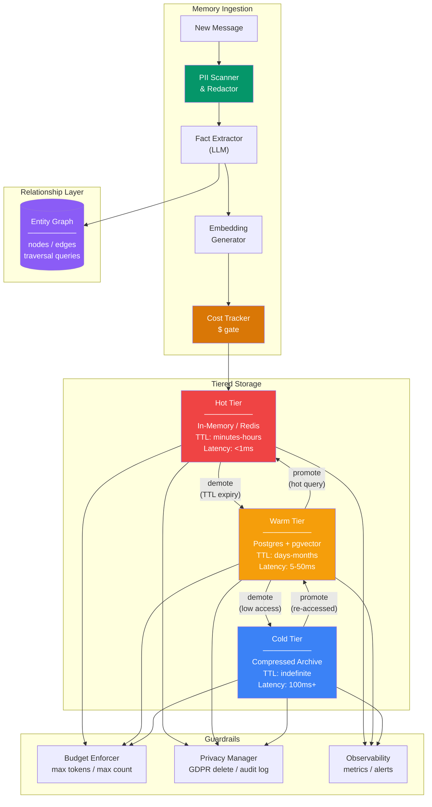

# Production Memory Patterns

  

## 📖 At a Glance

| Difficulty | Time | Prerequisites |
|------------|------|---------------|
| Advanced | ~60 min | Python 3.8+, `ANTHROPIC_API_KEY`, understanding of 06 Vector Store Memory and 13 Hierarchical Memory Layers recommended |

This technique is for developers preparing to deploy agent memory at scale, covering caching, sharding, GDPR compliance, and observability.

## TL;DR

- **What it is:** **Production Memory Patterns** covers the engineering needed to scale agent memory: caching, TTL policies, sharding, GDPR compliance, and observability.
- **When you need it:** You are moving agent memory from a working prototype to a production system that serves real users.
- **The trade-off:** Adds operational complexity across caching, PII redaction, cost tracking, and multi-tier storage management.
- **Closest alternative in this repo:** 21 Cross-Session Memory handles basic persistence without the production infrastructure layer.

## Description

Getting agent memory to work in a demo is one thing. Keeping it fast, affordable, private, and reliable at scale is the real challenge. Think of it like cooking. A great meal for two is fun. But a restaurant serving 500 people nightly needs food safety, consistent quality, and tight cost control. Production Memory Patterns cover the engineering you need to deploy LLM agent memory in real applications. You'll learn about caching for low latency (response time), TTL policies (automatic data expiration), horizontal sharding (splitting data across servers), and GDPR compliance. You'll also set up observability (logging and metrics) to catch issues early. These patterns are essential for any team scaling chatbots, support agents, or AI assistants with persistent memory.

Moving agent memory from a prototype to production introduces engineering challenges that go beyond retrieval quality. This technique covers the architecture patterns you need:

- **Caching** frequently accessed memories in Redis (an in-memory data store) to reduce latency (response time).
- **TTL policies** (time-to-live: automatic expiration after a set time) to remove stale or low-value memories.
- **Horizontal sharding** (splitting data across multiple database servers by user ID) to handle growing user bases.
- **Backup and recovery** strategies to prevent data loss.
- **GDPR right-to-forget** (the legal requirement to completely delete a user's data on request), including embeddings and graph relationships.
- **Observability** (logging, metrics, and alerts) so issues are caught before they affect users.
- **Cost management** to keep embedding generation, vector storage, and LLM-based extraction economically viable at scale.

**Keywords:** agent memory, production deployment, caching, TTL, horizontal sharding, GDPR, observability, latency optimization, LLM agent, cost management

## Key Concepts

- **Memory caching (Redis)**: placing a fast cache layer in front of the primary memory store. This serves frequently accessed memories with sub-millisecond latency and reduces load on the backing database.
- **TTL policies**: assigning time-to-live values to memories. Ephemeral information (e.g., "user is currently in a meeting") automatically expires without manual cleanup.
- **Horizontal sharding**: distributing memory data across multiple database nodes by user ID or namespace hash. This maintains performance as the user base grows beyond single-node capacity.
- **Backup and recovery**: scheduled snapshots and write-ahead logs for the memory store, with tested restore procedures to recover from hardware failures, data corruption, or accidental deletions.
- **GDPR right-to-forget**: implementing complete user data deletion across all memory layers (raw conversations, extracted facts, vector embeddings, graph nodes and edges) in compliance with privacy regulations.
- **Memory observability**: instrumenting memory operations with structured logging, distributed tracing, and dashboards. You track retrieval latency, cache hit rates, store sizes, error rates, and extraction quality.
- **Cost management**: strategies for controlling the cost of embedding generation (batching, caching embeddings), vector storage (tiered storage, dimensionality reduction), and LLM extraction calls (selective processing, smaller models).
- **Latency optimization**: techniques for keeping memory retrieval under latency budgets. This includes pre-fetching likely memories, connection pooling, index tuning, and async memory operations that don't block the response path.

## Architecture

  

Mermaid source

---

## How It Works

1. New messages pass through a PII scanner (a tool that detects personally identifiable information like emails and phone numbers) and redactor before storage.
2. An LLM-based fact extractor pulls structured facts and entity relationships from the redacted text.
3. An embedding generator (a model that converts text into numerical vectors for similarity search) creates a vector for each memory. A cost tracker logs every operation.
4. The system stores new memories in the hot tier (in-memory cache with sub-millisecond reads) and the warm tier (vector database for persistent search).
5. On retrieval, the system searches hot first, then warm, then cold. Frequently accessed warm records get promoted to hot. Cold records get decompressed and promoted to warm when touched.
6. Periodic maintenance enforces per-user budget limits, demotes stale low-importance records to cold storage, and tracks cost against daily and monthly spend caps.

## When to Use

- You're scaling agent memory beyond a single-user prototype and need to handle thousands of users with different access patterns.
- Your application must comply with GDPR or similar privacy laws, requiring complete deletion of a user's data across all storage layers on request.
- You need cost control because embedding generation, LLM extraction, and vector storage costs grow with message volume.
- Retrieval latency matters and you need sub-millisecond access to frequently used memories while keeping storage costs low for rarely accessed ones.

## Limitations

- Tiered storage adds engineering complexity. You must manage promotion, demotion, and consistency across three storage layers.
- Regex-based PII detection catches common patterns (emails, SSNs) but misses context-dependent PII like names or addresses. Production systems need a dedicated PII service.
- Importance scoring drives eviction decisions, but inaccurate scores can cause the system to discard valuable memories or keep low-value ones.
- This technique covers single-node patterns. Horizontal sharding (splitting data across servers), distributed caching, and cross-region replication require additional infrastructure not shown here.

## Notebook

[**production_memory_patterns.ipynb**](production_memory_patterns.ipynb): Implements a complete tiered memory system with hot (Redis-like cache with TTL/LRU), warm (pgvector-like cosine similarity search), and cold (zlib-compressed archive) storage tiers. Includes PII detection and redaction, GDPR right-to-forget with full cross-tier deletion and audit logging, per-user memory budget enforcement with importance-weighted eviction, dollar cost tracking with daily/monthly spend caps, an entity-relationship graph store for structured knowledge, and LLM-powered fact extraction. All components are orchestrated through a single `TieredMemorySystem` class.

## FAQ

### Q: What is Production Memory Patterns in agent memory?

**A:** Production Memory Patterns covers the engineering practices needed to run agent memory at scale. This includes caching hot memories in Redis with TTL policies, horizontal sharding across database partitions, GDPR-compliant deletion workflows, cost monitoring dashboards, and observability infrastructure (logging, tracing, alerting). It is not a single memory technique but a collection of operational patterns that make any memory technique production-ready. Think of it as the "ops layer" on top of the memory layer.

### Q: When should I use Production Memory Patterns instead of Cross-Session Memory?

**A:** Use Production Memory Patterns when you move beyond prototyping to serving real users. Cross-Session Memory (technique 21) handles basic persistence. Production patterns add what basic persistence lacks: multi-user isolation, horizontal scaling, cache layers for latency, TTL-based cleanup, PII handling, and monitoring. If you have more than 100 active users, handle sensitive data, or need uptime guarantees, you need these operational patterns on top of whatever memory technique you chose.

### Q: What are the limits or failure modes of Production Memory Patterns?

**A:** Over-engineering is the main risk. Adding caching, sharding, and observability before you have enough users wastes development time. Each infrastructure layer adds operational complexity and potential failure points. Cache invalidation bugs can serve stale data. Sharding makes cross-shard queries expensive. GDPR deletion across multiple stores (vector DB, graph DB, cache) requires careful coordination. Start with the simplest production-ready setup and add layers as your scale demands them.

### Q: Can I combine Production Memory Patterns with another memory technique?

**A:** Yes. Production patterns are meant to wrap any memory technique. Apply caching to technique 06 (Vector Store Memory) to reduce embedding lookup latency. Add TTL policies to technique 19 (Forgetting and Decay) for automatic cleanup. Use sharding with technique 21 (Cross-Session Memory) to partition by user ID. Layer observability on technique 28 (Memory Evaluation) for continuous monitoring. These patterns are infrastructure, not alternatives to memory techniques.

### Q: What library or framework can I use to skip the implementation work?

**A:** Zep (technique 27) provides a production-ready managed service with built-in caching, multi-user isolation, and async processing. Mem0 Platform (technique 25) offers a cloud API with production infrastructure included. For self-hosted setups, Redis handles caching, PostgreSQL or DynamoDB handles persistence, and OpenTelemetry provides observability. LangSmith from LangChain offers tracing and monitoring for memory-augmented agents. The specific tools depend on your cloud provider and scale requirements.

## References

- Redis documentation: [https://redis.io/docs/](https://redis.io/docs/?utm_source=nirdiamant&utm_medium=github&utm_campaign=agent_memory_techniques)
- GDPR right to erasure (Article 17): [https://gdpr-info.eu/art-17-gdpr/](https://gdpr-info.eu/art-17-gdpr/?utm_source=nirdiamant&utm_medium=github&utm_campaign=agent_memory_techniques)
- Pinecone production best practices: [https://docs.pinecone.io/guides/getting-started/overview](https://docs.pinecone.io/guides/getting-started/overview?utm_source=nirdiamant&utm_medium=github&utm_campaign=agent_memory_techniques)
- OpenTelemetry for observability: [https://opentelemetry.io/docs/](https://opentelemetry.io/docs/?utm_source=nirdiamant&utm_medium=github&utm_campaign=agent_memory_techniques)
- Weaviate scaling and replication: [https://weaviate.io/developers/weaviate](https://weaviate.io/developers/weaviate?utm_source=nirdiamant&utm_medium=github&utm_campaign=agent_memory_techniques)
- AWS Well-Architected Framework: [https://docs.aws.amazon.com/wellarchitected/latest/reliability-pillar/welcome.html](https://docs.aws.amazon.com/wellarchitected/latest/reliability-pillar/welcome.html?utm_source=nirdiamant&utm_medium=github&utm_campaign=agent_memory_techniques)

## Related Techniques

- [**28 Memory Evaluation**](../28_memory_evaluation/) - Measure your memory quality before and after deploying to production.
- [**19 Forgetting and Decay**](../19_forgetting_and_decay/) - TTL policies are a production implementation of the forgetting and decay concept.
- [**27 Zep Memory**](../27_zep_memory/) - Zep is a production-ready framework that handles many of these patterns for you.
- [**06 Vector Store Memory**](../06_vector_store_memory/) - The most common memory backend you'll scale and optimize with these patterns.

---

