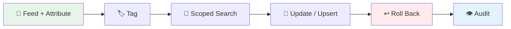

# Managing Documents Over Time

A knowledge abstract is not a one-shot artifact — it evolves as your source documents change. This guide walks through the complete lifecycle: **ingest → attribute → tag → search within scope → update → roll back → audit**.

---

## Prerequisites

- A graph-family knowledge abstract (graph / hypergraph / temporal / spatial)
- hyperextract installed (`pip install hyperextract`)
- An LLM provider configured (`he config init ...`)

---

## The Workflow



### 1. Ingest with Attribution

Every document you feed can carry a `source_id` — the foundation for per-document rollback and change detection:

```bash
he feed ./ka/ contract-acme.md --source contract-acme
he feed ./ka/ contract-globex.md --source contract-globex
he parse ./more-docs/ -o ./ka/ -t legal/contract_obligation -l en --source more-docs
```

```python
ka.feed_text(text, source_id="contract-acme")
```

!!! tip
    When the input is a **directory**, `he parse` automatically attributes each file by its stem — no explicit `--source` needed.

### 2. Tag Sources

Group documents with tags so you can scope searches and batch-identify groups later:

```bash
he tag ./ka/ --source contract-acme --add legal --add acme --add reviewed
he tag ./ka/ --source contract-globex --add legal --add globex
he tag ./ka/ --list
```

### 3. Search Within Scope

Restrict retrieval to a subset of documents by source or tag:

```bash
# Only knowledge from legal-tagged documents
he search ./ka/ "termination clause" --tag legal

# Only knowledge from a specific document
he search ./ka/ "payment terms" --source contract-acme

# Union: match either filter
he search ./ka/ "liability" --tag legal --source contract-globex
```

## 4. Update a Document (Upsert)

When a source document changes, simply re-feed it under the same source id. The previous version's contributions are rolled back automatically — facts removed from the updated document disappear, and shared keys re-merge from surviving sources:

```bash
he feed ./ka/ contract-acme-v2.md --source contract-acme
```

Facts removed from the updated document **do not linger**.

### 5. Roll Back a Document

Remove every contribution of one document without touching the rest:

```bash
he remove ./ka/ --document contract-globex
```

Keys shared with surviving documents are re-merged from their raw results — deterministic with classic merge strategies. For a scorched-earth approach, use `--strategy touched` to delete every key the source touched.

You can also remove individual items:

```bash
he remove ./ka/ --node Apple
he remove ./ka/ --edit-node Apple --fact "founded by Steve Jobs"
```

### 6. Audit the Ledger

See which documents contributed to your knowledge abstract and how much:

```bash
he info ./ka/ --sources
```

```
┌─────────────────────── Source Ledger ───────────────────────┐
│ Source ID         │ Raw Items │ Content Hash │ Tags        │
├───────────────────┼───────────┼──────────────┼─────────────┤
│ contract-acme     │ 3         │ a1b2c3d4...  │ legal,acme  │
│ contract-globex   │ 2         │ e5f6a7b8...  │ legal       │
└───────────────────┴───────────┴──────────────┴─────────────┘
```

---

## Persistence

The KA directory is **self-contained**:

```
ka/
├── data.json               # merged knowledge (the derived view)
├── metadata.json           # template, lang, timestamps
├── sources_nodes.json      # node source ledger (raw items + hashes + tags)
├── sources_edges.json      # edge source ledger
├── documents/              # archived source documents
│   ├── a1b2c3d4e5f6-contract-acme.md
│   └── e5f6a7b8c9d0-contract-globex.md
└── index/                  # vector index (patched in place)
```

Copy the directory and you have the complete knowledge **plus** the full evidence trail.

---

## Change Detection

`he feed --source` computes a SHA-256 content hash and records it in the ledger. Re-feeding an unchanged document is skipped automatically:

```
Source 'contract-acme' is unchanged (content hash matches) — nothing to do.
Use --refeed to re-ingest anyway.
```

Use `--refeed` to force re-ingestion (e.g. after upgrading the extraction template or LLM model).

---

## Python API

```python
from hyperextract.types import AutoGraph

ka = AutoGraph(node_schema=..., edge_schema=..., ...)

# Attributed ingestion
ka.feed_text(text, source_id="contract-acme")

# Tag
ka.tag_source("contract-acme", add=["legal", "acme"])

# Scoped search
nodes, edges = ka.search("termination", tags=["legal"])

# Document upsert (roll back old + merge new)
ka.feed_text(v2_text, source_id="contract-acme")

# Roll back a document
report = ka.remove_source("contract-globex")

# Audit
print(ka.sources())

# Persist (ledger + documents included)
ka.dump("./ka/")
```

---

## See Also

- [`he feed`](feed.md) — incremental ingestion
- [`he remove`](remove.md) — all deletion modes (key / fact / document)
- [`he tag`](tag.md) — tag management
- [`he search`](search.md) — scoped search options
- [`he info --sources`](info.md) — ledger audit
- [Provenance Guide (Python SDK)](../../python/guides/provenance.md) — the same lifecycle via the Python API
