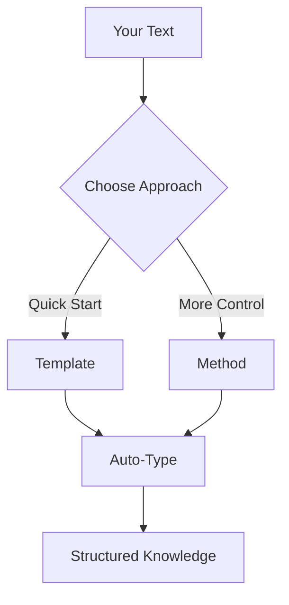
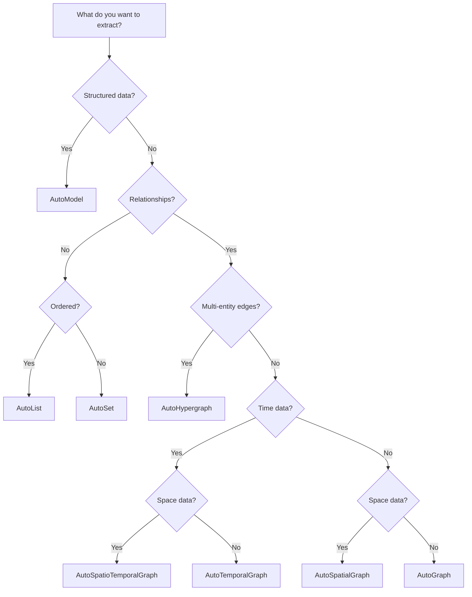

# Core Concepts

Understanding the three pillars of Hyper-Extract: Templates, Auto-Types, and Methods.

---

## Architecture Overview



---

## Templates

**Templates** are pre-configured extraction setups for specific domains and tasks.

### What is a Template?

A template combines:
- **Auto-Type** — Output data structure
- **Prompts** — LLM instructions
- **Schema** — Field definitions
- **Guidelines** — Extraction rules

### Using Templates

```python
from hyperextract import Template

# Create from preset
ka = Template.create("general/biography_graph", language="en")

# Create from file
ka = Template.create("/path/to/custom.yaml", language="en")

# List available
templates = Template.list()
for path, cfg in templates.items():
    print(f"{path}: {cfg.description}")
```

## When to Use Templates

✅ **Use templates when:**
- You want quick results
- Working with common document types
- Need domain-specific extraction
- Don't want to configure prompts

❌ **Don't use templates when:**
- You need full control over extraction
- Implementing custom algorithms
- Research/experimentation

---

## Auto-Types

**Auto-Types** define the output data structure for extracted knowledge.

### The 8 Auto-Types

| Type | Description | Best For |
|------|-------------|----------|
| `AutoModel` | Single structured object | Summaries, reports |
| `AutoList` | Ordered collection | Sequences, ranked items |
| `AutoSet` | Deduplicated collection | Unique items, tags |
| `AutoGraph` | Entity-Relation graph | Knowledge graphs |
| `AutoHypergraph` | Multi-entity edges | Complex relationships |
| `AutoTemporalGraph` | Graph + time | Timelines, histories |
| `AutoSpatialGraph` | Graph + space | Maps, locations |
| `AutoSpatioTemporalGraph` | Graph + time + space | Full context |

### Working with Auto-Types

```python
from hyperextract import Template

# Graph extraction
ka = Template.create("general/graph", "en")
result = ka.parse(text)

# Access graph data
for node in result.nodes:
    print(f"Node: {node.name}")

for edge in result.edges:
    print(f"{edge.source} --{edge.type}--> {edge.target}")
```

## Choosing an Auto-Type



---

## Methods

**Methods** are the underlying extraction algorithms.

### Types of Methods

#### RAG-Based Methods

Use retrieval-augmented generation for large documents:

| Method | Description |
|--------|-------------|
| `graph_rag` | Community-based retrieval |
| `light_rag` | Lightweight graph RAG |
| `hyper_rag` | Hypergraph RAG |
| `hypergraph_rag` | Advanced hypergraph |
| `cog_rag` | Cognitive RAG |

#### Typical Methods

Direct extraction approaches:

| Method | Description |
|--------|-------------|
| `itext2kg` | Triple-based extraction |
| `itext2kg_star` | Enhanced iText2KG |
| `kg_gen` | Knowledge graph generator |
| `atom` | Temporal with evidence |

### Using Methods

```python
from hyperextract import Template

# Create from method
ka = Template.create("method/light_rag")

# Or via path
ka = Template.create("method/graph_rag")
```

## Template vs Method

| Aspect | Template | Method |
|--------|----------|--------|
| **Ease of use** | ⭐⭐⭐ | ⭐⭐ |
| **Flexibility** | ⭐⭐ | ⭐⭐⭐ |
| **Domain fit** | ⭐⭐⭐ | ⭐⭐ |
| **Configuration** | Minimal | More |
| **Language** | Multi | English |

---

## The Extraction Pipeline

### 1. Text Input

```python
text = "Your document content here..."
```

### 2. Chunking (if needed)

Long documents are automatically split:
- Default chunk size: 2048 characters
- Overlap: 256 characters
- Parallel processing with multiple workers

### 3. LLM Extraction

Each chunk is processed by the LLM:
- Structured output using Pydantic schemas
- Concurrent processing for speed
- Merge results from all chunks

### 4. Result

```python
result = ka.parse(text)

# result contains:
# - result.data: Extracted knowledge
# - result.metadata: Extraction info
# - Methods for search, chat, save
```

---

## Putting It All Together

### Template Approach (Recommended)

```python
from hyperextract import Template

# 1. Choose template
ka = Template.create("general/biography_graph", "en")

# 2. Extract
result = ka.parse(text)

# 3. Build index for search/chat capabilities
result.build_index()

# 4. Use
result.show()
```


## Method Approach (Advanced)

```python
from hyperextract import Template

# 1. Choose method
ka = Template.create("method/light_rag")

# 2. Extract
result = ka.parse(text)

# 3. Use
result.build_index()
results = result.search("query")
```

## Direct Auto-Type Usage (Advanced)

For full control over extraction, you can instantiate Auto-Types directly. This requires defining your own schemas and extraction logic.

```python
from hyperextract import AutoGraph
from langchain_openai import ChatOpenAI, OpenAIEmbeddings
from pydantic import BaseModel

# Define schemas
class Entity(BaseModel):
    name: str
    type: str

class Relation(BaseModel):
    source: str
    target: str
    type: str

# Create with full control
llm = ChatOpenAI()
emb = OpenAIEmbeddings()

ka = AutoGraph[Entity, Relation]()
    node_schema=Entity,
    edge_schema=Relation,
    llm_client=llm,
    embedder=emb,
    # Plus additional configuration...
)

result = ka.parse(text)
```

!!! note "Advanced Topic"
    Direct Auto-Type usage requires understanding of:
    - Pydantic schema definitions
    - LLM client configuration
    - Key extractors for deduplication
    
    See [Working with Auto-Types](guides/working-with-autotypes.md#advanced-usage) for complete examples.

---

## Next Steps

- [Using Templates](guides/using-templates.md)
- [Using Methods](guides/using-methods.md)
- [Working with Auto-Types](guides/working-with-autotypes.md)
- [Auto-Types Reference](../concepts/autotypes.md)
