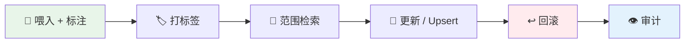

# 管理文档的生命周期

知识摘要不是一次性产物——它随来源文档的变化而演化。本指南完整介绍文档的生命周期：**摄取 → 标注 → 打标签 → 范围检索 → 更新 → 回滚 → 审计**。

---

## 前置条件

- 图谱类知识摘要（graph / hypergraph / temporal / spatial）
- 已安装 hyperextract（`pip install hyperextract`）
- 已配置 LLM 提供商（`he config init ...`）

---

## 完整工作流



### 1. 带来源标注摄取

每份文档都可以携带 `source_id`——这是按文档回滚和变更检测的基础：

```bash
he feed ./ka/ contract-acme.md --source contract-acme
he feed ./ka/ contract-globex.md --source contract-globex
he parse ./more-docs/ -o ./ka/ -t legal/contract_obligation -l en --source more-docs
```

```python
ka.feed_text(text, source_id="contract-acme")
```

!!! tip
    当输入是**目录**时，`he parse` 会自动按文件名标注每个文件——无需显式 `--source`。

### 2. 打标签

用标签对文档分组，以便后续范围检索和批量识别：

```bash
he tag ./ka/ --source contract-acme --add legal --add acme --add reviewed
he tag ./ka/ --source contract-globex --add legal --add globex
he tag ./ka/ --list
```

### 3. 范围检索

按来源或标签将检索限定在部分文档范围内：

```bash
# 只检索 legal 标签文档中的知识
he search ./ka/ "termination clause" --tag legal

# 只检索特定文档贡献的知识
he search ./ka/ "payment terms" --source contract-acme

# 并集：命中任一过滤条件即保留
he search ./ka/ "liability" --tag legal --source contract-globex
```

## 4. 更新文档（Upsert）

来源文档变化后，用同一个 source id 重新喂入即可。旧版本的贡献会自动回滚——更新后删掉的事实不再残留，共享 key 从幸存来源重新合并：

```bash
he feed ./ka/ contract-acme-v2.md --source contract-acme
```

更新后删掉的事实**不会残留**。

### 5. 回滚整份文档

删除某份文档的全部贡献，不影响其余知识：

```bash
he remove ./ka/ --document contract-globex
```

与其他文档共享的 key 会从幸存来源的原始结果重新合并——经典合并策略下完全确定。如需"全部删除"可用 `--strategy touched`。

也可以删除单个条目：

```bash
he remove ./ka/ --node Apple
he remove ./ka/ --edit-node Apple --fact "founded by Steve Jobs"
```

### 6. 审计来源账本

查看哪些文档贡献了知识以及贡献量：

```bash
he info ./ka/ --sources
```

```
┌─────────────────────── 来源账本 ───────────────────────────┐
│ 来源 ID            │ 原始条目 │ 内容哈希      │ 标签       │
├───────────────────┼───────────┼──────────────┼─────────────┤
│ contract-acme     │ 3         │ a1b2c3d4...  │ legal,acme  │
│ contract-globex   │ 2         │ e5f6a7b8...  │ legal       │
└───────────────────┴───────────┴──────────────┴─────────────┘
```

---

## 持久化

KA 目录是**自包含**的：

```
ka/
├── data.json               # 合并后的知识（派生视图）
├── metadata.json           # 模板、语言、时间戳
├── sources_nodes.json      # 节点来源账本（原始结果 + 哈希 + 标签）
├── sources_edges.json      # 边来源账本
├── documents/              # 归档的来源文档
│   ├── a1b2c3d4e5f6-contract-acme.md
│   └── e5f6a7b8c9d0-contract-globex.md
└── index/                  # 向量索引（原地修补）
```

复制整个目录，即可带走完整的知识**和**完整的证据链。

---

## 变更检测

`he feed --source` 会计算输入文本的 SHA-256 哈希并记入账本。重复喂入内容未变的文档会自动跳过：

```
Source 'contract-acme' is unchanged (content hash matches) — nothing to do.
Use --refeed to re-ingest anyway.
```

使用 `--refeed` 可强制重新摄取（例如升级抽取模板或 LLM 模型后）。

---

## Python API

```python
from hyperextract.types import AutoGraph

ka = AutoGraph(node_schema=..., edge_schema=..., ...)

# 带来源标注摄取
ka.feed_text(text, source_id="contract-acme")

# 打标签
ka.tag_source("contract-acme", add=["legal", "acme"])

# 范围检索
nodes, edges = ka.search("termination", tags=["legal"])

# 文档 upsert（回滚旧版 + 合并新版）
ka.feed_text(v2_text, source_id="contract-acme")

# 回滚整份文档
report = ka.remove_source("contract-globex")

# 审计
print(ka.sources())

# 持久化（含账本和文档）
ka.dump("./ka/")
```

---

## 另请参阅

- [`he feed`](feed.md) — 增量摄取
- [`he remove`](remove.md) — 所有删除模式（按键 / 按事实 / 按文档）
- [`he tag`](tag.md) — 标签管理
- [`he search`](search.md) — 范围检索选项
- [`he info --sources`](info.md) — 来源账本审计
- [溯源指南（Python SDK）](../../python/guides/provenance.md) — 同一生命周期的 Python API 视角
